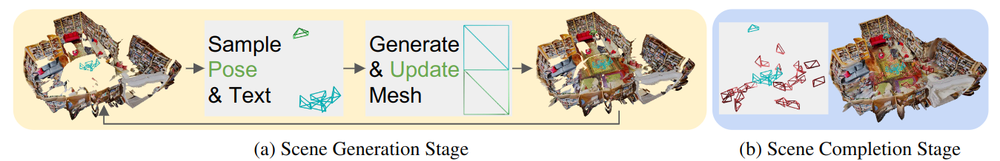

# Note board (obarads.github.io)
This site (repository) provides **setup commands (with docker) to run the implementation of papers or packages** and **the paper clippings**.
If you want to know this contents, Please check [my github.io](https://obarads.github.io/) or Example (docker command) section.

## 🖥️ Setup commands 
Setup commands section notes how to build environments to run the implementation of papers or packages with Docker. Setup commands are written in 'How to build with docker and run the model in a docker container' section. 

### Example
For example, [text2room](https://obarads.github.io/papers/Text2Room%20Extracting%20Textured%203D%20Meshes%20from%202D%20Text-to-Image%20Models.md) contains the following items:
1. Create a docker container
2. Setup packages
3. Setup the models
4. Run the model

Each item has commands for setup, an example of [text2room](https://obarads.github.io/papers/Text2Room%20Extracting%20Textured%203D%20Meshes%20from%202D%20Text-to-Image%20Models.md) '1. Create a docker container' is as follows:
```bash
# Set this repository absolute path (ex: /home/user/obarads.github.io)
git clone https://github.com/Obarads/obarads.github.io.git
cd obarads.github.io
OGI_DIR_PATH=$PWD

# Get a base image
BASE_IMAGE=nvidia/cuda:11.7.1-cudnn8-devel-ubuntu20.04
docker pull $BASE_IMAGE

# Create and move to a container dir
mkdir containers
cd containers
# Clone the repository
git clone https://github.com/lukasHoel/text2room.git
# Move to text2room
cd text2room
# Switch to 2023/07/16 ver.
git switch -d c38d97e4d418cb5a93cfdc7b89ea0e6e7bbcf20b
# Copy a folder for building env.
cp -r $OGI_DIR_PATH/environments/TET3Mf2TM/ ./dev_env

# Create docker image and container
docker build . -t text2room -f ./dev_env/Dockerfile --build-arg UID=$(id -u) --build-arg GID=$(id -g) --build-arg BASE_IMAGE=$BASE_IMAGE
docker run -dit --name text2room --gpus all -v $PWD:/workspace text2room
```

## 📝 Paper clippings and note
Paper clippings section notes summary of paper methods. Paper clippings are written in 'どんなもの?' (What thing?) 'どうやって有効だと検証した?' (How did the authors verify that proposed method is valid?) section and '論文関連リンク' (cited papers in the paper). 

### Example
An example of [text2room](https://obarads.github.io/papers/Text2Room%20Extracting%20Textured%203D%20Meshes%20from%202D%20Text-to-Image%20Models.md) 'どんなもの?' is as follows:

- The authors present Text2Room, a method for generating textured 3D meshes of room-scale indoor scenes from a given text prompt as input.
- > In very recent concurrent work, Fridman et al. [18] create 3D scenes from text,  but  focus  on  this  type  of  3D-consistent “zoom-out” video generation. 
  - > Instead, we generate complete, textured 3D room geometry from arbitrary trajectories.
- > We visualize this workflow in Figure 2.



> Figure 2. Method overview.  We iteratively create a textured 3D mesh in two stages.  (a) First, we sample predefined poses and text to generate the complete scene layout and furniture. Each new pose (marked in green) adds newly generated geometry to the mesh (depicted by green triangles) in an iterative scene generation scheme (see Figure 3 for details).  Blue poses/triangles denote viewpoints that created geometry in a previous iteration.  (b) Second, we fill in the remaining unobserved regions by sampling additional poses (marked in red) after the scene layout is defined.


> Figure 3. Iterative scene generation. For each new pose, we ren- der the current mesh to obtain partial RGB and depth renderings. We complete both, utilizing respective inpainting models and the text prompt.  Next, we perform depth alignment (see Section 3.2) and mesh filtering (see Section 3.3) to obtain an optimal next mesh patch, that is finally fused with the existing geometry.

Note: I used 'どんなもの?' and 'どうやって有効だと検証した?' with reference to [先端技術とメディア表現1 #FTMA15](https://www.slideshare.net/Ochyai/1-ftma15).
Note: I used 'どんな論文か?', '新規性', '結果' with reference to [cvpaperchallenge format](http://xpaperchallenge.org/cv/survey/eccv2022_summaries/1).

## Note
[previous data](https://github.com/Obarads/obarads.github.io/tree/b328c1c56d76cd4ea41cb4f1996da56de496c768/public/previous_data)
