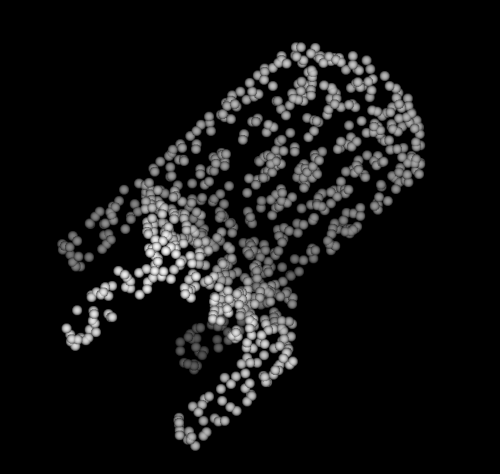

# point cloud
## 概要
日本語では点群と呼ばれる、3D表現の一つ。下の図の様にすべてを点で表す。データが軸に沿って規則的に並んでいる2D画像と違い、点群は不規則かつバラバラにデータが表現されている。

## 技術用語
- **Registration**  
  点群Aと点群Bに共通する箇所がある場合、その個所をもとに点群Aと点群Bを合体させるタスクである。下の図([1]の図1からの引用)の一番下が2つの点群をRegistrationしたものである。

  

  [2]によるとCoarse registration algorithmとFine registration algorithmsの二つがある。以下の2つの説明は[2]の引用、修正したものである。
  - Coarse registration algorithm  
    このアルゴリズムは各点群の位置が近接していると事前に仮定しておらず、おおざっぱな位置合わせを目的としており、損失関数のポリシーも穏やかである。
  - Fine registration algorithm  
    入力される点群が大体位置合わせされており、先ほどの[1]の図の様に点群が大きくかぶっている場合はこのアルゴリズムが使われる。また、Coarse registration algorithmの補助としても使われる。

## Reference
1. [Haowen Deng, Tolga Birdal, Slobodan Ilic. PPFNet: Global Context Aware Local Features for Robust 3D Point Matching. CVPR2018.](https://arxiv.org/abs/1802.02669)
2. [Gil Elbaz, Tamar Avraham, Anath Fischer. 3D Point Cloud Registration for Localization Using a Deep Neural Network Auto-Encoder. CVPR2017](http://openaccess.thecvf.com/content_cvpr_2017/papers/Elbaz_3D_Point_Cloud_CVPR_2017_paper.pdf)

## key-words
Point_Cloud, Registration