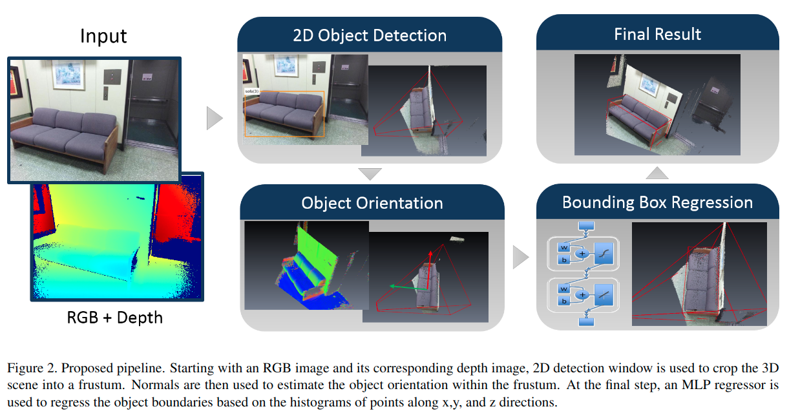

# 2D-Driven 3D Object Detection in RGB-D Images

Cite: [Lahoud, Jean, and Bernard Ghanem. 2017. “2D-Driven 3D Object Detection in RGB-D Images.” In 2017 IEEE International Conference on Computer Vision (ICCV). IEEE. https://doi.org/10.1109/iccv.2017.495.](https://vision.unipv.it/CV/materiale2017-18/fifthchoice/Lahoud_2D-Driven_3D_Object_ICCV_2017_paper.pdf)
Implementation: [?]()  

## どんなもの?
2D検出手法を恩恵を利用して、RGBと深度画像からオブジェクトの向きと3Dバウンディングボックスを高速で推定する手法を提案した。
- 2D検出を使用して、オブジェクトに対する3D検索範囲を制限し、時間の短縮を実現した。
- 点群座標をヒストグラム(密度)として利用し、3Dバウンディングボックスを回帰する。

## 先行研究と比べてどこがすごいの? or 関連事項
### 既存の手法よりも高速な3D検出ができるようになった。
- >  Despite hardware acceleration (GPU), they tend to be much slower than 2D object detection methods for several reasons. (Sect. 1)
  1. > One of these reasons is the relative size of the 3D scene compared to its 2D image counterpart. (Sect. 1)
  2. > Another reason is the incomplete sparse data available in 3D point clouds generated by a single RGB-D image, which suffers from weak adjacency/contiguity characteristics found in 2D images. (Sect. 1)
  3. > The ideal encoding and exploitation of depth information in RGB-D images is still an open challenge. (Sect. 1)
    - 深度情報を追加のチャンネルとして扱う方法は検出プロセスの高速化と容易化の恩恵を得られるが、現状、最終的な出力は2D検出に限定している。
    - 深度情報をボクセル化する手法は、センサーによって観測した部分のみをボクセル化するため、3D空間上に反映されるボクセルがほとんどない(被写体の表面をなぞった位置のみボクセルが得られる)。これにより、3Dデータとしては欠損がひどいため処理できない。
- 本提案では、
  - 2D検出を利用して3Dの検索範囲[(処理する範囲)]を3D空間全体から一部分に狭めることで、検出速度を上げた。
  - オブジェクトの向きとオブジェクトの3次元点群座標のヒストグラムを使用して、3Dバウンディングボックスの回帰を行える様にした。

## 技術や手法のキモはどこ? or 提案手法の詳細
### 手法の概要
- 手法のパイプラインは図2の通り。

1. Faster R-CNNでオブジェクトの2Dバウンディングボックス(BB)を取得し、そこから錐台3DBBを得る。
   - 錐台3DBBは2DBBと深度画像から生成される。
2. 3Dオブジェクトの方向を推定する。
   - [1]で提案されている、Manhattan Frame Estimation(MFE)を利用して、全ての錐台3DBB内のオブジェクトの方向をそれぞれ推定する。
3. 3DBBを推定する。
   - 点群の重心と推定されたオブジェクトの方向を用いて正規直交系を設定する。
   - 3次元点群座標のヒストグラムをMLPに入力し、3DBBの境界を推定する。
   - 3DBBを得た後に、スコアの計算を行う。
4. コンテキスト情報を用いて、スコアを洗練させる。
   - 各BBの関係をグラフを用いて表して洗練のための計算をする。

## どうやって有効だと検証した?

## 議論はある?

## Reference
1. [B. Ghanem, A. Thabet, J. C. Niebles, and F. C. Heilbron. Ro-bust manhattan frame estimation from a single rgb-d image. InCVPR, pages 3772–3780. IEEE, 2015.](https://www.cv-foundation.org/openaccess/content_cvpr_2015/papers/Ghanem_Robust_Manhattan_Frame_2015_CVPR_paper.pdf)

## Note
なし

## key-words
##### CV, RGB_Image, Depth_Image, Detection, Point_Cloud

