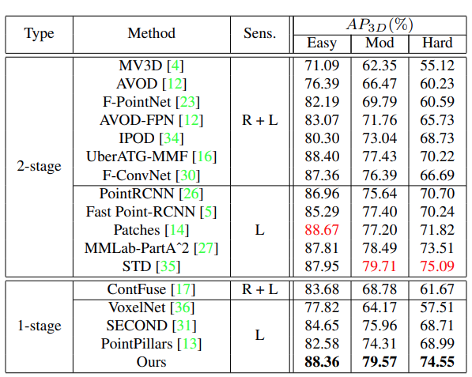

# 3DSSD: Point-based 3D Single Stage Object Detector

Update: 2023/06/15

## Info
- Paper: [arxiv.org](https://arxiv.org/abs/2002.10187)
  - Submission date: 2020/02/24
  - Authors: Zetong Yang, Yanan Sun, Shu Liu, Jiaya Jia
  - Conf.: CVPR 2020
- Implementation: [dvlab-research/3DSSD](https://github.com/dvlab-research/3DSSD)
  - framework: tensorflow
  - Official code: Yes
  - License: MIT license
- Keywords: CV, Point Cloud, Detection

## How to build with docker and run the model in a docker container
The docker environment is as follows, and () is estimated minimum specifications to run the model:
- CPU: Intel® Core™ i9-9900K CPU @ 3.60GHz × 16 
- GPU: NVIDIA GeForce RTX 2080 Ti
- Memory: 64 GiB (16 GiB)
- Capacity: 1 TB (64 GiB)

### 1. Create a docker container
```bash
# Set this repository absolute path (ex: /home/user/obarads.github.io)
OGI_DIR_PATH=/path/to/obarads.github.io

# Create a base image with cuda 8.0, cudnn 6.0, and ubuntu 16.04
BASE_IMAGE=ogi_cuda:cuda8.0_cudnn6.0_ubuntu16.04
docker build . -t $BASE_IMAGE  -f $OGI_DIR_PATH/public/data/envs/cuda/cuda8.0_cudnn6.0_ubuntu16.04/Dockerfile 

# Clone the repository
git clone https://github.com/dvlab-research/3DSSD.git
# Move to 3DSSD
cd 3DSSD
# Switch to 2020/04/09 ver.
git switch -d 8bc7605d4d3a6ec9051e7689e96a23bdac4c4cd9
# Copy a folder for building env.
cp -r $OGI_DIR_PATH/public/data/envs/3P3SSOD/ ./dev_env

# Create docker image and container
docker build . -t 3dssd -f ./dev_env/Dockerfile --build-arg UID=$(id -u) --build-arg GID=$(id -g) --build-arg BASE_IMAGE=$BASE_IMAGE
docker run -dit --name 3dssd --gpus all -v $PWD:/workspace 3dssd
```

### 2. Setup in the docker container
In a docker container:
```bash
cd /workspace

source ~/.bashrc
conda create -n 3dssd python=3.6
conda activate 3dssd

TENSORFLOW_PATH=~/anaconda3/envs/3dssd/lib/python3.6/site-packages/tensorflow
CUDA_PATH=/usr/local/cuda

cd dev_env
git apply code.diff
pip install -r requirements.txt

cd ../
bash compile_all.sh $TENSORFLOW_PATH $CUDA_PATH

export PYTHONPATH=$PYTHONPATH:/workspace/lib:/workspace/mayavi
echo 'export PYTHONPATH=$PYTHONPATH:/workspace/lib:/workspace/mayavi' >> ~/.bashrc
```

### 3. Setup the dataset
Please refer to [the section of README.md](https://github.com/dvlab-research/3DSSD/tree/8bc7605d4d3a6ec9051e7689e96a23bdac4c4cd9#data-preparation) for the [KITTI dataset](https://www.cvlibs.net/datasets/kitti/eval_object.php?obj_benchmark=3d) preparation (`calib`, `image_2`, `label_2`, `velodyne` dirs) into the docker container, and then run the following commands:
```bash
mkdir -p dataset/KITTI/object
cd dataset/KITTI/object
wget https://github.com/dvlab-research/3DSSD/files/4491173/train.txt --no-check-certificate
wget https://github.com/dvlab-research/3DSSD/files/4491174/val.txt --no-check-certificate
wget https://github.com/dvlab-research/3DSSD/files/4491574/test.txt --no-check-certificate

gdown https://drive.google.com/u/0/uc?id=1d5mq0RXRnvHPVeKx6Q612z0YRO1t2wAp
unzip train_planes.zip -d training/

python lib/core/data_preprocessor.py --cfg configs/kitti/3dssd/3dssd.yaml --split training --img_list train
python lib/core/data_preprocessor.py --cfg configs/kitti/3dssd/3dssd.yaml --split training --img_list val
```

### 4. Run the model
In a docker container:
```bash
cd /workspace
python lib/core/trainer.py --cfg configs/kitti/3dssd/3dssd.yaml
```

## どんなもの?
### Single stage 3D物体検出モデル、3DSSDを提案した。
- 精度と効率を調律させた軽量のモデルである。
- 効率を上げるため、既存手法で大抵採用されているアップサンプリング層とrefinement stageをすべて省き、計算コストを大幅削減した。
- 少ない代表点での検出を可能にするためのダウンサンプリング処理におけるfusion sampling strategyを提案する。
- また、処理速度は38msほどでありながら、最新のtwo stage手法ほどの精度を持つ。
- 全体像は図1の通り。


> Figure 1. Illustration of the 3DSSD framework. On the whole, it is composed of backbone and box prediction network including a candidate generation layer and an anchor-free prediction head. (a) Backbone network. It takes the raw point cloud (x, y, z, r) as input, and generates global features for all representative points through several SA layers with fusion sampling (FS) strategy. (b) Candidate generation layer (CG). It downsamples, shifts and extracts features for representative points after SA layers. (c) Anchor-free prediction head.

### Contribution
> - We first propose a lightweight and effective point-based 3D single stage object detector, named 3DSSD. In our paradigm, we remove FP layers and the refinement module, which are indispensible in all existing point-based methods, contributing to huge deduction on inference time of our framework.
> - A novel fusion sampling strategy in SA layers is developed to keep adequate interior points of different foreground instances, which preserves rich information for regression and classification.
> - We design a delicate box prediction network, making our framework both effective and efficient further. Experimental results on KITTI and nuScenes dataset show that our framework outperforms all single stage methods, and has comparable performance to state-of-the-art two stage methods with a much faster speed, which is 38ms per scene.

## どうやって有効だと検証した?
他モデルと比べた際の結果は以下の通り。

### KITTIによる検出検証


> Table 3. Results on KITTI test set on class Car drawn from official Benchmark [1]. “Sens.” means sensors used by the method. “L” and “R” represent using LiDAR and RGB images respectively

### nuScenesによる検出検証


> Table 4. AP on nuScenes dataset. The results of SECOND come from its official implementation [2].

## 論文関連リンク
なし

