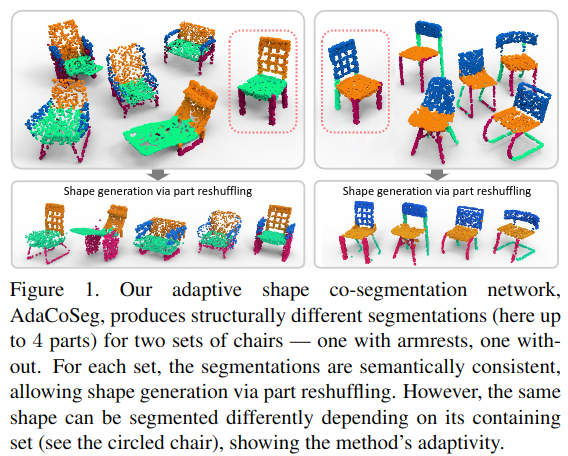
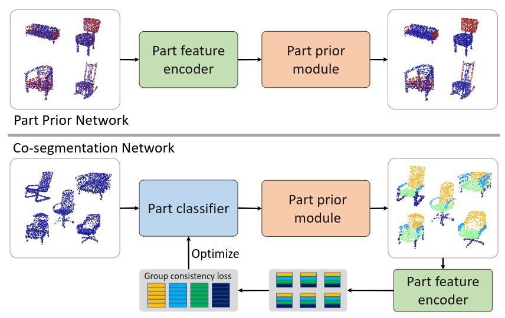
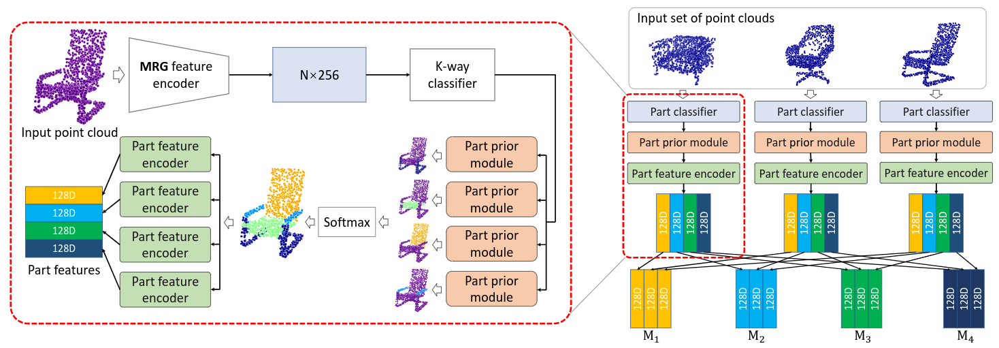

# AdaCoSeg: Adaptive Shape Co-Segmentation with Group Consistency Loss

Cite: [Zhu, Chenyang, Kai Xu, Siddhartha Chaudhuri, Li Yi, Leonidas Guibas, and Hao Zhang. 2019. “AdaCoSeg: Adaptive Shape Co-Segmentation with Group Consistency Loss.” arXiv [cs.CV]. arXiv. http://arxiv.org/abs/1903.10297.](https://arxiv.org/abs/1903.10297)  
Implementation: [BigkoalaZhu/AdaCoSeg](https://github.com/BigkoalaZhu/AdaCoSeg)  

## どんなもの?
> We introduce AdaCoSeg, a deep neural network architecture for adaptive co-segmentation of a set of 3D shapes represented as point clouds.

この手法では、与ららた複数の点群オブジェクト間で一貫するようなパーツセグメンテーションをその場で学習し出力する(パーツセグメンテーション時は教師なし学習)。本質的には、k-meansのようなクラスタリング手法と同じである。

> From this perspective, the input shape collection serves both as the test setand the training set. Ideally, the co-segmentation network can quickly adapt to a new input set without expensive retraining. Such an adaptive network would change its behavior, i.e., the network weights, at the time it is run. This is different from the traditional label learning paradigm, where the trained model strives to generalize to new inputs without changing the network weights, either under the su-pervised [11, 20] or weakly supervised settings [5, 19, 26].  
> Hence, the network performs essentially an unsupervised K-way clustering of the input points across all test shapes.

ただし、一部モジュール(part prior network)は事前の教師あり学習(タスクはパーツセグメンテーションとは別)を行う必要がある。

> Our part prior network is trained using the dataset from ComplementMe [25]; the adaptive co-segmentation is unsupervised.

本手法の根幹は、ネットワークに入力される点群間のみで一貫したセグメンテーションを得られるようにするCo-segmentationである。

> The goal of co-segmentation is to compute a consistent segmentation for all shapes in the input collection. The consistency of the segmentation implies a correspondence between all the segmented parts, which is a critical re-quirement for knowledge and attribute transfer, collecting statistics over a dataset, and structure-aware shape model-ing [18]. Figure 1 shows such a modeling example based on part reshuffling induced by a co-segmentation. 

## 先行研究と比べてどこがすごいの?
省略

## 技術や手法のキモはどこ? or 提案手法の詳細
本提案は、(1)事前にpart prior networkを教師あり学習し、(2)パーツセグメンテーションしたいデータ群をCo-segmentation Netwrokに入力して、教師なし手法を介して結果を取得する流れとなっている。

Part prior networkの学習については以下の通り。
> The network takes as input a point cloud with noisy binary labeling, where the foreground represents an imperfect part, and outputs a regularized labeling leading to a refined part.  
> Essentially, the part prior network learns what a valid part looks like through training on a labeling denoising task.

Co-segmentation Networkの学習については以下の通り。

> The corresponding part features with the same label for all shapes in the set constitute a part feature matrix. Then, weights of the co-segmentation network are optimized with the objective to maximize the part feature similarity within one label and minimize the similarity across different labels. This amounts to minimizing the rank of the part feature matrix for each semantic label while maximizing the rank of the joint part feature matrix for two semantic labels. 

## どうやって有効だと検証した?
省略

## 議論はある?
省略

## Reference
1. [なし]()

## Note
なし

## key-words
##### CV, Point_Cloud, Part_Segmentation

