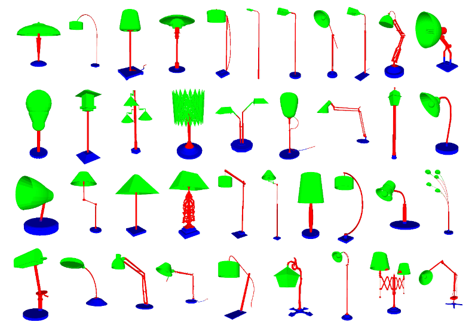
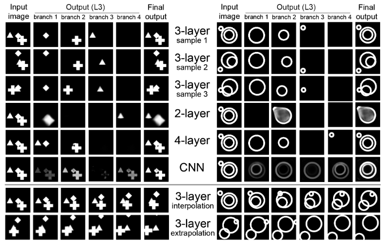
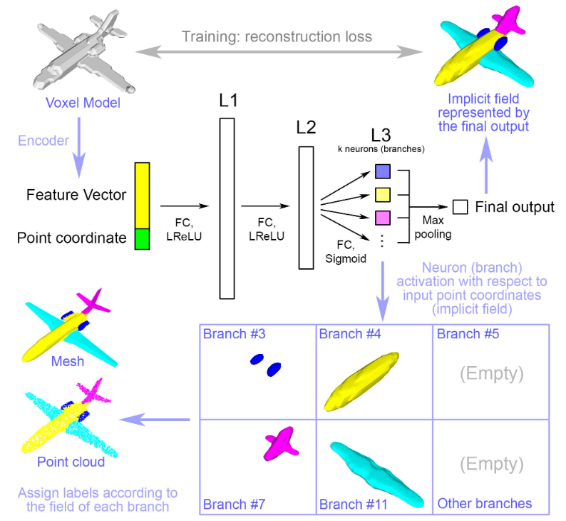

# BAE-NET: Branched Autoencoder for Shape Co-Segmentation

Cite: [Chen, Zhiqin, Kangxue Yin, Matthew Fisher, Siddhartha Chaudhuri, and Hao Zhang. 2019. “BAE-NET: Branched Autoencoder for Shape Co-Segmentation.” In 2019 IEEE/CVF International Conference on Computer Vision (ICCV). IEEE. https://doi.org/10.1109/iccv.2019.00858.](http://dx.doi.org/10.1109/iccv.2019.00858)  
Implementation: [czq142857/BAE-NET](https://github.com/czq142857/BAE-NET)  

## どんなもの?
著者らは、与えられた形状データ(Meshオブジェクトデータ等)のセットに基づいて、セット間で共通するパーツを学習する手法を提案した。

> We treat shape co-segmentation as a representation learning problem and introduce BAE-NET, a branched autoencoder network, for the task.

> Importantly, the decoder is branched: each branch learns a compact representation for one commonly recurring part of the shape collection, e.g., airplane wings.

> The unsupervised BAE-NET is trained with a collection of unsegmented shapes, using a shape reconstruction loss, without any ground-truth labels.

## 先行研究と比べてどこがすごいの?
### For existing Image co-segmentation approaches without strong supervision:
> In contrast to all the above methods, we develop an unsupervised co-segmentation approach for geometric shapes, without colors.

### For 3D segmentation without strong supervision:
For methods without deep learning:
> In contrast, our method is an end-to-end differentiable pipeline that requires no manual feature specification or large-scale graph optimization. 

For Tulsiani et al. [54]:
> Their approach has similarities to ours – they predict part cuboids with branches from an encoder network, and impose a reconstruction loss to make the cuboid assembly resemble the original shape.

> However, the critical difference is the restriction to cuboidal boxes: they cannot accommodate complex, non-convex part geometries such as the rings in Figure4and the groups of disjoint lamp parts in Figure1, for which a nonlinear stack of neurons is a much more effective indicator function. 

> Figure 1. Unsupervised co-segmentation by BAE-NETon the lamp category from the ShapeNet part dataset [64]. Each color denotes a part labeled by a specific branch of our network. 

> Figure 4. Independent shape extraction results of different models. The first three rows show the segmentation results of the 3-layer model. The next three rows show the segmentation results of other models for comparison. The last row shows the extrapolation results continuing its previous row. Note that no shape patterns go beyond the boundary in our synthesized training dataset, thus we can be certain that some shapes in the last row are completely new. 

For other shpae segmentation:
> In parallel, approaches were developed for weakly supervised [36, 50, 70] and semi-supervised [19, 28, 59] shape segmentation. Shapes formed by articulation of a template shape can be jointly co-segmented [2,63].

> Our method does not depend on any such supervision or base template, although it can optionally benefit from one or two annotated examples to separate strongly correlated part pairs. 

## 技術や手法のキモはどこ? or 提案手法の詳細
> To learn shape parts, we introduce a branched version of autoencoders, where each branch is tasked to learn a simple representation for one universal part of the input shape collection.

> Figure 2. Network architecture of the BAE-NET decoder; encoder is a CNN. L3 is the branch output layer (one neuron per branch) that gives the implicit field for each branch. The final output layer groups the branch outputs, via max pooling, to form the final implicit field. Each branch either represents a shape part or simply outputs nothing, if all the parts are represented by other branches. The max pooling operator allows part overlap, giving BAE-NET the freedom to represent each part in the most natural or simplest way. All the colors for the parts are for visualization only. 

About shape co-segmentation result:
>  Finally, we use a max pooling operator to merge parts together and obtain the entire shape, which allows our segmented parts to overlap

About other learning methods:
> We show unsupervised, weakly supervised, and one-shot learning results by BAE-NET, demonstrating that using only a couple of exemplars, our network can generally outperform state-of-the-art supervised methods trained on hundreds of segmented shapes.

## どうやって有効だと検証した?
> We demonstrate unsupervised, weakly supervised, and one-shot learning results for shape co-segmentation on the ShapeNet [5], ShapeNet part [64], and Tags2Parts [36] datasets, comparing BAE-NET with existing supervised and weakly supervised methods. The co-segmentation results from BAE-NET are consistent without explicitly enforcing any consistency loss in the network. Using only one (resp. two or three) segmented exemplars, the one-shot learn-ing version of BAE-NET outperforms state-of-the-art su-pervised segmentation methods, including PointNet++ and PointCNN, when the latter are trained on 10% (resp. 20% or 30%), i.e., hundreds, of the segmented shapes.

## 議論はある?
省略

## Reference
1. [Shubham Tulsiani, Hao Su, Leonidas J. Guibas, Alexei A. Efros, and Jitendra Malik. Learning shape abstractions by assembling volumetric primitives. CVPR, 2017.](https://arxiv.org/abs/1612.00404)

## Note
なし

## key-words
##### CV, Point_Cloud, Mesh, Voxel, Unsupervised_Learning, Part_Segmentation, Reconstruction, AutoEncoder

