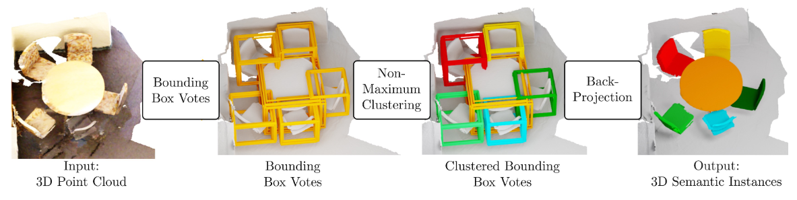
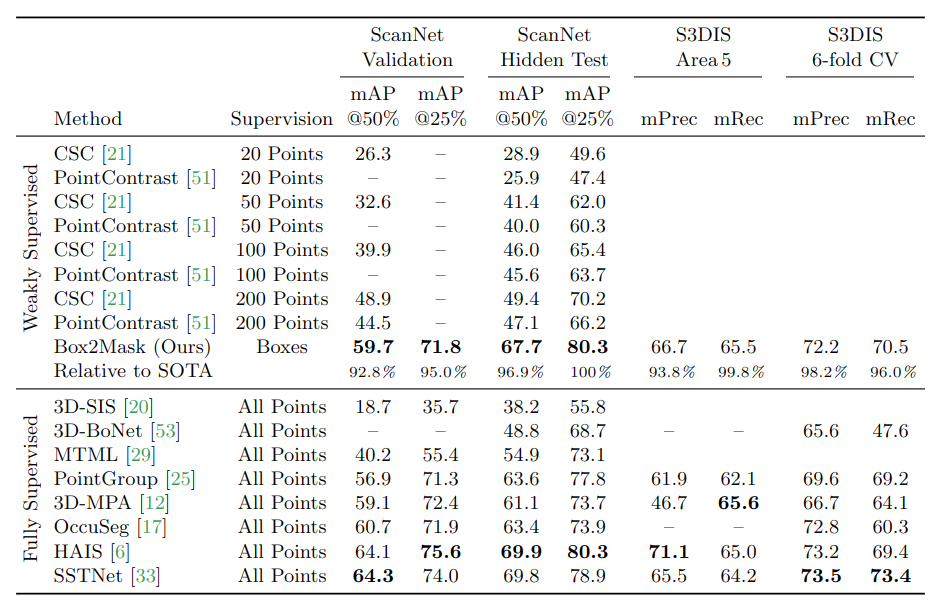
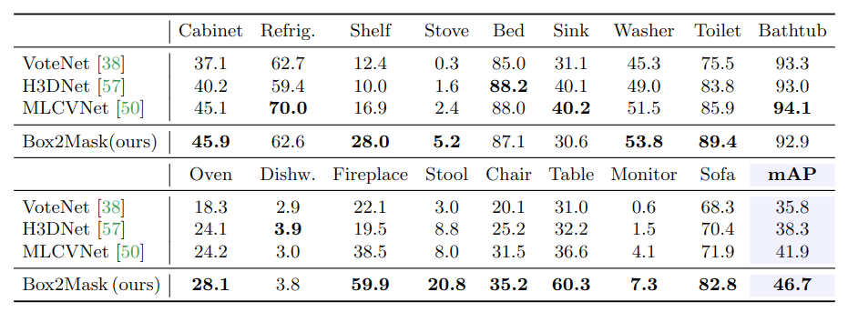

# Box2Mask: Weakly Supervised 3D Semantic Instance Segmentation Using Bounding Boxes

Cite: [Chibane, Julian, Francis Engelmann, Tuan Anh Tran, and Gerard Pons-Moll. 2022. “Box2Mask: Weakly Supervised 3D Semantic Instance Segmentation Using Bounding Boxes.” In Computer Vision – ECCV 2022, 681–99. Springer Nature Switzerland.](https://www.ecva.net/papers/eccv_2022/papers_ECCV/papers/136910666.pdf)  
Implementation: [jchibane/Box2Mask](https://github.com/jchibane/Box2Mask)  

## どんなもの?
- 著者らはSemantic Instance Segmantationの推論に対する新たなweakly supervised learning手法の提案を行った。
- 著者らの提案手法は、Bounding box(BB)を活用する手法となっている。
  - 学習データとしてBBとBBに紐づくsemanticラベルのみを利用する。
  - これらの学習データのみでSemantic Instance Segmantationを学習するための、新規voting手法、instance clustering、学習手法を著者らが提案する。
- 既存のweakly supervised learning手法を超えるパフォーマンスを達成し、fully-supervised learning手法に対しても競争力のある結果を出している。

## 先行研究と比べてどこがすごいの?
省略

## 技術や手法のキモはどこ? or 提案手法の詳細
推論及び学習のフローは以下の図3の通り。

> Fig. 3: Box2Mask Overview. Input to Box2Mask is a colored 3D point cloud of a scene. Bounding Box Voting: For each point in the input scene, our model predicts the points instance, parameterized as 6-DoF bounding box. The key contribution is the training procedure with only coarse bounding box labels (requiring no per-point labels) by associating points to bounding box labels. Non-Maximum Clustering: Votes are clustered using our Non-Maximum Clustering (NMC) that is specifically tailored to the bounding box representation. Back-Projection: A point is associated with the cluster of the box it predicted. Doing this for each point yields the final instance masks.

- フロー内でキモとなるのはNon-Maximum Clusteringとなる、4章 Clustering and Back-projection参照。
- 訓練方法に関しては、5章 Training with Weak Bounding Box Labels参照。

## どうやって有効だと検証した?
S3DIS、ScanNet、ARKitScenesの3つで評価を行った。大まかな結果は表1と2の通り。

S3DISとScanNetの結果は表1の通り。

> Table 1: State-of-the-art 3D Semantic Instance Segmentation. We show fully-supervised methods (dense point annotations) and weakly-supervised methods (sparse points and bounding boxes) on ScanNet [9] and S3DIS [2]. [51] is as reported in [21].

点ごとのラベルが無いARKitScenesではIoUを用いた評価を行い、結果は表2のようになった。

> Table 2: Whole-scene 3D Object Detection Scores on ARKitScenes [3]. The ground truth includes only oriented bounding box annotations, no point-level instance masks. Therefore, we cannot directly compute instance segmentation scores. Instead, as a proxy, we compare to recent object detection methods by fitting an oriented bounding box containing our predicted masks. We report the average precision on the validation set with an IoU threshold of 50% as in [38]. All other scores are as reported in [3].

## 議論はある?
省略

## Reference
1. [なし]()

## Note
Update log: 2022/12/01

## key-words
##### CV, Point_Cloud, Weakly_Supervised_Learning, Instance_Segmentation, Semantic_Segmentation
