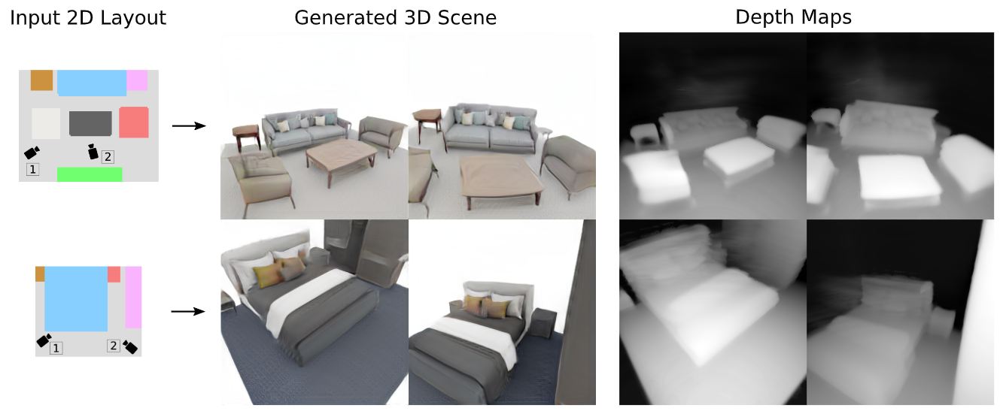
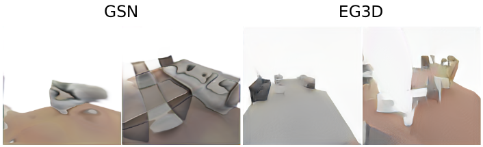
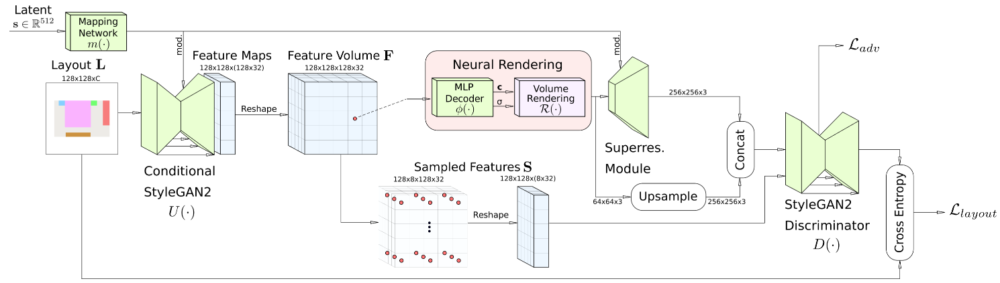
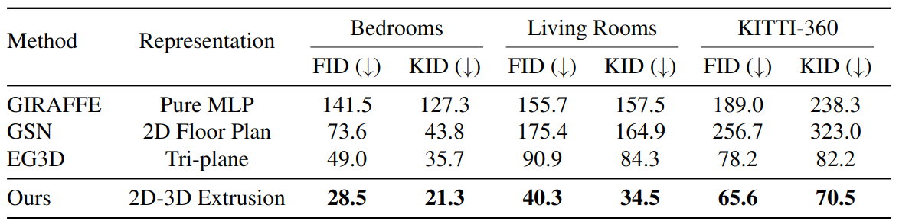
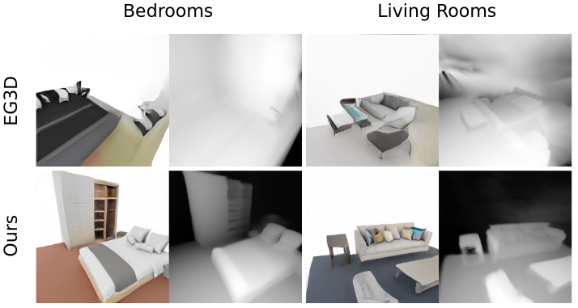
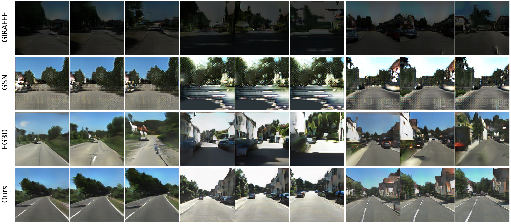

# CC3D: Layout-Conditioned Generation of Compositional 3D Scenes

Update: 2023/08/19

## ℹ️ Info
- Paper: [arxiv.org](https://arxiv.org/abs/2303.12074)
  - Submission date: 2023/03/21
  - Authors: Sherwin Bahmani, Jeong Joon Park, Despoina Paschalidou, Xingguang Yan, Gordon Wetzstein, Leonidas Guibas, Andrea Tagliasacchi
  - Conf.: ?
- Implementation: [sherwinbahmani/cc3d](https://github.com/sherwinbahmani/cc3d)
  - framework: Pytorch
  - Official code: Yes
  - License: The code is based on the [EG3D](https://github.com/NVlabs/eg3d) and follows their license code.
- Keywords: CV, Mesh, Scene Generation

## 🖥️ Setup commands to run the implementation
### 1. Create a docker container
```bash
# Set this repository absolute path (ex: /home/user/obarads.github.io)
git clone https://github.com/Obarads/obarads.github.io.git
cd obarads.github.io
OGI_DIR_PATH=$PWD

# Get a base image
BASE_IMAGE=nvidia/cuda:11.6.2-cudnn8-devel-ubuntu20.04
docker pull $BASE_IMAGE

# Clone the repository
git clone https://github.com/sherwinbahmani/cc3d.git
# Move to the repository
cd cc3d
# Switch to 2023/8/1 ver.
git switch -d 62120dd131395362f0b5d955552ab80c245f0fee
# Copy a folder for building env.
cp -r $OGI_DIR_PATH/environments/CLGoC3DS/ ./dev_env

# Create docker image and container
docker build . -t cc3d -f ./dev_env/Dockerfile --build-arg UID=$(id -u) --build-arg GID=$(id -g) --build-arg BASE_IMAGE=$BASE_IMAGE
docker run -dit --name cc3d --gpus all -v $PWD:/workspace cc3d
```

### 2. Setup in the docker container
In a docker container:
```bash
cd /workspace

# setup python and packages
conda create -n cc3d -y python=3.9.15
conda activate cc3d
pip install torch==1.12.1+cu116 torchvision==0.13.1+cu116 --extra-index-url https://download.pytorch.org/whl/cu116
pip install -r requirements.txt
```

### (WIP) 3. Setup the dataset
In a docker container:
```bash
cd /workspace
```

### (WIP) 4. Run the model
In a docker container:
```bash
cd /workspace
```

## 📝 Clipping and note
### どんなもの? 
- > In this work, we introduce CC3D, a conditional generative model that synthesizes complex 3D scenes conditioned on 2D semantic scene layouts, trained using single-view images.
  - Fig.1 shows input and output.
  - > The key component of our approach is a 2D-to-3D translation scheme that efficiently converts the 2D layout image into a 3D neural field.
    - > Our generator network is based on a modified StyleGAN2 [28] architecture that processes the input 2D layout image into a 2D feature map.
    - Fig.3 shows architecture.
- In proposing the method of this paper, the author treats mainly the following two existing problems.
  - > First, they typically generate the entire scene from a single latent code, ignoring the compositional nature of multi-object scenes, thus struggling to synthesize scenes with multiple objects, as shown in Fig. 2.
  - > Second, their generation process remains largely uncontrol- lable, making it non-trivial to enable user control.
    - > While some works [6, 31] allow conditioning the generation of input images via GAN inversion, this optimization process can be time-consuming and prone to local minima.
  - The authors also describe their differentiation over other current methods in Sec. 2 Concurrent works.


> Figure 1. Compositional 3D Scene Generation – We introduce CC3D, a 3D compositional GAN capable of synthesizing view-consistent renderings of multi-object scenes conditioned on a semantic layout, describing the scene structure.  Video results can be viewed on our website: https://sherwinbahmani.github.io/cc3d.


> Figure 2. Failure cases – of non-compositional 3D GANs on multi-object scenes. We show examples of generated scenes synthesized with [15, 7], which do not explicitly model the compositional nature of multi-object living rooms. Note their lack of visual qualities.


> Figure 3. Architecture – Our method takes a floorplan projection of the semantic scene layout and a noise vector as inputs.  We use a conditional StyleGAN2 backbone to generate a 2D feature field based on the given layout and reshape the channels into a 3D feature volume. This feature volume is queried using trilinear interpolation and subsequently decoded into color and density using a small MLP. We use a superresolution module to upsample volume rendered images to target resolution and use a standard StyleGAN2 discriminator. In order to ensure semantic consistency between the layout and the rendering, we sample equidistant coordinates from the feature volume and process the sampled features with a semantic segmentation decoder added to the discriminator. We train our model on a combination of an adversarial loss and cross entropy loss.

### どうやって有効だと検証した?
- About Data
  - > We  conduct  experiments  on  3D-FRONT [17] bedrooms and living rooms, following the same pre-processing steps as [41].
  - > To demonstrate the generation capabilities of our model in more challenging real-world scenarios, we also evaluate our model on KITTI-360 [29].
- Quantitative results (table 1)
- Qualitative analysis (figure 7, 8, 9)


> Quantitative evaluation using FID and KID for all methods at $256^2$ pixel resolution on 3D-FRONT bedrooms, 3D-FRONT living rooms, and KITTI-360.


> Figure 7. Visualization of depth maps – extracted from the density fields.  Our method is able to generate sharp depth maps in comparison to EG3D, which produces unrecognizable results.


> Figure 8. Qualitative comparison on 3D-FRONT bedrooms and living rooms – We compare our model with GSN [15], GIRAFFE [38], EG3D [7] and observe that GIRAFFE and GSN fail to output realistic renderings. Although EG3D produces reasonable texture with limited scene compositionality, our method synthesizes more compelling texture and scene structure. Best viewed digitally.


> Figure 9. Qualitative comparison on KITTI-360 – We compare our model with GSN [15], GIRAFFE [38], EG3D [7]. Although KITTI scenes are more complex, our model can robustly synthesize realistic and diverse outdoor scenes. Best viewed digitally.

### Other experiments
Empirical Analysis, Video Results, Additional Results

## 📚 論文関連リンク
- [7] Eric R Chan, Connor Z Lin, Matthew A Chan, Koki Nagano, Boxiao  Pan,  Shalini  De  Mello,  Orazio  Gallo,  Leonidas Guibas,  Jonathan Tremblay,  Sameh Khamis,  Tero Karras, and Gordon Wetzstein. Efficient geometry-aware 3d genera- tive adversarial networks. In Proc. IEEE Conf. on Computer Vision and Pattern Recognition (CVPR), 2022.
- [15] Terrance DeVries, Miguel Angel Bautista, Nitish Srivastava, Graham W Taylor, and Joshua M Susskind.  Unconstrained scene generation with locally conditioned radiance fields. In Proc. of the IEEE International Conf. on Computer Vision (ICCV), 2021.
- [17] Huan Fu, Bowen Cai, Lin Gao, Ling-Xiao Zhang, Jiaming Wang,  Cao  Li,  Qixun  Zeng,  Chengyue  Sun,  Rongfei  Jia, Binqiang Zhao,  et al.   3d-front:  3d furnished rooms with layouts and semantics.  In Proc. of the IEEE International Conf. on Computer Vision (ICCV), 2021.
- [29] Yiyi Liao, Jun Xie, and Andreas Geiger. Kitti-360: A novel dataset and benchmarks for urban scene understanding in 2d and 3d. IEEE Trans. on Pattern Analysis and Machine Intelligence (PAMI), 2022.
- [38] Michael Niemeyer and Andreas Geiger.  Campari: Camera- aware decomposed generative neural radiance fields. In Proc. of the International Conf. on 3D Vision (3DV), 2021.
- [41] Despoina Paschalidou, Amlan Kar, Maria Shugrina, Karsten Kreis, Andreas Geiger, and Sanja Fidler. Atiss: Autoregres- sive transformers for indoor scene synthesis. Advances in Neural Information Processing Systems (NeurIPS), 2021.

