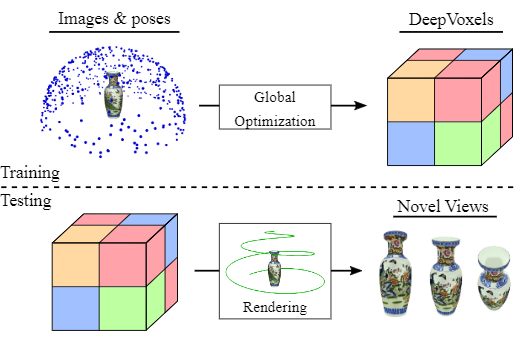
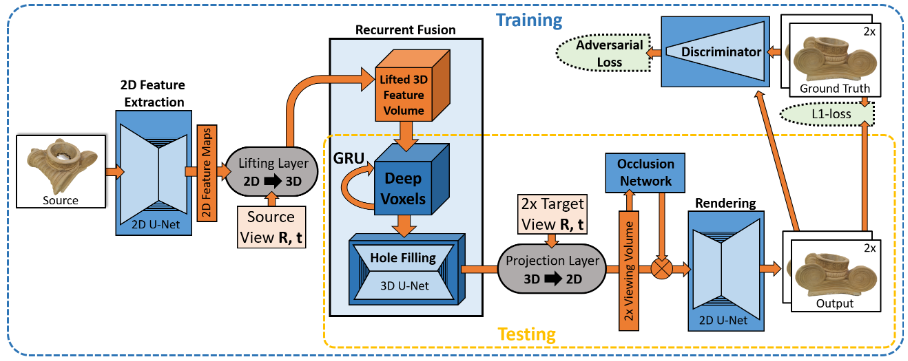
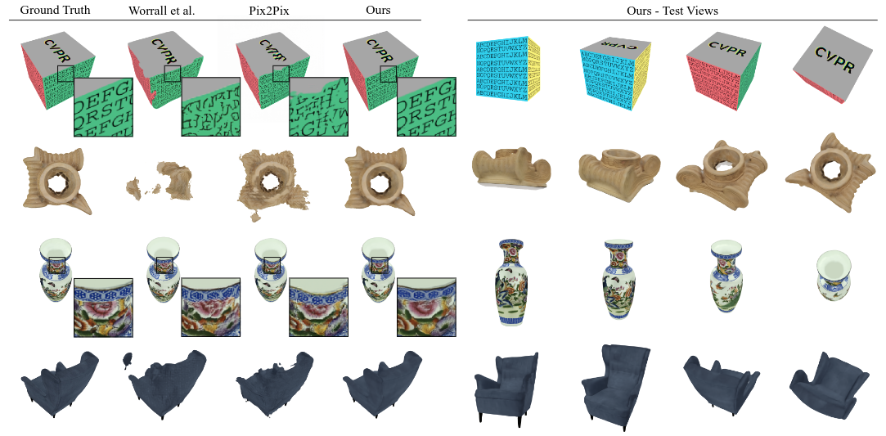
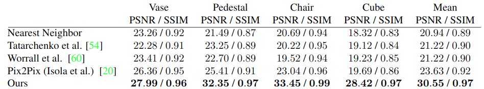

# DeepVoxels: Learning Persistent 3D Feature Embeddings

Cite: [Sitzmann, Vincent, Justus Thies, Felix Heide, Matthias Nießner, Gordon Wetzstein, and Michael Zollhöfer. 2018. “DeepVoxels: Learning Persistent 3D Feature Embeddings.” arXiv [cs.CV]. arXiv. http://arxiv.org/abs/1812.01024.](https://arxiv.org/abs/1812.01024)  
Implementation: [Project page](https://www.vincentsitzmann.com/deepvoxels/)  

## どんなもの?
> In this work, we address the lack of 3D understanding of generative neural networks by introducing a persistent 3D feature embedding for view synthesis. To this end, we propose DeepVoxels, a learned representation that encodes the view-dependent appearance of a 3D scene without having to explicitly model its geometry. (Abst.)

> Figure 1: During training, we learn a persistent DeepVoxels rep-resentation that encodes the view-dependent appearance of a 3D scene from a dataset of posed multi-view images (top). At test time, DeepVoxels enable novel view synthesis (bottom)

## 先行研究と比べてどこがすごいの?
DeepVoxels can generate high-quality novel veiw that depends on the view in 3D space. Also, the method does not need scene geometric data such as depth image.

> Note, our approach is based only on a set of registered multi-view images and we do not have access to the scene geometry or depth maps, rather our approach learns automatically to resolve the depth ambiguity based on a gated recurrent network in 3D. (Sect. 3.2)

## 技術や手法のキモはどこ? or 提案手法の詳細
The mechanism from Lifting Layer to Occulusion Network is the main part of the proposal (fig. 2). In this mechanism, feature embeddings of 3D voxel shapes are created from multiple 2D (image formats) and new view images are generated based on these embeddings.

> Figure 2: Overview of all model components. At the heart of our encoder-decoder based architecture is a novel viewpoint-invariant and persistent 3D volumetric scene representation called DeepVoxels that enforces spatial structure on the learned per-voxel code vectors. 

## どうやって有効だと検証した?
> We evaluate model performance on synthetic data obtained from rendering 4 high-quality 3D scans (see Fig. 4). (Sect. 4)

> Figure 4: Left: Comparison of the best three performing models to ground truth. From Left to right: Ground truth, Worrall et al. [60], Isola et al. [20] (Pix2Pix), and ours. Our outputs are closest to the ground truth, performing well even in challenging cases such as the strongly foreshortened letters on the cube or the high-frequency detail of the vase. Right: Other samples of novel views generated by our model. 

>  We evaluate reconstruction error in terms of PSNR and SSIM [59]. (Sect. 4)

> Table 1: Quantitative comparison to four baselines. Our approach obtains the best results in terms of PSNR and SSIM on all objects. 

## 議論はある?
省略

## Reference
1. [なし]()

## Note
なし

## key-words
##### CV, RGB_Image, Novel_View_Synthesis, Rendering, Multi-View
