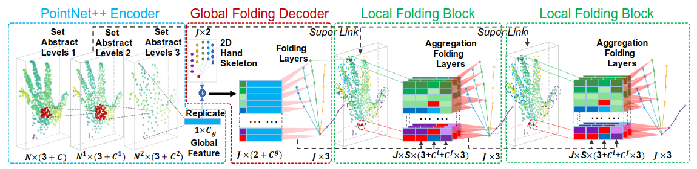
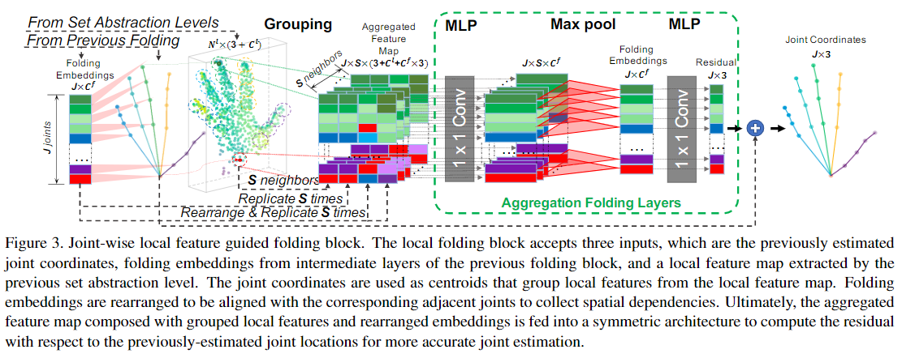

# HandFoldingNet: A 3D Hand Pose Estimation Network Using Multiscale-Feature Guided Folding of a 2D Hand Skeleton

Cite: [Cheng, Wencan, Jae Hyun Park, and Jong Hwan Ko. 2021. “HandFoldingNet: A 3D Hand Pose Estimation Network Using Multiscale-Feature Guided Folding of a 2D Hand Skeleton.” In Proceedings of the IEEE/CVF International Conference on Computer Vision, 11260–69.](https://arxiv.org/abs/2108.05545)  
Implementation: [cwc1260/HandFold](https://github.com/cwc1260/HandFold)  

## どんなもの?
> With increasing applications of 3D hand pose estimation in various human-computer interaction applications, convolution neural networks (CNNs) based estimation models have been actively explored. However, the existing models require complex architectures or redundant computational resources to trade with the acceptable accuracy. To tackle this limitation, this paper proposes HandFoldingNet, an accurate and efficient hand pose estimator that regresses the hand joint locations from the normalized 3D hand point cloud input.

## 先行研究と比べてどこがすごいの?
### Existing pose estiomation
- 2D CNNs method (with depth image)
    > However, 2D CNNs cannot fully take advantage of 3D spatial information of the depth image, which is essential for achieving high accuracy.
- 3D CNNs method with 3D voxels
    > However, its critical limitation is the cubic growth of memory consumption with an increase in the image resolution [31]. Thus, application of 3D CNNs has been limited to low-resolution images, which may lead to lose of critical details for estimation. 
- PointNet-based model with regression or detection
    - Regression based method
        > The regression-based methods process only a sin-gle global feature, which is not sufficient for highly com-plex mapping into 3D hand poses.  
    - Detection based method
        > On the other hand, the detection-based methods propagate hierarchical features to each point including the points that contribute little to the specific joint estimation. Therefore, this redundant feature propagation significantly increases the computational cost and slows down the estimation. 

### Propose method
model idea: 
> The key idea of HandFoldingNet is to fold a 2D hand skeleton into the 3D pose, guided by multi-scale features extracted from both global and local information.

modules in the propose method:
> Utilization of local features is supposed to compensate for the weakness of conventional regression-based methods. Additionally, unlike the detection-based methods that propagate local features to all the points, we only extract a small region of local features near each joint, in order to avoid massive computations.

## 技術や手法のキモはどこ? or 提案手法の詳細
The propose consept is based on FoldingNet:
> The motivation of adopting the folding-based design in FoldingNet [45] is that it is suitable for a 3D hand pose estimation task. Essentially, a specific hand pose is a result of applying a force on the human hand skeleton. The folding operation can be interpreted as emulating the ”force” applied to the fixed 2D hand skeleton, as shown in Figure 1.

> Figure 1. Illustration of the folding concept. The network can be interpreted as emulating the ”force” through multi-scale features extracted from the point cloud. The ”force” will drive a 2D hand skeleton to ”fold” into the 3D joint coordinates representing the hand pose. 

### Architecture

> Figure 2. The HandFoldingNet architecture. It takes the preprocessed normalized point cloud with surface normal vectors from a2D depth image as an input. The hierarchical PointNet encoder is then exploited to extract features of various levels to summarize a global feature from the input point cloud. The global folding decoder receives the global feature to guide the folding of a pre-defined 2D hand skeleton into the initial joint coordinates. In the end, the local features near the initial joint coordinates are grouped and fed into the local folding blocks to estimate the accurate joint coordinates. 

### The two novel modules in propose models
- global-feature guided folding (global folding) decoder  
    > The proposed decoder folds a fixed 2D hand skeleton into the 3D coordinates of joints, being guided by a global feature.
- joint-wise local-feature guided folding (local folding) block  
    
    > Figure 3. Joint-wise local feature guided folding block. The local folding block accepts three inputs, which are the previously estimated joint coordinates, folding embeddings from intermediate layers of the previous folding block, and a local feature map extracted by the previous set abstraction level. The joint coordinates are used as centroids that group local features from the local feature map. Folding embeddings are rearranged to be aligned with the corresponding adjacent joints to collect spatial dependencies. Ultimately, the aggregated feature map composed with grouped local features and rearranged embeddings is fed into a symmetric architecture to compute the residual with respect to the previously-estimated joint locations for more accurate joint estimation. 

## どうやって有効だと検証した?
> Experimental results show that the proposed model outperforms the existing methods on three hand pose benchmark datasets with the lowest model parameter requirement.

> We evaluate our network on ICVL [36], MSRA [35] and NYU [40] datasets, which are challenging benchmarks commonly used for evaluation of a 3D hand pose estimation task.

## 議論はある?
省略

## Reference
1. [Yang, Yaoqing, Chen Feng, Yiru Shen, and Dong Tian. 2018. “Foldingnet: Point Cloud Auto-Encoder via Deep Grid Deformation.” In Proceedings of the IEEE Conference on Computer Vision and Pattern Recognition, 206–15.](https://openaccess.thecvf.com/content_cvpr_2018/html/Yang_FoldingNet_Point_Cloud_CVPR_2018_paper.html)

## Note
なし

## key-words
##### CV, Point_Cloud, Supervised_Learning, Pose_Estimation
