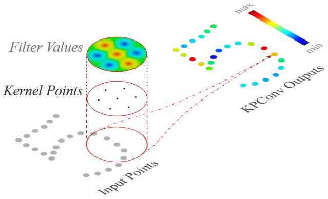
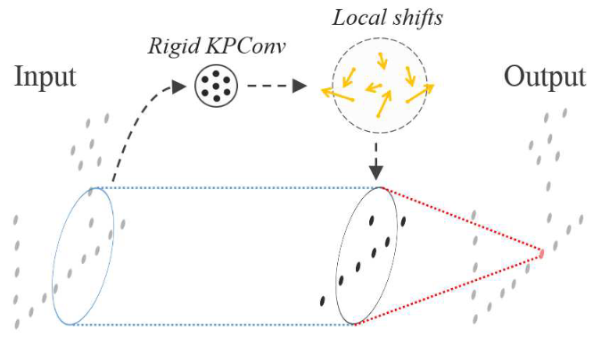
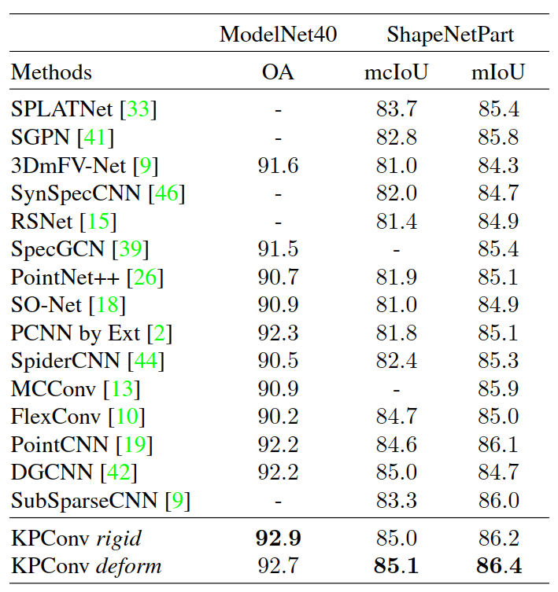
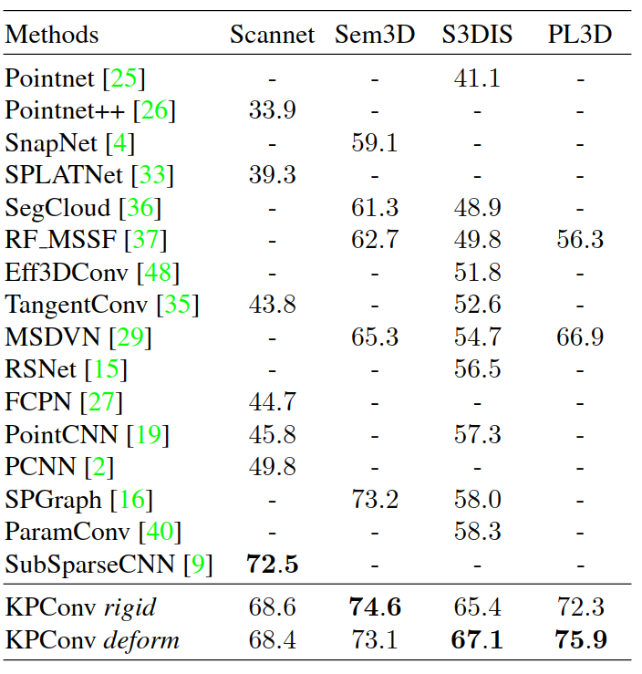

# KPConv: Flexible and Deformable Convolution for Point Clouds

Update: 2023/06/26

## Info
- Paper: [arxiv.org](https://arxiv.org/abs/1904.08889)
  - Submission date: 2019/04/18
  - Authors: Hugues Thomas, Charles R. Qi, Jean-Emmanuel Deschaud, Beatriz Marcotegui, François Goulette, Leonidas J. Guibas
  - Conf.: ICCV 2019
- Implementation: [HuguesTHOMAS/KPConv-PyTorch](https://github.com/HuguesTHOMAS/KPConv-PyTorch) or [HuguesTHOMAS/KPConv](https://github.com/HuguesTHOMAS/KPConv)
  - framework: Pytorch, Tensorflow
  - Official code: Yes
  - License: MIT License, MIT License
- Keywords: CV, Point Cloud, Semantic Segmentation, Classification, Part Segmentation

## How to build with docker and run the model in a docker container
This documentation describes the Pytorch version. The docker environment is as follows:
- CPU: Intel® Core™ i9-9900K CPU @ 3.60GHz × 16 
- GPU: NVIDIA GeForce RTX 2080 Ti
- Memory: 64 GiB
- Capacity: 1 TB

### 1. Create a docker container
```bash
# Set this repository absolute path (ex: /home/user/obarads.github.io)
OGI_DIR_PATH=/path/to/obarads.github.io

# Create a base image with cuda 10.0, cudnn 7.6, and ubuntu 18.04
BASE_IMAGE=ogi_cuda:cuda10.0_cudnn7.6_ubuntu18.04
docker build . -t $BASE_IMAGE  -f $OGI_DIR_PATH/public/data/envs/cuda/cuda10.0_cudnn7.6_ubuntu18.04/Dockerfile 

# Clone the repository
git clone https://github.com/HuguesTHOMAS/KPConv-PyTorch
# Move to KPConv-PyTorch
cd KPConv-PyTorch
# Switch to 2023/05/03 ver.
git switch -d 680296878d238e6bdb798c190120062a46f492d1
# Copy a folder for building env.
cp -r $OGI_DIR_PATH/public/data/envs/KFaDCfPC/ ./dev_env

# Create docker image and container
docker build . -t kpconv -f ./dev_env/Dockerfile --build-arg UID=$(id -u) --build-arg GID=$(id -g) --build-arg BASE_IMAGE=$BASE_IMAGE
docker run -dit --name kpconv --gpus all --shm-size 16g -v $PWD:/workspace kpconv
```

### 2. Setup in the docker container
In a docker container:
```bash
cd /workspace

sh dev_env/poetry.sh
source ~/.bashrc

cd cpp_wrappers
sh compile_wrappers.sh
```

### 3. Setup the dataset
In a docker container:
```bash
cd /workspace
wget https://shapenet.cs.stanford.edu/media/modelnet40_normal_resampled.zip --no-check-certificate
sudo mkdir /Data/
unzip modelnet40_normal_resampled.zip
sudo mv modelnet40_normal_resampled /Data/ModelNet40
```

### 4. Run a model
In a docker container:
```bash
cd /workspace
python train_ModelNet40.py
```

## どんなもの?
### 新規の点畳込み演算子、Kernel Point Convolution (KPConv)を提案した。
- >  KPConv also consists of a set of local 3D filters, but overcomes previous point convolution limitations as shown in related work.
  - "previous point convolution" are Projection networks, Graph convolution networks, Pointwise MLP networks, Point convolution networks.
  - > PCNN [2] design is the closest to KPConv.
- > KPConv is inspired by image-based convolution, but in place of kernel pixels, we use a set of kernel points to define the area where each kernel weight is applied, like shown in Figure 1.
- > Furthermore, we propose a deformable version of our convolution [7], which consists of learning local shifts applied to the kernel points (see Figure 3).


> Figure 1. KPConv illustrated on 2D points. Input points with a constant scalar feature (in grey) are convolved through a KPConv that is defined by a set of kernel points (in black) with filter weights on each point.


> Figure 3. Deformable KPConv illustrated on 2D points.

## どうやって有効だと検証した?
他モデルと比べた際の結果は以下の通り。

### 3D shape Classificaton (ModelNet40)とPart Segmentation(ShapeNetPart)による精度実験

> Table 1. 3D Shape Classification and Segmentation results. For generalizability to real data, we only consider scores obtained without shape normals on ModelNet40 dataset. The metrics are overall accuracy (OA) for Modelnet40, class average IoU (mcIoU) and instance average IoU (mIoU) for ShapeNetPart.

### 3D Scene Semantic Segmentation (ScanNet, Semantic 3D, S3DIS, Paris-Lille-3D)による精度検証

> 3D scene segmentation scores (mIoU). Scannet, Semantic3D and Paris-Lille-3D (PL3D) scores are taken from their respective online benchmarks (reduced-8 challenge for Seman- tic3D). S3DIS scores are given for Area-5 (see supplementary material for k-fold).

## 論文関連リンク
- [2] Matan Atzmon, Haggai Maron, and Yaron Lipman. Point convolutional neural networks by extension operators. ACM Transactions on Graphics (TOG), 37(4):71, 2018.
- [7] Jifeng Dai, Haozhi Qi, Yuwen Xiong, Yi Li, Guodong Zhang, Han Hu, and Yichen Wei. Deformable convolutional networks. In Proceedings of the IEEE international Confer- ence on Computer Vision, pages 764–773, 2017.
