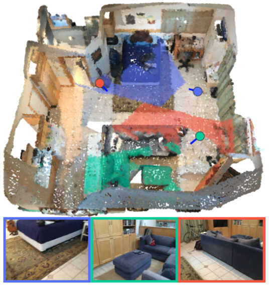
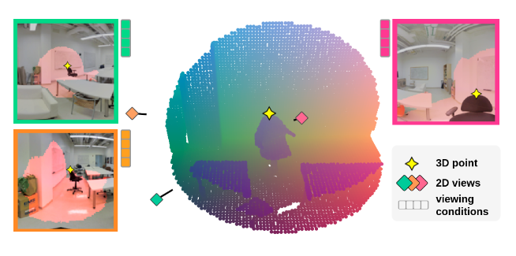
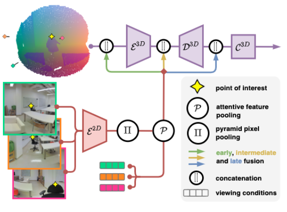
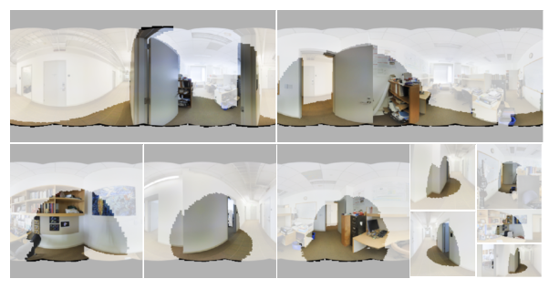
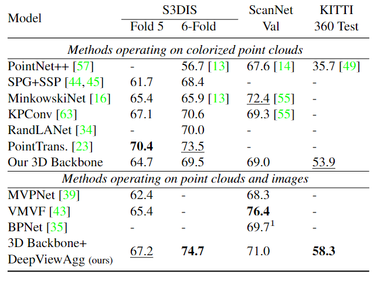

# Learning Multi-View Aggregation In the Wild for Large-Scale 3D Semantic Segmentation

Cite: [Robert, Damien, Bruno Vallet, and Loic Landrieu. 2022. “Learning Multi-View Aggregation In the Wild for Large-Scale 3D Semantic Segmentation.” arXiv [cs.CV]. arXiv. http://arxiv.org/abs/2204.07548.](https://arxiv.org/abs/2204.07548)  
Implementation: [drprojects/DeepViewAgg](https://github.com/drprojects/DeepViewAgg)  

## どんなもの?
The author proposes the aggregation method that merges 2D color image features with 3D point features with point-pixel mapping. This mapping uses camera pose information but does not use true depth maps of 2D color images or mesh on 3D points.. Also, this method can handle an arbitrary number of images per point taken at any position.

> Figure 1. Combining 2D and 3D Information. We propose to merge the complementary information between point clouds and a set of co-registered images. Using a simple visibility model, we can project 2D features onto the 3D points and use viewing conditions to select features from the most relevant images. We represent images at their position with the symbol and color the 3D points according to the image they are seen in.

symbol is .

## 先行研究と比べてどこがすごいの?
skip a section

## 技術や手法のキモはどこ? or 提案手法の詳細
The key point is that the authors proposed and used attention modules (Sect. 3.2), which estimate each compatible point-image pair based on viewing conditions. Fig.3 show relationships between 3D point and pixel on green image or pink image as the compatible point-image pair.

> Figure 3. Multi-View Information. A 3D point is seen in several images with different insights. Here, the green image contains contextual information, while the pink image captures the local texture. The orange image sees the point at a slanted angle and may contain no additional relevant information. 

The proposed multi-view aggregation module is the following fig.

> Bimodal 2D/3D Architecture. Using our multi-view aggregation module, we combine a 2D convolutional encoder $\mathcal{E}^{2 \mathrm{D}}$ and a 3D network composed of an encoder $\mathcal{E}^{3 \mathrm{D}}$ , a decoder $\mathcal{D}^{3 \mathrm{D}}$ , and a classifier $\mathcal{C}^{3 \mathrm{D}}$ . We associate relevant 2D features to each 3D point according to their viewing conditions in each compatible image. We propose three different 2D/3D fusion strategies: early (our choice in the experiments), intermediate, and late fusion. 

It also proposed a way to reduce the computational complexity when calculating 2D image features. (fig. 5)

> Figure 5. Dynamic Batching. We can improve the quantity of information contained in each training batch by cropping images around the sampled point clouds. We represent a set of 10 images with different crop size fitting in a budget of pixels corresponding to 4 full-size images. 

## どうやって有効だと検証した?
In this paper, the authors evaluate the proposed method with S3DIS, ScanNet, KITTI-360.

> Table1.Quantitative Evaluation.MeanIntersection-over-Union of different state-of-the-art methods on S3DIS’s Fold 5 and 6-fold, ScanNet Val, and KITTI-360 Test. All methods except the last line are trained on colorized point clouds.State-of-the-art, second highest. $^1$ with 3D supervision only. 

## 議論はある?
skip a section

## Reference
1. [なし]()

## Note
なし

## key-words
##### CV, RGB_Image, Point_Cloud, Semantic_Segmentation, Multi-View

