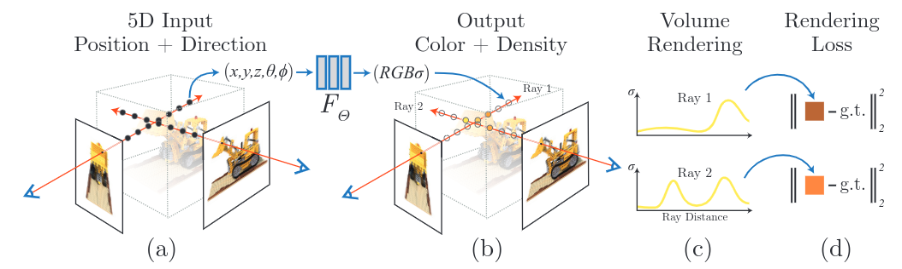

# NeRF: Representing Scenes as Neural Radiance Fields for View Synthesis

Cite: [Mildenhall, Ben, Pratul P. Srinivasan, Matthew Tancik, Jonathan T. Barron, Ravi Ramamoorthi, and Ren Ng. 2020. “NeRF: Representing Scenes as Neural Radiance Fields for View Synthesis.” arXiv [cs.CV]. arXiv. http://arxiv.org/abs/2003.08934.](https://arxiv.org/abs/2003.08934)  
Implementation: [TensorFlow (official)](https://github.com/bmild/nerf), [Pytorch](https://github.com/yenchenlin/nerf-pytorch)  

## どんなもの?
The authors proposed the rendering method using neural radiance field. The neural radiance field in the paper links viewing direction ($\theta, \phi$) and a position ($x, y, z$) on the camera ray to the color (RGB) and volume density ($\sigma$) on $x, y, z$ with deep learning ($F_\Theta$).

> Fig. 2: An overview of our neural radiance field scene representation and differentiable rendering procedure. We synthesize images by sampling 5D coordinates (location and viewing direction) along camera rays (a), feeding those locations into an MLP to produce a color and volume density (b), and using volume rendering techniques to composite these values into an image (c). This rendering function is differentiable, so we can optimize our scene representation by minimizing the residual between synthesized and ground truth observed images (d).

## 先行研究と比べてどこがすごいの?

## 技術や手法のキモはどこ? or 提案手法の詳細

## どうやって有効だと検証した?

## 議論はある?

## Reference
1. [なし]()

## Note
なし

## key-words
##### CV, RGB_Image, Novel_View_Synthesis, Rendering, Multi-View, WIP_article

