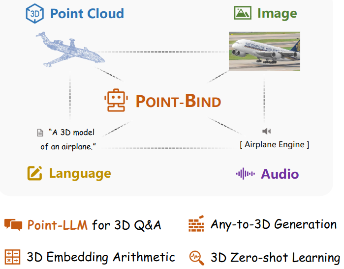
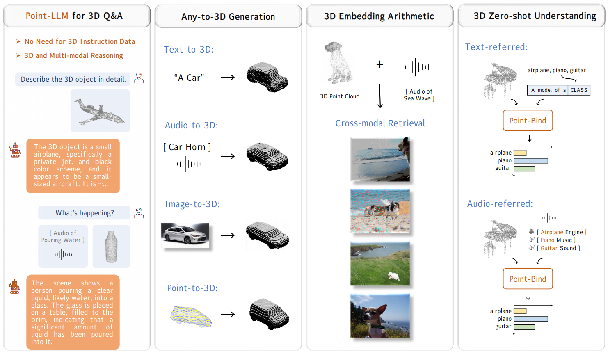
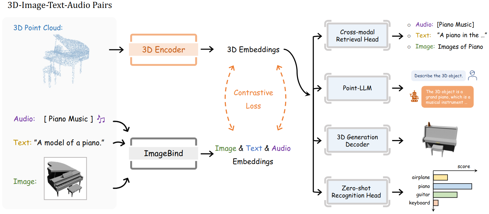
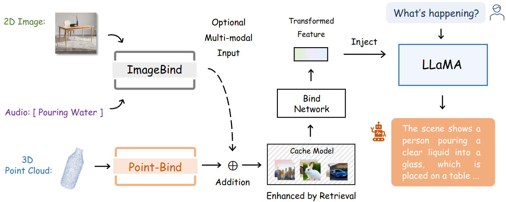
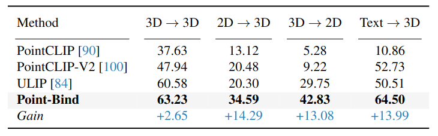

# Point-Bind & Point-LLM: Aligning Point Cloud with Multi-modality for 3D Understanding, Generation, and Instruction Following

Update: 2023/09/09

## ℹ️ Info
- Paper: [arxiv.org](https://arxiv.org/abs/2309.00615)
  - Submission date: 2023/09/01
  - Authors: Ziyu Guo, Renrui Zhang, Xiangyang Zhu, Yiwen Tang, Xianzheng Ma, Jiaming Han, Kexin Chen, Peng Gao, Xianzhi Li, Hongsheng Li, Pheng-Ann Heng
  - Conf.: ??
- Implementation: [ZiyuGuo99/Point-Bind_Point-LLM](https://github.com/ZiyuGuo99/Point-Bind_Point-LLM)
  - framework: Pytorch
  - Official code: Yes
  - License: MIT License
- Keywords: CV, Audio, NLP, Point_Cloud, RGB_Image, LLM, Multi-Modality

## 🖥️ Setup commands to run the implementation
Tested on:
- GPU: RTX2080ti

### 1. Create a docker container
```bash
# Set this repository absolute path (ex: /home/user/obarads.github.io)
git clone https://github.com/Obarads/obarads.github.io.git
cd obarads.github.io
OGI_DIR_PATH=$PWD

# Get a base image
BASE_IMAGE=nvidia/cuda:11.8.0-cudnn8-devel-ubuntu22.04
docker pull $BASE_IMAGE

# Create and move to a container dir
mkdir containers
cd containers
# Clone the repository
git clone https://github.com/ZiyuGuo99/Point-Bind_Point-LLM
# Move to the repository
cd Point-Bind_Point-LLM
# Switch to 2023/09/08 ver.
git switch -d 5d16bfccb4b12bdfb0243342ee496f4ae58b17ee
# Copy a folder for building env.
cp -r $OGI_DIR_PATH/environments/P\&PAPCwMf3UGaIF/ ./dev_env

# Create docker image and container
docker build . -t point-bind_point-llm -f ./dev_env/Dockerfile --build-arg UID=$(id -u) --build-arg GID=$(id -g) --build-arg BASE_IMAGE=$BASE_IMAGE
docker run -dit --name point-bind_point-llm --gpus all -v $PWD:/workspace point-bind_point-llm
```

### 2. Setup packages
In a docker container:
```bash
cd /workspace

# setup python and packages
conda create -y -n Point-Bind_Point-LLM python=3.9
conda activate Point-Bind_Point-LLM
cd dev_env
pip install -r requirements.txt

# Install GPU-related packages
pip install "git+https://github.com/erikwijmans/Pointnet2_PyTorch.git#egg=pointnet2_ops&subdirectory=pointnet2_ops_lib"
pip install --upgrade https://github.com/unlimblue/KNN_CUDA/releases/download/0.2/KNN_CUDA-0.2-py3-none-any.whl
```

### 3. Setup the models
In a docker container:
```bash
cd /workspace
mkdir ckpts
cd ckpts
gdown https://drive.google.com/uc?id=1V9y3h9EPlPN_HzU7zeeZ6xBOcvU-Xj6h
gdown https://drive.google.com/uc?id=1BILH_aAGYuZOxvom8V9-n2fYW7nLGcai
```

### 4. Run the model
In a docker container:
```bash
cd /workspace
python demo_text_3d.py 
```

## 📝 Clipping and note
### どんな論文か？
- > We introduce Point-Bind, a 3D multi-modality model aligning point clouds with 2D image, language, audio, and video.
  - Figure 1 shows the data treated in Point-Bind.
  - Figure 4 shows overall pipline.
- > Furthermore, on top of our joint embedding space, we propose to incorporate Point-Bind with LLaMA [73] to develop the first 3D large language models (LLMs), termed as Point-LLM.
  - > As shown in Figure 2, our Point-LLM can respond to language instructions with 3D point cloud conditions, and effectively capture spatial geometry characteristics.
  - Figure 5 shows inference paradigm.



> Figure 1. Characteristics of Point-Bind. We propose to align 3D with multi-modalities and develop a unified framework, Point-Bind, which extends various 3D multi-modal applications. Based on Point-Bind, we further introduce Point-LLM, a 3D large language model with bilingual 3D instruction-following capacity.



> Figure 2. 3D Multi-modal Applications of Point-Bind. With a joint 3D multi-modal embedding space, Point-Bind enables many promising application scenarios, e.g., Point-LLM for 3D instruction following, 3D generation conditioned on any modalities, embedding-space arithmetic with 3D, and multi-modal 3D zero-shot understanding.



> Figure 4. Overall Pipeline of Point-Bind. We collect 3D-image-audio-text data pairs for contrastive learning, which aligns 3D modality with others guided ImageBind [22].  With a joint embedding space, Point-Bind can be utilized for 3D cross-modal retrieval, any-to-3D generation, 3D zero-shot understanding, and developing a 3D large language model, Point-LLM.



> Figure 5. Inference Paradigm of Point-LLM. Referring to ImageBind-LLM [19], we adopt a bind network, a visual cache model, and zero-initialized gating mechanisms to fine-tune LLaMA [73] to follow 3D instructions.  Optionally, our Point-LLM can also take as input multi-modality data, and conduct cross-modal reasoning for language response.

### 新規性
- Point-Bind
  - > Aligning 3D with ImageBind. Within a joint embedding space, Point-Bind firstly aligns 3D point clouds with multi-modalities guided by ImageBind, including 2D images, video, language, audio, etc.
  - > Any-to-3D Generation. Based on existing text-to-3D generative models, Point-Bind enables 3D shape synthesis conditioned on any modalities, i.e., text/image/audio/point-to-mesh generation.
  - > 3D Embedding-space Arithmetic. We observe that 3D features from Point-Bind can be added with other modalities to incorporate their semantics, achieving composed cross-modal retrieval.
  - > 3D Zero-shot Understanding. Point-Bind attains state-of-the-art performance for 3D zero-shot classification. Also, our approach supports audio-referred 3D open-world understanding, besides text reference.
- Point-LLM
  - > Point-LLM for 3D Question Answering. Using Point-Bind, we introduce Point-LLM, the first 3D LLM that responds  to  instructions  with  3D  point  cloud  conditions, supporting both English and Chinese.
  - > Data- and Parameter-efficiency. We only utilize public  vision-language  data  for  tuning  without  any  3D instruction  data,  and  adopt  parameter-efficient  finetuning techniques, saving extensive resources.
  - > 3D  and  Multi-modal  Reasoning. Via  the  joint  embedding space, Point-LLM can generate descriptive responses by reasoning a combination of 3D and multi-modal input, e.g., a point cloud with an image/audio.

### 結果
- Point-LLM for 3D Q&A
  - > In Figure 3, we provide the question-answering examples of Point-LLM, which shows favorable 3D instruction-following and multi-modal reasoning capacity.
- 3D Cross-modal Retrieval with ModelNet40
  - > In Table 1, we report the quantitive results for 3D zero-shot retrieval, where Point-Bind attains state-of-the-art performance on all benchmarks compared with prior works.


> Figure 3. 3D Question-answering Examples of Point-LLM. Given 3D and multi-modal instructions, our Point-LLM can effectively generate detailed responses and conduct superior cross-modal reasoning. Notably, we do not need any 3D instruction data for training.



> Table 1. Performance on 3D Cross-modal Retrieval, including 3D-to-3D, 2D-to-3D, 3D-to-2D, and text-to-3D retrieval. We report the mAP scores (%) on ModelNet40 [80] dataset.

### Other experiments
Embedding-space Arithmetic with 3D, Any-to-3D Generation, 3D Zero-shot Understanding, Ablation Study

## 📚 論文関連リンク
- [] 

