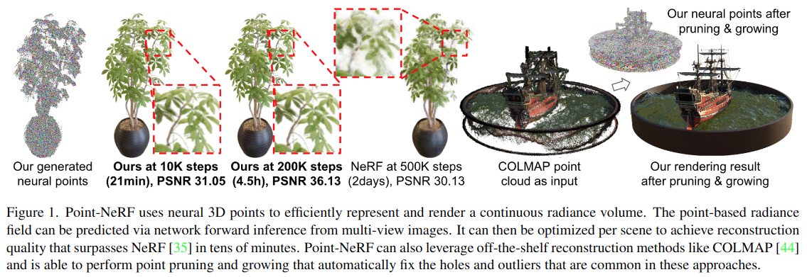

# Point-NeRF: Point-based Neural Radiance Fields

Cite: [Xu, Qiangeng, Zexiang Xu, Julien Philip, Sai Bi, Zhixin Shu, Kalyan Sunkavalli, and Ulrich Neumann. 2022. “Point-NeRF: Point-Based Neural Radiance Fields.” arXiv [cs.CV]. arXiv. http://arxiv.org/abs/2201.08845.](https://arxiv.org/abs/2201.08845)  
Implementation: [Xharlie/pointnerf](https://github.com/Xharlie/pointnerf)  

## どんなもの?
The authors propose Point-NeRF, a novel point-based radiance field representation that uses 3D neural points to model a continuous volumetric radiance field. Fig. 1 shows the results of Point-NeRF.

> Figure 1. Point-NeRF uses neural 3D points to efficiently represent and render a continuous radiance volume. The point-based radiance field can be predicted via network forward inference from multi-view images. It can then be optimized per scene to achieve reconstruction quality that surpasses NeRF [35] in tens of minutes. Point-NeRF can also leverage off-the-shelf reconstruction methods like COLMAP [44] and is able to perform point pruning and growing that automatically fix the holes and outliers that are common in these approaches. 

## 先行研究と比べてどこがすごいの?
By using point clouds, Point-NeRF can avoid sampling points in the vast empty space, and leads to faster radiance field reconstruction than the existing NeRF method with 2D image. Also, Point-NeRF uses point clouds with scene geometry so lead to better quality than NeRF.

## 技術や手法のキモはどこ? or 提案手法の詳細
> A radiance field represents the volume density $\sigma$ and view-dependent radiance $r$ at any 3D location. NeRF [35] proposes to use a multi-layer perceptron (MLP) to regress such radiance fields. We propose Point-NeRF that instead utilizes a neural point cloud to compute the volume properties, allowing for faster and higher-quality rendering. (Sect. 3)

## どうやって有効だと検証した?
省略

## 議論はある?
省略

## Reference
1. [なし]()

## Note
なし

## key-words
##### CV, Point_Cloud, Mesh, Depth_Image, Reconstruction, Rendering

