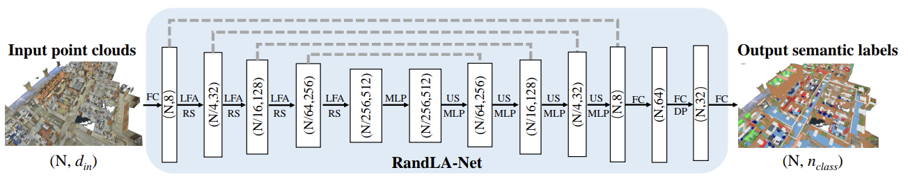
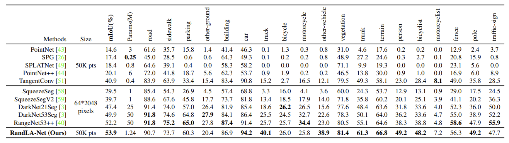

# RandLA-Net: Efficient Semantic Segmentation of Large-Scale Point Clouds

Update: 2023/06/22

## ℹ️ Info
- Paper: [arxiv.org](https://arxiv.org/abs/1911.11236)
  - Submission date: 2019/11/25
  - Authors: Qingyong Hu, Bo Yang, Linhai Xie, Stefano Rosa, Yulan Guo, Zhihua Wang, Niki Trigoni, Andrew Markham
  - Conf.: CVPR 2020
- Implementation: [QingyongHu/RandLA-Net](https://github.com/QingyongHu/RandLA-Net)
  - framework: Tensorflow
  - Official code: Yes
  - License: Attribution-NonCommercial-ShareAlike 4.0 International
- Keywords: CV, Point Cloud, Semantic Segmentation

## 🖥️ Setup commands to run the implementation
### 1. Create a docker container
```bash
# Set this repository absolute path (ex: /home/user/obarads.github.io)
git clone https://github.com/Obarads/obarads.github.io.git
cd obarads.github.io
OGI_DIR_PATH=$PWD

# Create a base image with cuda 9.0, cudnn 7.6, and ubuntu 16.04
ENV_VERSION=cuda9.0_cudnn7.6_ubuntu16.04
BASE_IMAGE=ogi_cuda:$ENV_VERSION
docker build . -t $BASE_IMAGE  -f $OGI_DIR_PATH/public/data/envs/cuda/$ENV_VERSION/Dockerfile 

# Create and move to a container dir
mkdir containers
cd containers
# Clone the repository
git clone https://github.com/QingyongHu/RandLA-Net
# Move to RandLA-Net
cd RandLA-Net
# Switch to 2021/07/02 ver.
git switch -d 6b5445f5f279d33d2335e85ed39ca8b68cb1c57e
# Copy a folder for building env.
cp -r $OGI_DIR_PATH/environments/RESSoLPC/ ./dev_env

# Create docker image and container
docker build . -t randla_net -f ./dev_env/Dockerfile --build-arg UID=$(id -u) --build-arg GID=$(id -g) --build-arg BASE_IMAGE=$BASE_IMAGE
docker run -dit --name randla_net --gpus all -v $PWD:/workspace randla_net
```

### 2. Setup packages
In a docker container:
```bash
cd /workspace

conda create -n randlanet python=3.6 # for PyYAML=5.4
conda activate randlanet

cd dev_env
pip install -r requirements.txt 

cd ../
sh compile_op.sh
```

### 3. Setup the dataset
Please refer to [the section of README.md](https://github.com/QingyongHu/RandLA-Net/tree/6b5445f5f279d33d2335e85ed39ca8b68cb1c57e#2-s3dis) for the [S3DIS dataset](https://docs.google.com/forms/d/e/1FAIpQLScDimvNMCGhy_rmBA2gHfDu3naktRm6A8BPwAWWDv-Uhm6Shw/viewform?c=0&w=1) preparation (`/data/S3DIS/Stanford3dDataset_v1.2_Aligned_Version/` dir) into the docker container, and then run the following commands :
```bash
# setup a dataset for semantic segmentation
sudo chmod -R 777 /data/
python utils/data_prepare_s3dis.py
```

### 4. Run a model
In a docker container:
```bash
cd /workspace
sh jobs_6_fold_cv_s3dis.sh
```

## 📝 Clipping and note
### どんなもの?
- 大規模点群に対する軽量なモデル、RandLA-Netを提案した。
- 既存の手法よりも最大200倍早い。また、100万点に対する処理も一回の入力で処理できる。これは既存の手法よりも、一度に多くの点を処理できることを示す。
  - lage-scale点群を処理する手法はあるが、これらはボクセル化やSPG化などの前処理で時間がかかる。
- 複雑な点選択アプローチの代わりにランダムサンプリングを使用することがこのアイデアの重要な点である。
- 提案するモジュールは図3の通り。これを利用したネットワークであるRandLA-Netは図7の通り。
  - 本提案では、余分なメモリを必要とせず、計算コストが圧倒的に低いランダムサンプリング($\mathcal{O}(1)$)を使用する。
  - ランダムサンプリングは有用な点特徴を捨ててしまう恐れがあるため、問題を克服するために、ローカル特徴集約機構であるLocal Feature Aggregationモジュールを提案する。


> Figure 3. The proposed local feature aggregation module. The top panel shows the location spatial encoding block that extracts features, and the attentive pooling mechanism that weights the most important neighbouring features, based on the local context and geometry. The bottom panel shows how two of these components are chained together, to increase the receptive field size, within a residual block.



> Figure 7. The detailed architecture of our RandLA-Net. (N, D) represents the number of points and feature dimension respectively. FC: Fully Connected layer, LFA: Local Feature Aggregation, RS: Random Sampling, MLP: shared Multi-Layer Perceptron, US: Up-sampling, DP: Dropout.

### どうやって有効だと検証した?
- SemanticKITTIによるセグメンテーション検証 (table 2)
- Semantic3Dによるセグメンテーション検証 (table 3)


> Table 2. Quantitative results of different approaches on Semantic3D (reduced-8) [17]. Only the recent published approaches are compared. Accessed on 31 March 2020.



> Table 3. Quantitative results of different approaches on SemanticKITTI [3]. Only the recent published methods are compared and all scores are obtained from the online single scan evaluation track. Accessed on 31 March 2020.

## 📚 論文関連リンク
なし
