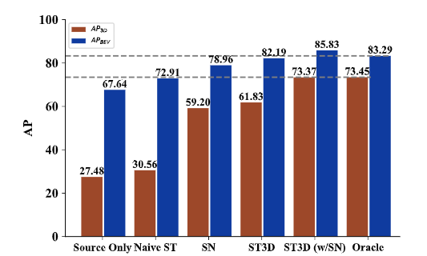
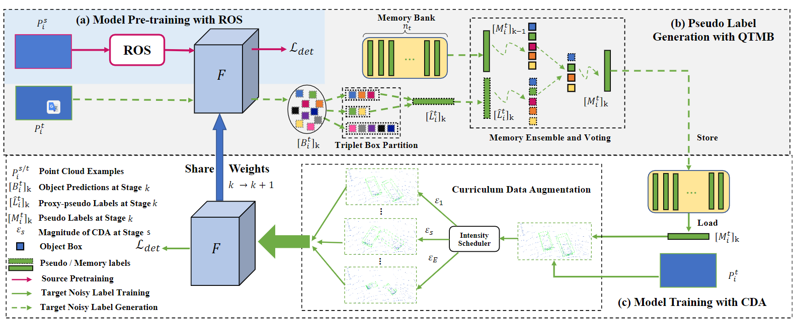
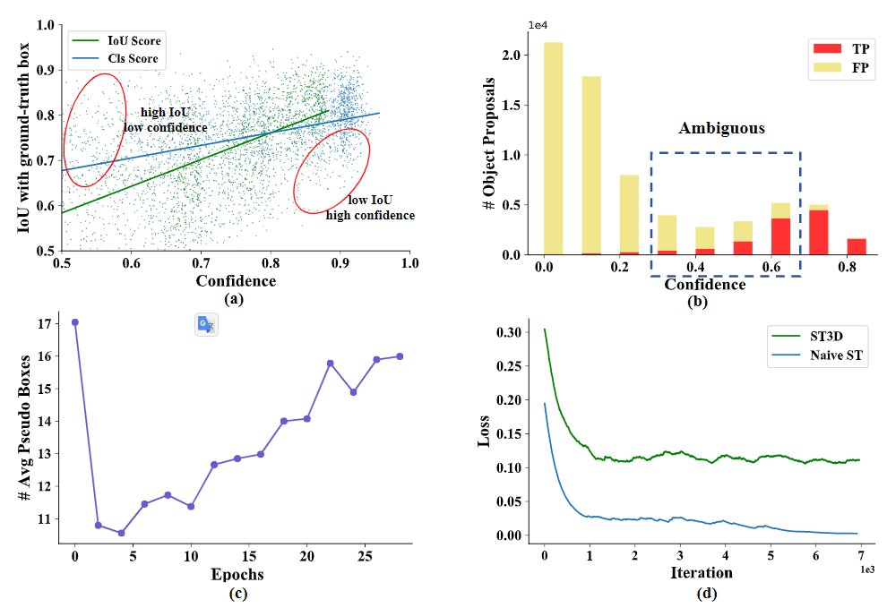

# ST3D: Self-training for Unsupervised Domain Adaptation on 3D Object Detection

Cite: [Yang, Jihan, Shaoshuai Shi, Zhe Wang, Hongsheng Li, and Xiaojuan Qi. 2021. “St3d: Self-Training for Unsupervised Domain Adaptation on 3d Object Detection.” In Proceedings of the IEEE/CVF Conference on Computer Vision and Pattern Recognition, 10368–78. openaccess.thecvf.com.](https://openaccess.thecvf.com/content/CVPR2021/html/Yang_ST3D_Self-Training_for_Unsupervised_Domain_Adaptation_on_3D_Object_Detection_CVPR_2021_paper.html)  
Implementation: [CVMI-Lab/ST3D](https://github.com/CVMI-Lab/ST3D)  

## どんなもの?
> We present a new domain adaptive self-training pipeline, named ST3D, for unsupervised domain adaptation on 3D object detection from point clouds.

## 先行研究と比べてどこがすごいの?
The authors propose an unsupervised domain adaptive 3D object detection which achieves superior performances.

### Existing method
- 2D methods: 
    > Self-training starts from pre-training a model on source labeled data and further iterating between pseudo la-bel generation and model training on unlabeled target data until convergence is achieved. The pseudo label for 3D ob-ject detection includes oriented 3D bounding boxes for lo-calization and object category information.
    
    > Despite of the encouraging results in image tasks, our study illustrates that naive self-training [44] does not work well in UDA for 3D detection as shown in Fig. 1 (“source only” vs. “naive ST”).

- SN [41] (Wang et al.):
    > Wang et al. propose SN [41] to normalize the object size of the source domain leveraging the object statistics of the target domain to close the size-level domain gap.
    
    > Though the performance has been improved, the method needs the target statistics information, and its effectiveness depends on the source and target data distributions.

  
> Figure 1. Performance of ST3D on Waymo → KITTI task using SECOND-IoU [46], compared to other unsupervised (i.e. source only, naive ST), weakly-supervised (i.e. SN [41]) and fully supervised (i.e. oracle) approaches. Dashed line denotes fully supervised target labeled data trained SECOND-IoU.

### Propose method
> In contrast, we propose a novel self-training pipeline for domain adaptive 3D ob-ject detection which achieves superior performance on all evaluated settings without target object statistics as a prior.

## 技術や手法のキモはどこ? or 提案手法の詳細
### Overview
> Starting from pre-training a detector on source labeled data with random object scaling (ROS) (see Fig. 2 (a)), ST3D alternates between generating pseudo labels for target data via quality-aware triplet memory bank (QTMB) (see Fig.2(b)) and training the detector with our curriculum data augmentation (CDA) (see Fig.2(c)) until convergence.

> Figure 2. Our ST3D framework consists of three phases: (a) Pre-train the object detectorF with ROS in source domain to mitigate object-size bias. (b) Generate high-quality and consistent pseudo labels on target unlabeled data with our QTMB. (c) Train model effectively on pseudo-labeled target data with CDA to progressively simulate hard examples. Best viewed in color.

### Processes Abstract
#### Model Pre-training with ROS
> Our ST3D starts from training a 3D object detector on labeled source data $\left\{\left(P_{i}^{s}, L_{i}^{s}\right)\right\}_{i=1}^{n_{s}}$ . The pre-trained model learns how to perform 3D detection on source labeled data and is further adopted to initialize object predictions for the target domain unlabeled data.

Motivation:
> However, despite of the useful knowledge, the pre-trained detector also learns the bias from the source data, such as object size and point densities due to domain shift. Among them, the bias in object size has direct negative impacts on 3D object detection, and results in incorrect size for pseudo-labeled target domain bounding boxes. This is also in line with the findings in [41].

> To mitigate the issue, we propose a very simple yet effective per-object aug-mentation strategy, i.e. random object scaling (ROS), fully leveraging the high degree of freedom of 3D spaces.

#### Pseudo label Generation with QTMB
> With the trained detector, the next step is to generate pseudo labels for the unlabeled target data.

Motivation:
> Different from classification and segmentation tasks, 3D object detection needs to jointly consider the classification and localization information, which poses great challenges for high-quality pseudo label generation.
- > First, the confidence of object category prediction may not necessarily reflect the precision of location as shown by the blue line in Fig.3(a).
- > Second, the fraction of false labels is much increased in confidence score intervals with medium values as illustrated in Fig. 3 (b).
- > Third, model fluctuations induce inconsistent pseudo labels as demonstrated in Fig. 3 (c). 

> To address the above challenges, we design quality-aware triplet memory bank (QTMB) to parse object pre-dictions to pseudo labels for self-training.

  

> Figure 3. (a) Correlation between confidence value and box IoU with ground-truth (b) Lots of boxes with medium confidence may be assigned with ambiguous labels. (c) The average number of pseudo boxes fluctuates at different epochs. (d) Training loss curve comparison between naive ST and our ST3D with CDA. 

#### Model training with CDA
> Our proposed QTMB can produce consistent and stable pseudo labels $\left[M_{i}^{t}\right]_{k}$ for the i-th point clouds.

Motivation:
> However, our observations show that most of positive pseudo boxes are easy examples since they are generated from previous high-confident object predictions.
- > Consequently, during training, model is prone to overfitting to these easy examples with low loss values (see Fig. 3 (d)), unable to further mine hard examples to improve the detector [2].
- > To prevent model from being trapped by bad local minimal, strong data augmentations could be an alter-native to generate diverse and potentially hard examples to improve the model. However, this might confuse the learner and hence be harmful to model training at the initial stage. 

> Motivated by the above observation, we design a curriculum data augmentation (CDA) strategy to progressively increase the intensity $\epsilon$ of data augmentation and gradually generate increasingly harder examples to facilitate improving the model and en-sure effective learning at the early stages.

## どうやって有効だと検証した?
> We conduct experiments on four widely used autonomous driving datasets: KITTI [13], Waymo [38], nuSenses [4], and Lyft [20].
> Our experiments lie in two aspects: Adaptation from label rich domains to label insufficient domains (i.e., Waymo to other datasets) and across domains with different number of the LiDAR beams (i.e., Waymo → nuScenes and nuScenes → KITTI).

## 議論はある?
省略

## Reference
1. [なし]()

## Note
なし

## key-words
##### CV, Point_Cloud, Unsupervised_Learning, Domain_Adaptation, Detection

