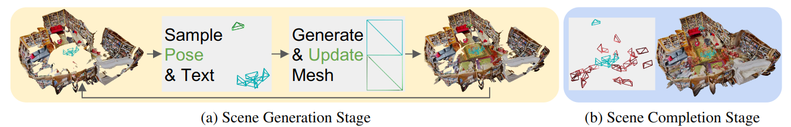
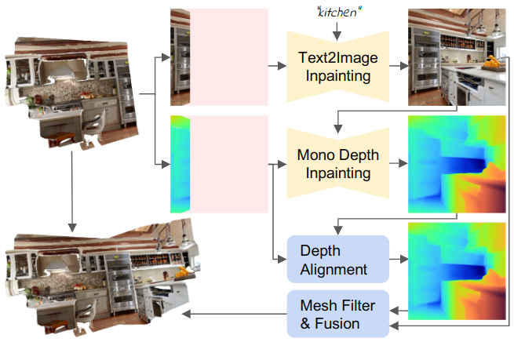
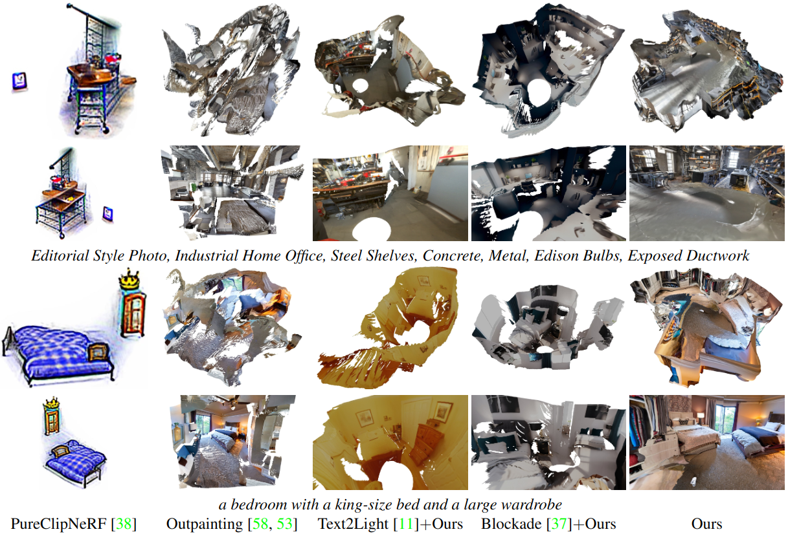
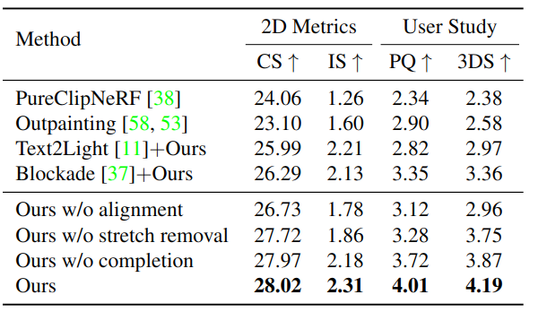

# Text2Room: Extracting Textured 3D Meshes from 2D Text-to-Image Models

Update: 2023/07/26

## ℹ️ Info
- Paper: [arxiv.org](https://arxiv.org/abs/2303.11989)
  - Submission date: 2023/03/21
  - Authors: Lukas Höllein, Ang Cao, Andrew Owens, Justin Johnson, Matthias Nießner
  - Conf.: ICCV 2023
- Implementation: [lukasHoel/text2room](https://github.com/lukasHoel/text2room)
  - framework: Pytorch
  - Official code: Yes
  - License: MIT license
- Keywords: CV, Mesh, RGB Image, Intensity Image, Scene Generation

## 🖥️ Setup commands to run the implementation
### 1. Create a docker container
```bash
# Set this repository absolute path (ex: /home/user/obarads.github.io)
git clone https://github.com/Obarads/obarads.github.io.git
cd obarads.github.io
OGI_DIR_PATH=$PWD

# Get a base image
BASE_IMAGE=nvidia/cuda:11.7.1-cudnn8-devel-ubuntu20.04
docker pull $BASE_IMAGE

# Create and move to a container dir
mkdir containers
cd containers
# Clone the repository
git clone https://github.com/lukasHoel/text2room.git
# Move to text2room
cd text2room
# Switch to 2023/07/16 ver.
git switch -d c38d97e4d418cb5a93cfdc7b89ea0e6e7bbcf20b
# Copy a folder for building env.
cp -r $OGI_DIR_PATH/environments/TET3Mf2TM/ ./dev_env

# Create docker image and container
docker build . -t text2room -f ./dev_env/Dockerfile --build-arg UID=$(id -u) --build-arg GID=$(id -g) --build-arg BASE_IMAGE=$BASE_IMAGE
docker run -dit --name text2room --gpus all -v $PWD:/workspace text2room
```

### 2. Setup packages
In a docker container:
```bash
cd /workspace

# setup python and packages
conda create -n text2room python=3.9
conda activate text2room
cd dev_env
pip install -r requirements.txt
pip install "git+https://github.com/facebookresearch/pytorch3d.git@v0.7.2"
```

### 3. Setup the models
In a docker container:
```bash
cd /workspace

mkdir checkpoints
gdown https://drive.google.com/uc?id=1mMvj0fBKPfXRjLypaDPrCidT67jutWdr -O checkpoints/
gdown https://drive.google.com/uc?id=16cNJPZgxHI2wsa5dlG1HgMD_Vl5BPTSq -O checkpoints/
```

### 4. Run the model
In a docker container:
```bash
cd /workspace
conda activate text2room
CUDA_VISIBLE_DEVICES=0 python generate_scene.py
```

## 📝 Clipping and note
### どんなもの?
- The authors present Text2Room, a method for generating textured 3D meshes of room-scale indoor scenes from a given text prompt as input.
- > In very recent concurrent work, Fridman et al. [18] create 3D scenes from text,  but  focus  on  this  type  of  3D-consistent “zoom-out” video generation. 
  - > Instead, we generate complete, textured 3D room geometry from arbitrary trajectories.
- > We visualize this workflow in Figure 2.



> Figure 2. Method overview.  We iteratively create a textured 3D mesh in two stages.  (a) First, we sample predefined poses and text to generate the complete scene layout and furniture. Each new pose (marked in green) adds newly generated geometry to the mesh (depicted by green triangles) in an iterative scene generation scheme (see Figure 3 for details).  Blue poses/triangles denote viewpoints that created geometry in a previous iteration.  (b) Second, we fill in the remaining unobserved regions by sampling additional poses (marked in red) after the scene layout is defined.



> Figure 3. Iterative scene generation. For each new pose, we ren- der the current mesh to obtain partial RGB and depth renderings. We complete both, utilizing respective inpainting models and the text prompt.  Next, we perform depth alignment (see Section 3.2) and mesh filtering (see Section 3.3) to obtain an optimal next mesh patch, that is finally fused with the existing geometry.

### どうやって有効だと検証した?
- > We  calculate CLIP Score (CS) [57] and Inception Score (IS) [68] on RGB renderings of the respective scenes.
- Qualitative Results (figure 6)
- Quantitative Results (table 1)


> Figure 5. 3D scene generation results of our method. We show color and shaded geometry renderings from generated scenes with corresponding text prompts. Our method synthesizes realistic meshes satisfying text descriptions. We remove the ceiling in the top-down view for better visualization of the scene layout.


> Table  1. Quantitative  comparison. We  report  2D  metrics and  user  study  results,  including:   Clip  Score  (CS),  Inception Score (IS), Perceptual Quality (PQ), and 3D Structure Completeness  (3DS). Our method creates scenes with the highest quality.

### Other experiments
Ablations, Application: Controllable Scene Generation, Limitations, Additional Discussion on Related Methods and Baselines, Additional Qualitative Results

## 📚 References
- [18] Rafail Fridman, Amit Abecasis, Yoni Kasten, and Tali Dekel. Scenescape:  Text-driven consistent scene generation. arXiv preprint arXiv:2302.01133, 2023.
- [57] Alec  Radford,   Jong  Wook  Kim,   Chris  Hallacy,   Aditya Ramesh,  Gabriel  Goh,  Sandhini  Agarwal,  Girish  Sastry, Amanda Askell, Pamela Mishkin, Jack Clark, et al. Learning transferable  visual  models  from  natural  language  supervi- sion. In International conference on machine learning, pages 8748–8763. PMLR, 2021.
- [68] Tim  Salimans,  Ian  Goodfellow,  Wojciech  Zaremba,  Vicki Cheung, Alec Radford, and Xi Chen.  Improved techniques for training gans. Advances in neural information processing systems, 29, 2016.
