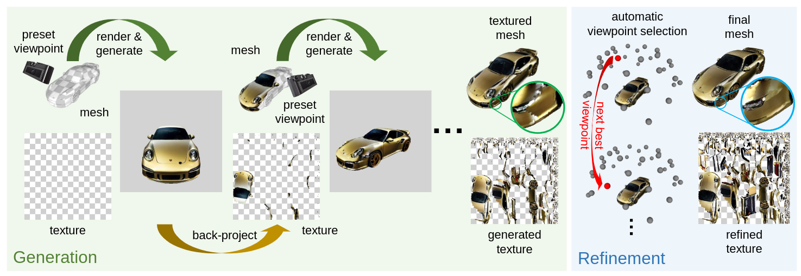
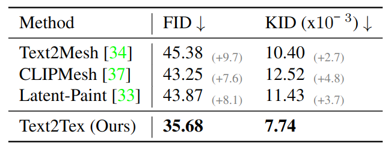
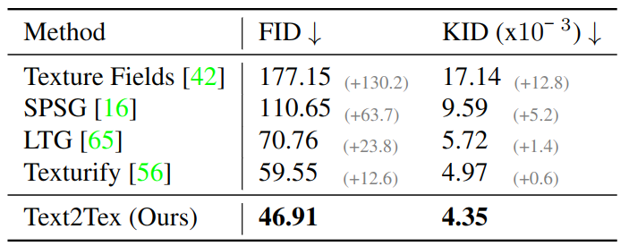
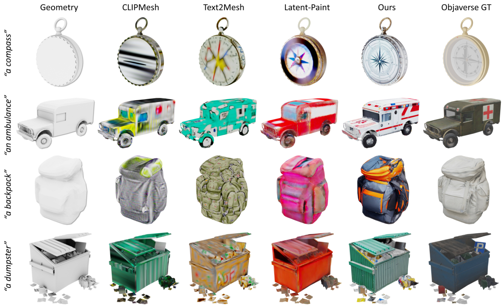
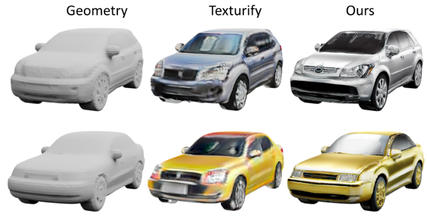

# Text2Tex: Text-driven Texture Synthesis via Diffusion Models

Update: 2023/08/13

## ℹ️ Info
- Paper: [arxiv.org](https://arxiv.org/abs/2303.11396)
  - Submission date: 2023/03/20
  - Authors: Dave Zhenyu Chen, Yawar Siddiqui, Hsin-Ying Lee, Sergey Tulyakov, Matthias Nießner
  - Conf.: ?
- Implementation: [daveredrum/Text2Tex](https://github.com/daveredrum/Text2Tex)
  - framework: Pytorch
  - Official code: Yes
  - License: licensed under a Creative Commons Attribution-NonCommercial-ShareAlike 3.0 Unported License
- Keywords: CV, Mesh, Texture Generation

## 🖥️ Setup commands to run the implementation
Tested on:
- GPU: RTX2080Ti

### 1. Create a docker container
```bash
# Set this repository absolute path (ex: /home/user/obarads.github.io)
git clone https://github.com/Obarads/obarads.github.io.git
cd obarads.github.io
OGI_DIR_PATH=$PWD

# Get a base image
BASE_IMAGE=nvidia/cuda:11.3.1-cudnn8-devel-ubuntu20.04
docker pull $BASE_IMAGE

# Create and move to a container dir
mkdir containers
cd containers
# Clone the repository
git clone https://github.com/daveredrum/Text2Tex.git
# Move to the repository
cd Text2Tex
# Switch to 2023/08/11 ver.
git switch -d 50780ae7444d41a4c561cc66404ccdb02a5c2eb3
# Copy a folder for building env.
cp -r $OGI_DIR_PATH/environments/TTTSvDM/ ./dev_env

# Create docker image and container
docker build . -t text2tex -f ./dev_env/Dockerfile --build-arg UID=$(id -u) --build-arg GID=$(id -g) --build-arg BASE_IMAGE=$BASE_IMAGE
docker run -dit --name text2tex --gpus all -v $PWD:/workspace text2tex
```

### 2. Setup packages
In a docker container:
```bash
cd /workspace

# setup python and packages
conda create -n text2tex -y python=3.9.15
conda activate text2tex
conda install pytorch==1.12.1 torchvision==0.13.1 torchaudio==0.12.1 cudatoolkit=11.3 -c pytorch
conda install -c fvcore -c iopath -c conda-forge fvcore==0.1.5.post20221221 iopath==0.1.9
conda install -c bottler nvidiacub==1.10.0
conda install pytorch3d==0.7.4  -c pytorch3d
conda install xformers==0.0.20 -c xformers
pip install -r requirements.txt

# setup pretrained model
pip install huggingface_hub==0.16.4
cd ../models/ControlNet/
python -c "from huggingface_hub import hf_hub_download; hf_hub_download(repo_id='lllyasviel/ControlNet', filename='models/control_sd15_depth.pth', local_dir='./')"
```

### 3. Run the model
In a docker container:
```bash
cd /workspace
./bash/run.sh
```

## 📝 Clipping and note
### どんな論文か？
- > In this paper, we introduce Text2Tex, a novel texture synthesis method that seamlessly texturizes 3D objects using a pre-trained depth-aware text-to-image diffusion model.
  - Overview is fig.2.
- > We conduct extensive study on a considerable amount of 3D objects, demonstrating the proposed method is effective for large-scale 3D content generation.



> Figure 2:  Overview of Text2Tex. We illustrate the pipeline using a 3D car mesh with a prompt “golden Porsche”. We progressively generate the texture via a generate-then-refine scheme. In progressive texture generation (Sec. 3.3), we start by rendering the object from an initial preset viewpoint.  We generate a new appearance according to the input prompt via a depth-to-image diffusion model, and project the generated image back to the partial texture.  Then, we repeat this process until the last preset viewpoint to output the initial textured mesh. In the subsequent texture refinement (Sec. 3.4), we update the initial texture from a sequence of automatically selected viewpoints to refine the stretched and blurry artifacts.

### Contributions, novelty
- > Text2Tex follows a generate-then-refine strategy.
- Also, the authors propose the automatic viewpoint selection technique to address unsatisfactory texturization issue of the autoregressive generation process via the diffusion-based image inpainting model.

### Result
- About data
  - > We evaluate our method on a subset of textured meshes from the Objaverse [17] dataset.
  - > To compare with GAN-based category-specific approaches, we also report results on the “car” objects from the ShapeNet dataset [7].
- Quantitative results are tab. 1 and 2.
- Qualitative analysis are fig. 5 and 6.


> Table  1: Quantitative  comparisons  on  Objaverse  subset. Our  method  performs  favaorably  against  state-of-the-art text-driven texture synthesis methods.


> Table  2:   Quantitative  comparison  on  the  ShapeNet  cars. Our  method  outperform  state-of-the-art  category-specific GAN-based methods by a significant margin.


> Figure 5:  Qualitative comparisons on Objaverse.  We compare our textured mesh against CLIPMesh [37], Text2Mesh [34], Latent-Paint [33], and the original textures from Objaverse.  In comparison with the baselines, our method produces more consistent and detailed 3D textures with respect to the input geometries. Image best viewed in color.


> Figure 6:  Qualitative comparisons on ShapeNet car.   Our method generates sharper and more coherent textures with respect to the geometries compared to the state-of-the-art GAN-based method.


### Other experiments
Ablation studies, Limitations, Additional Qualitative Results, 

## 📚 References
- [7] Angel  X  Chang,  Thomas  Funkhouser,  Leonidas  Guibas, Pat  Hanrahan,  Qixing  Huang,  Zimo  Li,  Silvio  Savarese, Manolis  Savva,  Shuran  Song,  Hao  Su,  et  al. Shapenet: An  information-rich  3d  model  repository. arXiv  preprint arXiv:1512.03012, 2015.
- [17] Matt Deitke, Dustin Schwenk, Jordi Salvador, Luca Weihs, Oscar  Michel,   Eli  VanderBilt,   Ludwig  Schmidt,   Kiana Ehsani,   Aniruddha  Kembhavi,   and  Ali  Farhadi. Obja- verse:  A universe of annotated 3d objects. arXiv preprint arXiv:2212.08051, 2022.
- [33] Gal Metzer, Elad Richardson, Or Patashnik, Raja Giryes, and Daniel Cohen-Or. Latent-nerf for shape-guided generation of 3d shapes and textures. In CVPR, 2023.
- [34] Oscar Michel, Roi Bar-On, Richard Liu, Sagie Benaim, and Rana Hanocka.   Text2mesh:  Text-driven neural stylization for meshes. In CVPR, 2022.
- [37] Nasir Mohammad Khalid, Tianhao Xie, Eugene Belilovsky, and Tiberiu Popa.   Clip-mesh:  Generating textured meshes from text using pretrained image-text models. In SIGGRAPH Asia, 2022.

## Note
pip only method in 2 subsec. (deprecated) 
```bash
cd /workspace

# setup python and packages
conda create -n text2tex -y python=3.9
conda activate text2tex
cd dev_env
pip install -r requirements.txt

# setup pytorch3D
pip install iopath==0.1.10 fvcore==0.1.5.post20221221
curl -LO https://github.com/NVIDIA/cub/archive/1.10.0.tar.gz
tar xzf 1.10.0.tar.gz
export CUB_HOME=$PWD/cub-1.10.0
pip install --no-index --no-cache-dir pytorch3d==0.7.2 -f https://dl.fbaipublicfiles.com/pytorch3d/packaging/wheels/py39_cu113_pyt1121/download.html

# setup xformers
pip install xformers==0.0.12
```
