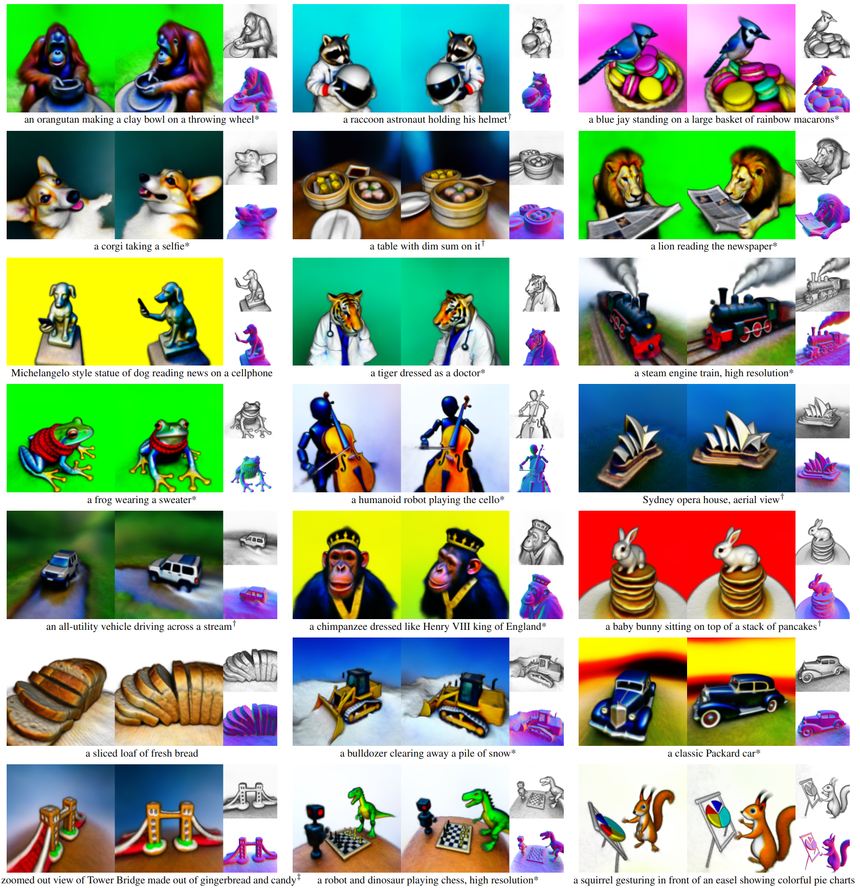
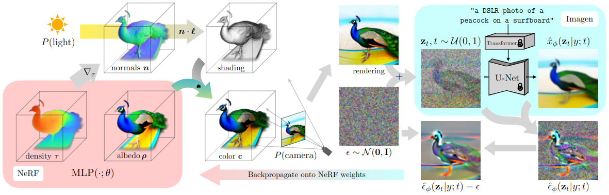
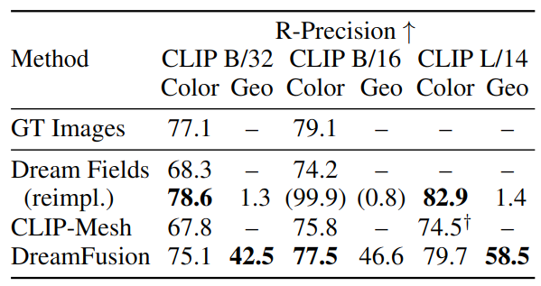

# DreamFusion: Text-to-3D using 2D Diffusion

Update: 2023/09/23

## ℹ️ Info
- Paper: [arxiv.org](https://arxiv.org/abs/2209.14988)
  - Submission date: 2022/09/29
  - Authors: Ben Poole, Ajay Jain, Jonathan T. Barron, Ben Mildenhall
  - Conf.: ICLR 2023
  - HTML: [ar5iv.labs.arxiv.org](https://ar5iv.labs.arxiv.org/html/2209.14988)
- Implementation: [ashawkey/stable-dreamfusion](https://github.com/ashawkey/stable-dreamfusion)
  - framework: Pytorch
  - Official code: No
  - License: Apache License 2.0
- Keywords: CV, RGB Image, Text, Mesh, Object Generation

## 🖥️ Setup commands to run the implementation
Test env.:
- GPU: RTX2080Ti
- Input: Text
- Output: 360 degree video of mesh (mp4), etc.

### 1. Create a docker container
```bash
# Set this repository absolute path (ex: /home/user/obarads.github.io)
git clone https://github.com/Obarads/obarads.github.io.git
cd obarads.github.io
OGI_DIR_PATH=$PWD

# Get a base image
BASE_IMAGE=nvidia/cuda:11.8.0-cudnn8-devel-ubuntu22.04
docker pull $BASE_IMAGE

# Create and move to a container dir
mkdir containers
cd containers
# Clone the repository
git clone https://github.com/ashawkey/stable-dreamfusion
# Move to the repository
cd stable-dreamfusion
# Switch to 2023/08/02 ver.
git switch -d 5550b91862a3af7842bb04875b7f1211e5095a63
# Copy a folder for building env.
cp -r "${OGI_DIR_PATH}/environments/DTu2D/" ./dev_env

# Create docker image and container
docker build . -t stable-dreamfusion -f ./dev_env/Dockerfile --build-arg UID=$(id -u) --build-arg GID=$(id -g) --build-arg BASE_IMAGE=$BASE_IMAGE
docker run -dit --name stable-dreamfusion --gpus all -v $PWD:/workspace stable-dreamfusion
```

### 2. Setup packages
In a docker container:
```bash
cd /workspace

# setup python and packages
conda create -y -n stable-dreamfusion python=3.9
conda activate stable-dreamfusion
cd dev_env
pip install -r requirements.txt
```

### 3. Run the model
In a docker container:
```bash
cd /workspace
python main.py --text "a hamburger" --workspace trial -O
```

## 📝 Clipping and note
### Introduction
- > In this work, we develop techniques to transfer pretrained 2D image-text diffusion models to 3D object synthesis, without any 3D data (see Figure 1).
- > We adopt a similar approach to Dream Fields, but replace CLIP with a loss derived from distillation of a 2D diffusion model. 
  - > Our loss is based on probabilty density distillation, minimizing the KL divergence between a family of Gaussian distribution with shared means based on the forward process of diffusion and the score functions learned by the pretrained diffusion model. The resulting Score Distillation Sampling (SDS) method enables sampling via optimization in differentiable image parameterizations.
- > See Fig. 3 for an overview of our approach.


> Figure 1:  DreamFusion uses a pretrained text-to-image diffusion model to generate realistic 3D models from text prompts. Rendered 3D models are presented from two views, with textureless ren- ders and normals to the right. See dreamfusion3d.github.io for videos of these results. Symbols indicate the following prompt prefixes which we found helped to improve the quality and realism: *a DSLR photo of... †a zoomed out DSLR photo of... ‡a wide angle zoomed out DSLR photo of...


> Figure 3: DreamFusion generates 3D objects from a natural language caption such as “a DSLR photo of a peacock on a surfboard.” The scene is represented by a Neural Radiance Field that is randomly initialized and trained from scratch for each caption. Our NeRF parameterizes volumetric density and albedo (color) with an MLP. We render the NeRF from a random camera, using normals computed from gradients of the density to shade the scene with a random lighting direction. Shading reveals geometric details that are ambiguous from a single viewpoint. To compute parameter updates, DreamFusion diffuses the rendering and reconstructs it with a (frozen) conditional Imagen model to predict the injected noise $\hat{\epsilon}_\phi\left(\mathbf{z}_t \mid y ; t\right)$. This contains structure that should improve fidelity, but is high variance. Subtracting the injected noise produces a low variance update direction stopgrad$\left[\hat{\epsilon}_\phi-\epsilon\right]$ that is backpropagated through the rendering process to update the NeRF MLP parameters.

### Contributions, novelty
- > By combining SDS with a NeRF variant tailored to this 3D generation task, DreamFusion generates high-fidelity coherent 3D objects and scenes for a diverse set of user-provided text prompts.

### Result
- Qualitative comparison
  - Fig.5 is qualitative comparison with baselines.
- Quantitative evaluation
  - > Table 1 reports CLIP R-Precision for DreamFusion and several baselines.


> Figure 5: Qualitative comparison with baselines.


> Table 1: Evaluating the coherence of DreamFusion generations with their caption using different CLIP retrieval models. We compare to the ground-truth MS-COCO images in the object-centric subset of Jain et al. (2022) as well as Khalid et al. (2022). †Evaluated with only 1 seed per prompt.  Metrics shown in parentheses may be overfit, as the same CLIP model is used during training and eval.

### Other experiments
Ablations, DISCUSSION

## 📚 References
- Ajay Jain, Ben Mildenhall, Jonathan T. Barron, Pieter Abbeel, and Ben Poole. Zero-shot text-guided object generation with dream fields. CVPR, 2022.
- Nasir Mohammad Khalid, Tianhao Xie, Eugene Belilovsky, and Popa Tiberiu.  CLIP-Mesh: Gen- erating textured meshes from text using pretrained image-text models. SIGGRAPH Asia 2022 Conference Papers, 2022.

