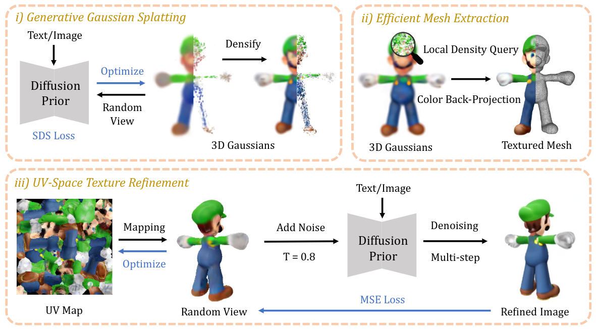
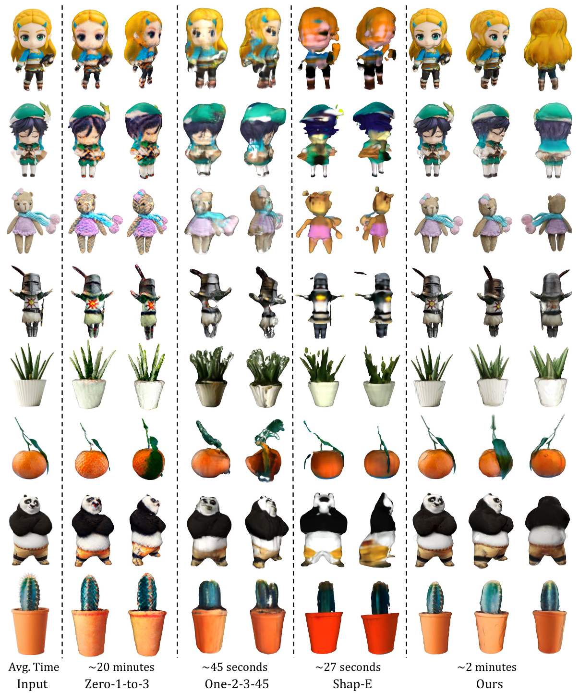
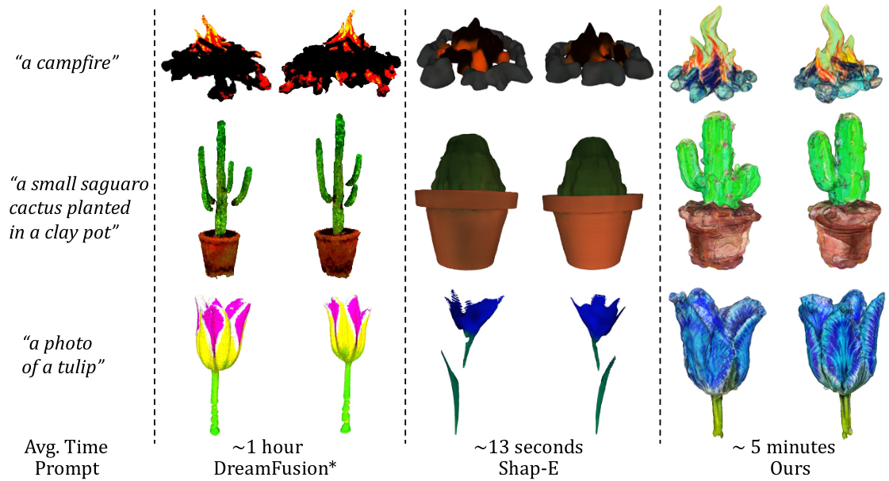
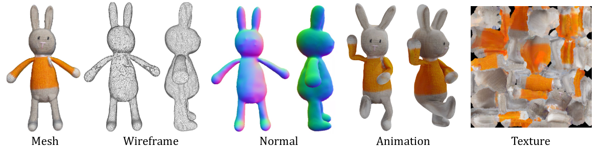
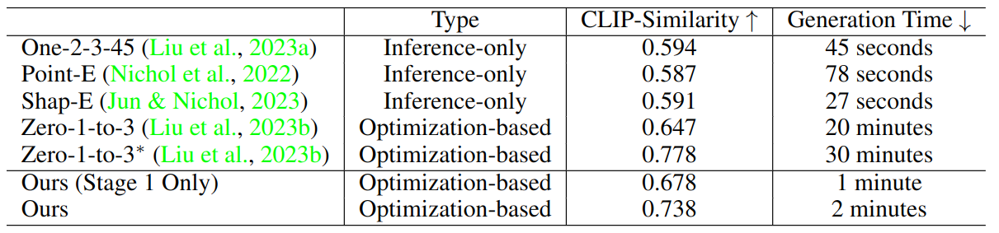
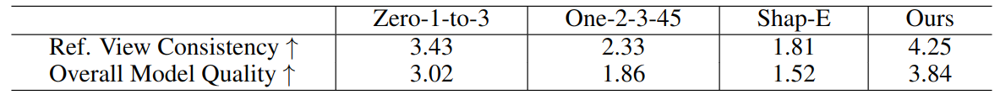

# DreamGaussian: Generative Gaussian Splatting for Efficient 3D Content Creation

Update: 2023/09/30

## ℹ️ Info
- Paper: [arxiv.org](https://arxiv.org/abs/2309.16653)
  - Submission date: 2023/09/28
  - Authors: Jiaxiang Tang, Jiawei Ren, Hang Zhou, Ziwei Liu, Gang Zeng
  - Conf.: ??
  - HTML: [ar5iv.labs.arxiv.org](https://ar5iv.labs.arxiv.org/html/2309.16653)
- Implementation: [dreamgaussian/dreamgaussian](https://github.com/dreamgaussian/dreamgaussian)
  - framework: Pytorch
  - Official code: Yes
  - License: MIT License
- Keywords: CV, RGB Image, Text, Mesh, Object Generation

## 🖥️ Setup commands to run the implementation
Test env.:
- GPU: RTX2080Ti
- Input: RGB Image
- Output: UV map (png), mesh (obj), mtl file, 360 degree video of mesh (mp4), etc.

### 1. Create a docker container
```bash
# Set this repository absolute path (ex: /home/user/obarads.github.io)
git clone https://github.com/Obarads/obarads.github.io.git
cd obarads.github.io
OGI_DIR_PATH=$PWD

# Get a base image
BASE_IMAGE=nvidia/cuda:11.8.0-cudnn8-devel-ubuntu22.04
docker pull $BASE_IMAGE

# Create and move to a container dir
mkdir containers
cd containers
# Clone the repository
git clone https://github.com/dreamgaussian/dreamgaussian
# Move to the repository
cd dreamgaussian
# Switch to 2023/09/29 ver.
git switch -d f787cb449edc9e7a6c4e818880c109362865ccb0
# Copy a folder for building env.
cp -r "${OGI_DIR_PATH}/environments/DGGSfE3CC/" ./dev_env

# Create docker image and container
docker build . -t dreamgaussian -f ./dev_env/Dockerfile --build-arg UID=$(id -u) --build-arg GID=$(id -g) --build-arg BASE_IMAGE=$BASE_IMAGE
docker run -dit --name dreamgaussian --gpus all --env="DISPLAY" --env="QT_X11_NO_MITSHM=1" -v $PWD:/workspace -v /tmp/.X11-unix:/tmp/.X11-unix dreamgaussian
```

### 2. Setup packages
In a docker container:
```bash
cd /workspace

# setup python and packages
conda create -y -n dreamgaussian python=3.9
conda activate dreamgaussian
cd dev_env
pip install -r requirements.txt

# a modified gaussain splatting (+ depth, alpha rendering)
git clone https://github.com/ashawkey/diff-gaussian-rasterization.git
cd diff-gaussian-rasterization
git switch -d 30be14209ca8d393bb75aac4c083f678ad8eae71
git submodule update --init --recursive
pip install .

# simple-knn
pip install ./simple-knn

# nvdiffrast
pip install git+https://github.com/NVlabs/nvdiffrast.git@c5caf7bdb8a2448acc491a9faa47753972edd380

# kiuikit
pip install git+https://github.com/ashawkey/kiuikit.git@1e6027afda465d45fcb4375af720b8a8176cb8df
```

### 3. Run the model
In a docker container:
```bash
cd /workspace
# Note: If you use an image except for data dir images, please run process.py.
# background removal and recenter, save rgba at 256x256
# python process.py data/name.jpg --size 256

# Note: force_cuda_rast=True to avoid dr.RasterizeGLContext() error in the container.
# training gaussian stage
python main.py --config configs/image.yaml input=data/catstatue_rgba.png save_path=output force_cuda_rast=True
# training mesh stage
python main2.py --config configs/image.yaml input=data/catstatue_rgba.png save_path=output force_cuda_rast=True
# save 360 degree video of mesh
python -m kiui.render logs/output_mesh.obj --save_video output.mp4 --force_cuda_rast --wogui
```

### Note
VSCode launch.json for debug:
```json
{
    "version": "0.2.0",
    "configurations": [
        {
            "name": "main.py",
            "type": "python",
            "request": "launch",
            "program": "main.py",
            "console": "integratedTerminal",
            "args": [
                "--config=configs/image.yaml",
                "input=data/catstatue_rgba.png",
                "save_path=name",
                "force_cuda_rast=True"
            ],
            "justMyCode": true
        }
    ]
}
```

## 📝 Clipping and note
### Introduction
- > In this paper, we propose DreamGaussian, a novel 3D content generation framework that achieves both efficiency and quality simultaneously.
  - > Our key insight is to design a generative 3D Gaussian Splatting model with companioned mesh extraction and texture refinement in UV space.
- Fig.2 shows DreamGaussian Framework.


> Figure 2: DreamGaussian Framework. 3D Gaussians are used for efficient initialization of geometry and appearance using single-step SDS loss. We then extract a textured mesh and refine the texture image with a multi-step MSE loss.

### Contributions, novelty
- > In summary, our contributions are:
  - > 1. We propose a novel framework for 3D content creation by adapting Gaussian splatting into generative settings,  significantly reducing the generation time of optimization-based 2D lifting methods.
  - > 2. We design an efficient mesh extraction algorithm from 3D Gaussians and a UV-space texture refinement stage to further enhance the generation quality.
  - > 3. Extensive experiments on both Image-to-3D and Text-to-3D tasks demonstrate that our method effectively balances optimization time and generation fidelity, unlocking new possibilities for real-world deployment of 3D content generation.

### Result
- QUALITATIVE COMPARISONS
  - > We first provide qualitative comparisons on image-to-3D in Figure 4.
  - > In Figure 5, we compare the results on text-to-3D.
  - > Furthermore, we highlight the quality of our exported meshes in Figure 6.
- QUANTITATIVE COMPARISONS
  - > In Table 1, we report the CLIP-similarity (Radford et al., 2021; Qian et al., 2023; Liu et al., 2023a) and average generation time of different image-to-3D methods on a collection of images from previous works (Melas-Kyriazi et al., 2023; Liu et al., 2023a; Tang et al., 2023b) and Internet.
  - > We also conduct an user study on the generation quality detailed in Table 2.


> Figure 4: Comparisons on Image-to-3D. Our method achieves a better balance between generation speed and mesh quality on various images.


> Figure 5: Comparisons on Text-to-3D. For DreamFusion, we use the implementation from Guo et al. (2023) which also uses Stable-Diffusion as the 2D prior.


> Figure 6: Mesh Exportation. We export high quality textured mesh from 3D Gaussians, which can be seamlessly used in downstream applications like rigged animation.


> Table 1: Quantitative Comparisons on generation quality and speed for image-to-3D tasks.  For Zero-1-to-3∗, a mesh fine-tuning stage is used to further improve quality (Tang, 2022).


> Table 2: User Study on image-to-3D tasks. The rating is of scale 1-5, the higher the better.

### Other experiments
ABLATION STUDY, LIMITATIONS AND CONCLUSION

## 📚 References
- Alec Radford, Jong Wook Kim, Chris Hallacy, Aditya Ramesh, Gabriel Goh, Sandhini Agarwal, Girish Sastry, Amanda Askell, Pamela Mishkin, Jack Clark, et al. Learning transferable visual models from natural language supervision. In ICML, pp. 8748–8763. PMLR, 2021.
- Guocheng Qian, Jinjie Mai, Abdullah Hamdi, Jian Ren, Aliaksandr Siarohin, Bing Li, Hsin-Ying Lee, Ivan Skorokhodov, Peter Wonka, Sergey Tulyakov, et al. Magic123: One image to high-quality 3d object generation using both 2d and 3d diffusion priors. arXiv preprint arXiv:2306.17843, 2023.
- Minghua Liu, Chao Xu, Haian Jin, Linghao Chen, Zexiang Xu, Hao Su, et al. One-2-3-45: Any single image to 3d mesh in 45 seconds without per-shape optimization. arXiv preprint arXiv:2306.16928, 2023a.
- Luke Melas-Kyriazi, Iro Laina, Christian Rupprecht, and Andrea Vedaldi. Realfusion: 360deg reconstruction of any object from a single image. In CVPR, pp. 8446–8455, 2023
- Junshu Tang, Tengfei Wang, Bo Zhang, Ting Zhang, Ran Yi, Lizhuang Ma, and Dong Chen. Make-it-3d: High-fidelity 3d creation from a single image with diffusion prior. arXiv preprint arXiv:2303.14184, 2023b.
