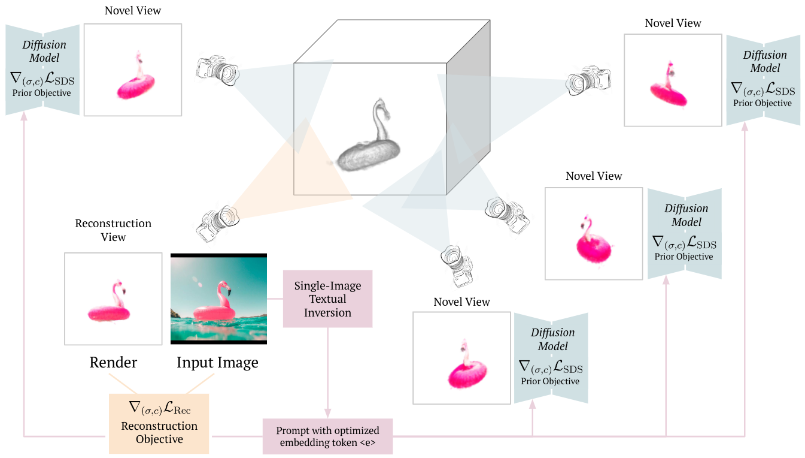

# RealFusion: 360° Reconstruction of Any Object from a Single Image

Update: 2023/09/21

## ℹ️ Info
- Paper: [arxiv.org](https://arxiv.org/abs/2302.10663)
  - Submission date: 2023/02/21
  - Authors: Luke Melas-Kyriazi, Christian Rupprecht, Iro Laina, Andrea Vedaldi
  - Conf.: ??
- Implementation: [lukemelas/realfusion](https://github.com/lukemelas/realfusion)
  - framework: Pytorch
  - Official code: Yes
  - License: Not described
- Keywords: CV, RGB Image, Multi-View

## 🖥️ Setup commands to run the implementation
Test env.:
- GPU: ??

### 1. Create a docker container
```bash
# Set this repository absolute path (ex: /home/user/obarads.github.io)
git clone https://github.com/Obarads/obarads.github.io.git
cd obarads.github.io
OGI_DIR_PATH=$PWD

# Get a base image
BASE_IMAGE=nvidia/cuda:11.8.0-cudnn8-devel-ubuntu22.04
docker pull $BASE_IMAGE

# Create and move to a container dir
mkdir containers
cd containers
# Clone the repository
git clone https://github.com/lukemelas/realfusion
# Move to the repository
cd realfusion
# Switch to 2023/04/07 ver.
git switch -d 45c55eb6a4d84b4558a14c0214d9d7abdcd0e1c3
# Copy a folder for building env.
cp -r "${OGI_DIR_PATH}/environments/R3RoAOfaSI/" ./dev_env

# Create docker image and container
docker build . -t realfusion -f ./dev_env/Dockerfile --build-arg UID=$(id -u) --build-arg GID=$(id -g) --build-arg BASE_IMAGE=$BASE_IMAGE
docker run -dit --name realfusion --gpus all -v $PWD:/workspace realfusion
```

### 2. Setup packages
In a docker container:
```bash
cd /workspace

# setup python and packages
conda create -y -n realfusion python=3.9
conda activate realfusion
cd dev_env
pip install -r requirements.txt

cd ../
pip install ./raymarching
pip install ./shencoder
pip install ./freqencoder
pip install ./gridencoder
pip install git+https://github.com/NVlabs/nvdiffrast.git@c5caf7bdb8a2448acc491a9faa47753972edd380
```

### 3. Setup code
In a docker container:
```bash
cd /workspace
git apply dev_env/code.diff
```

### 4. Run the model
In a docker container:
```bash
cd /workspace
export DATA_DIR="/workspace/examples/natural-images/test_bird_2"
export IMAGE_PATH="/workspace/examples/natural-images/bird_2/image.png"
python scripts/extract-mask.py --image_path ${IMAGE_PATH} --output_dir ${DATA_DIR}

cd textual_inversion
export MODEL_NAME="runwayml/stable-diffusion-v1-5"
export OUTPUT_DIR="outputs"
python textual_inversion.py \
  --pretrained_model_name_or_path=$MODEL_NAME \
  --train_data_dir=$DATA_DIR \
  --learnable_property="object" \
  --placeholder_token="_cat_statue_" \
  --initializer_token="cat" \
  --resolution=512 \
  --train_batch_size=1 \
  --gradient_accumulation_steps=4 \
  --max_train_steps=3000 \
  --learning_rate=5.0e-04 --scale_lr \
  --lr_scheduler="constant" \
  --lr_warmup_steps=0 \
  --output_dir=$OUTPUT_DIR \
  --use_augmentations
```

## 📝 Clipping and note
### Introduction
- > We consider the problem of reconstructing a full 360◦ photographic model of an object from a single image of it.
  - Figure 2 is method diagram.


> Figure 2. Method diagram. Our method optimizes a neural radiance field using two objectives simultaneously: a reconstruction objective and a prior objective.  The reconstruction objective ensures that the radiance field resembles the input image from a specific, fixed view.  The prior objective uses a large pre-trained diffusion model to ensure that the radiance field looks like the given object from randomly sampled novel viewpoints. The key to making this process work well is to condition the diffusion model on a prompt with a custom token 〈e〉, which is generated prior to reconstruction using single-image textual inversion. This diagram does not  display  our  coarse-to-fine  training  strategy  or  regularization terms, both of which improve qualitative results.

### Contributions, novelty
- > (1) We propose RealFusion, a method that can extract from a single image of an object a 360◦ photographic 3D reconstruction without assumptions on the type of object imaged or 3D supervision of any kind;
- > (2) We do so by leveraging an existing 2D diffusion image generator via a new single-image variant of textual inversion;
- > (3) We also introduce new regularizers and provide an efficient implementation using InstantNGP;
- > (4) We demonstrate state-of-the-art reconstruction results on a number of in-the-wild images and images from existing datasets when compared to alternative approaches.

### Result

### Other experiments

## 📚 References
- [] 

