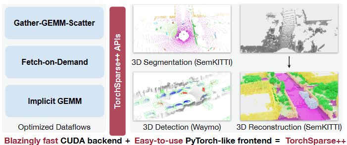
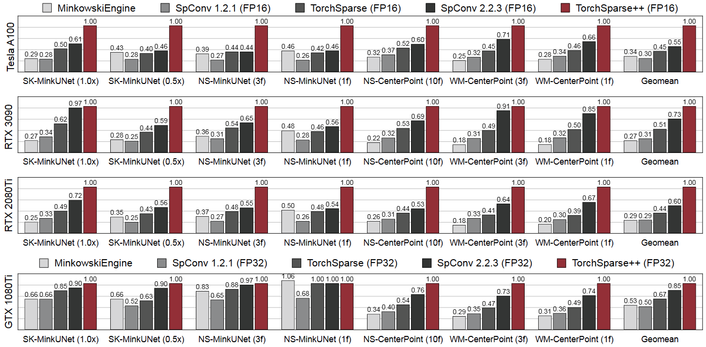
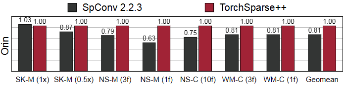

# TorchSparse++: Efficient Point Cloud Engine

Update: 2023/09/06

## ℹ️ Info
- Paper: [openaccess.thecvf.com](https://openaccess.thecvf.com/content/CVPR2023W/WAD/html/Tang_TorchSparse_Efficient_Point_Cloud_Engine_CVPRW_2023_paper.html)
  - Submission date: 2023/06/18
  - Authors: Haotian Tang, Shang Yang, Zhijian Liu, Ke Hong, Zhongming Yu, Xiuyu Li, Guohao Dai, Yu Wang, Song Han
  - Conf.: CVPR 2023
- Implementation: [mit-han-lab/torchsparse](https://github.com/mit-han-lab/torchsparse)
  - framework: Pytorch
  - Official code: Yes
  - License: MIT license
- Keywords: CV, Point Cloud, Detection, Semantic Segmentation, Library

## 🖥️ Setup commands to run the implementation
Test env.:
- GPU: RTX2080ti

### 1. Create a docker container
```bash
# Set this repository absolute path (ex: /home/user/obarads.github.io)
git clone https://github.com/Obarads/obarads.github.io.git
cd obarads.github.io
OGI_DIR_PATH=$PWD

# Get a base image
BASE_IMAGE=nvidia/cuda:11.8.0-cudnn8-devel-ubuntu20.04
docker pull $BASE_IMAGE

# Create and move to a container dir
mkdir containers
cd containers
# Clone the repository
git clone https://github.com/mit-han-lab/torchsparse.git
# Move to the repository
cd torchsparse
# Switch to 2023/07/28 ver.
git switch -d b55506aa2524c8d69e3b6081a4fd404ffd072b4b
# Copy a folder for building env.
cp -r $OGI_DIR_PATH/environments/TEPCE/ ./dev_env

# Create docker image and container
docker build . -t torchsparse -f ./dev_env/Dockerfile --build-arg UID=$(id -u) --build-arg GID=$(id -g) --build-arg BASE_IMAGE=$BASE_IMAGE
docker run -dit --name torchsparse --gpus all -v $PWD:/workspace torchsparse
```

### 2. Setup packages
In a docker container:
```bash
cd /workspace

# setup python and packages
conda create -y -n torchsparse python=3.10
conda activate torchsparse

pip install -r dev_env/requirements.txt
python -c "$(curl -fsSL https://raw.githubusercontent.com/mit-han-lab/torchsparse/master/install.py)"
```

### 4. Run the model
In a docker container:
```bash
cd /workspace
cd examples
python example.py
```

## 📝 Clipping and note
### どんな論文か？
- > In this work, we systematically analyze and improve existing dataflows.
- > Our resulting system, TorchSparse++, achieves 2.9×, 3.3×, 2.2× and 1.8× measured end-to-end speedup on an NVIDIA A100 GPU over the state-of-the-art MinkowskiEngine, SpConv 1.2, TorchSparse and SpConv v2 in inference respectively.
  - > Furthermore, TorchSparse++ is the only system to date that supports all necessary primitives for 3D segmentation, detection, and reconstruction workloads in autonomous driving.
  - Fig.1 show an outline.



> TorchSparse++ is a high-performance GPU library that provides highly-optimized dataflows for convolution on point clouds. It provides state-of-the-art inference and training performance for all driving-related applications (e.g. 3D semantic segmentation, object detection and scene reconstruction). Scenes source: [2, 9, 27].

### Contributions, novelty
- > Although most functions in TorchSparse++ are implemented straightforwardly, efficiently mapping the sparse convolution operator onto GPUs poses a nontrivial challenge. In this section, we describe three alternative implementations for sparse convolution that we have developed to address this challenge. Our approaches significantly improve upon existing implementations by introducing tensor core intrinsics, enhancing computation regularity and parallelism.

### Result
- Inference Speedup
  - > We compare our results with the baseline design MinkowskiEngine, SpConv 1.2.1, TorchSparse and SpConv 2.2.3 in Figure 10.
  - > Figure 9, we also compare TorchSparse++ with SpConv 2.2.3 on NVIDIA Jetson Orin, an edge GPU platform widely deployed on real-world autonomous vehicles.
  - The abbreviations on the diagram are (probably) as follows.
    - SK-M(0.5x), SK-M(1x): MinkUNet [12] (0.5× or 1× width) on SemanticKITTI [2]
    - NS-M(3f), NS-M(1f): MinkUNet (1 or 3 frames) on nuScenes-LiDARSeg [3]
    - NS-C(10f): CenterPoint [44] (10 frames) on nuScenes detection
    - WM-C(3f), WM-C(1f): CenterPoint (1 or 3 frames) on Waymo Open Dataset [33]
    - Geomean: ?



> Figure 10. TorchSparse++ significantly outperforms existing point cloud inference engines in both 3D object detection and LiDAR segmentation benchmarks. It achieves 1.36-1.81× geomean speedup over state-of-the-art SpConv 2.2.3 and is 1.96-2.20× faster than TorchSparse on GPUs with the NVIDIA Ampere architecture. Furthermore, TorchSparse++ is 1.2-1.6× faster than SpConv 2.2.3 on Turing and Pascal architectures.



> Figure 9. TorchSparse++ is 1.24× faster on average and up to 1.57× more efficient than SpConv 2.2.3 on resource-constrained NVIDIA Jetson Orin. All workloads run at >18 FPS, which is significantly faster than the LiDAR frequency.

### Other experiments
None

## 📚 References
- [2] Jens Behley, Martin Garbade, Andres Milioto, Jan Quenzel, Sven Behnke, Cyrill Stachniss, and Juergen Gall. SemanticKITTI: A Dataset for Semantic Scene Understanding of LiDAR Sequences. In IEEE/CVF International Conference on Computer Vision (ICCV), 2019.
- [3] Holger Caesar, Varun Bankiti, Alex H. Lang, Sourabh Vora, Venice Erin Liong, Qiang Xu, Anush Krishnan, Yu Pan, Giancarlo Baldan, and Oscar Beijbom. nuScenes: A Multimodal Dataset for Autonomous Driving. In IEEE/CVF Conference on Computer Vision and Pattern Recognition (CVPR), 2020.
- [9] Ran Cheng, Christopher Agia, Yuan Ren, Xinhai Li, and Bingbing Liu. S3CNet: A Sparse Semantic Scene Completion Network for LiDAR Point Clouds. In CoRL, 2020.
- [12] Christopher Choy, JunYoung Gwak, and Silvio Savarese. 4D Spatio-Temporal ConvNets: Minkowski Convolutional Neural Networks. In IEEE/CVF Conference on Computer Vision and Pattern Recognition (CVPR), 2019.
- [33] Pei Sun, Henrik Kretzschmar, Xerxes Dotiwalla, Aurelien Chouard, Vijaysai Patnaik, Paul Tsui, James Guo, Yin Zhou, Yuning Chai, Benjamin Caine, Vijay Vasudevan, Wei Han, Jiquan Ngiam, Hang Zhao, Aleksei Timofeev, Scott Ettinger, Maxim Krivokon, Amy Gao, Aditya Joshi, Yu Zhang, Jonathon Shlens, Zhifeng Chen, and Dragomir Anguelov. Scalability in Perception for Autonomous Driving: Waymo Open Dataset. In IEEE/CVF Conference on Computer Vision and Pattern Recognition (CVPR), 2020.
- [44] Tianwei Yin, Xingyi Zhou, and Philipp Kr ̈ahenb ̈uhl. Center-based 3D Object Detection and Tracking. In IEEE/CVF Conference on Computer Vision and Pattern Recognition (CVPR), 2021.

