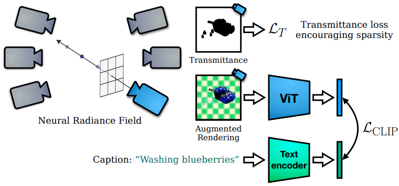
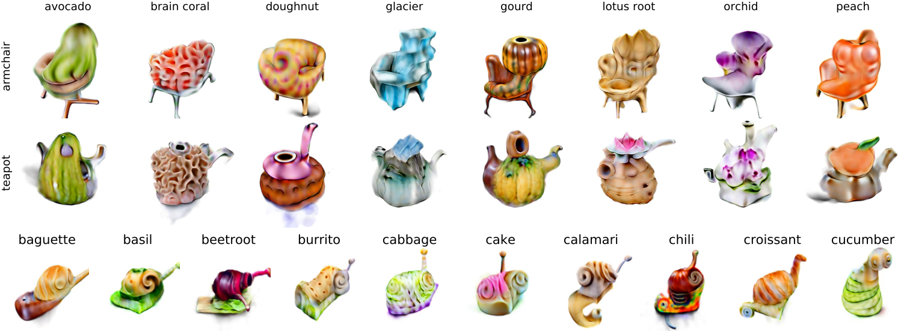

# Zero-Shot Text-Guided Object Generation with Dream Fields

Update: 2023/09/24

## ℹ️ Info
- Paper: [arxiv.org](https://arxiv.org/abs/2112.01455)
  - Submission date: 2021/12/02
  - Authors: Ajay Jain, Ben Mildenhall, Jonathan T. Barron, Pieter Abbeel, Ben Poole
  - Conf.: CVPR 2022
  - HTML: [ar5iv.labs.arxiv.org](https://ar5iv.labs.arxiv.org/html/2112.01455)
- Implementation: [google-research/google-research](https://github.com/google-research/google-research/tree/master/dreamfields)
  - framework: tensorflow
  - Official code: Yes
  - License: Apache License 2.0
- Keywords: CV, RGB Image, Text, Object Generation, Novel View Synthesis, Multi-View

## 🖥️ (WIP) Setup commands to run the implementation
Test env.:
- GPU: RTX2080Ti

### 1. Create a docker container
```bash
# Set this repository absolute path (ex: /home/user/obarads.github.io)
git clone https://github.com/Obarads/obarads.github.io.git
cd obarads.github.io
OGI_DIR_PATH=$PWD

# Get a base image
BASE_IMAGE=nvidia/cuda:11.2.2-cudnn8-devel-ubuntu20.04
docker pull $BASE_IMAGE

# Create and move to a container dir
mkdir containers
cd containers
# Clone the repository
git clone https://github.com/google-research/google-research
# Move to the repository
cd google-research/dreamfields
# Switch to 2023/09/23 ver.
git switch -d 9988e6224311c83e63137d32eb24729c8282b593
# Copy a folder for building env.
cp -r "${OGI_DIR_PATH}/environments/ZTOGwDF/" ./dev_env

# Create docker image and container
docker build . -t dream_fields -f ./dev_env/Dockerfile --build-arg UID=$(id -u) --build-arg GID=$(id -g) --build-arg BASE_IMAGE=$BASE_IMAGE
docker run -dit --name dream_fields --gpus all -v $PWD:/workspace dream_fields
```

### 2. Setup packages
In a docker container:
```bash
cd /workspace

# setup python and packages
conda create -y -n dream_fields python=3.9
conda activate dream_fields
```

### 3. Setup the models (WIP)
In a docker container:
```bash
cd /workspace
```

### 4. Run the model (WIP)
In a docker container:
```bash
cd /workspace
```

## 📝 Clipping and note
### Introduction
- > In this work, we propose Dream Fields, a method to automatically generate open-set 3D models from natural language prompts. 
  - Dream Field uses NeRF and pre-trained neural image-text retrieval models like CLIP[46].
  - Figure 1 shows overview of Dream Field.
- Diverse captioned 3D models or captioned multi-view data are not available, so the authors correlate renderings of the radiance field to text prompt with semantics of pre-trained neural image-text retrieval models like CLIP [46].


> Figure 1. Given a caption, we learn a Dream Field, a continuous volumetric representation of an object’s geometry and appearance learned with guidance from a pre-trained model. We optimize the Dream Field by rendering images of the object from random camera poses that are scored with frozen pre-trained image and text encoders trained on web images and alt-text. 2D views share the same underlying radiance field for consistent geometry.

### Contributions, novelty
- > Our contributions include:
  - > Using aligned image and text models to optimize NeRF without 3D shape or multi-view data,
  - > Dream Fields, a simple, constrained 3D representation with neural guidance that supports diverse 3D object generation from captions in zero-shot, and
  - > Simple geometric priors including transmittance regularization, scene bounds, and an MLP architecture that together improve fidelity.

### Result
- Compositional generation
  - > In Figure 6, we show non-cherrypicked generations that test the compositional generalization of Dream Fields to fine-grained variations in captions taken from the website of [48].


> Figure 6. Compositional object generation. Dream Fields allow users to express specific artistic styles via detailed captions. Top two rows: Similar to text-to-image experiments in [48], we generate objects with the caption “armchair in the shape of an avocado. armchair imitating avocado.” Bottom: Generations vary the texture of a single snail. Captions follow the template “a snail made of baguette. a snail with the texture of baguette” Results are not cherry-picked.

### Other experiments
Analyzing retrieval metrics, Model ablations,  Discussion and limitations, Supplementary Material

## 📚 References
- [46] Alec Radford, Jong Wook Kim, Chris Hallacy, Aditya Ramesh, Gabriel Goh, Sandhini Agarwal, Girish Sastry, Amanda Askell, Pamela Mishkin, Jack Clark, Gretchen Krueger, and Ilya Sutskever. Learning transferable visual models from natural language supervision. CoRR, abs/2103.00020, 2021.
- [48] Aditya Ramesh, Mikhail Pavlov, Gabriel Goh, Scott Gray, Chelsea Voss, Alec Radford, Mark Chen, and Ilya Sutskever. Zero-shot text-to-image generation. CoRR, abs/2102.12092, 2021.

