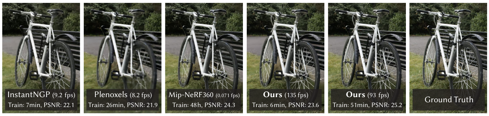
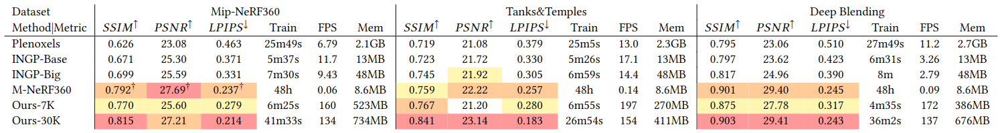
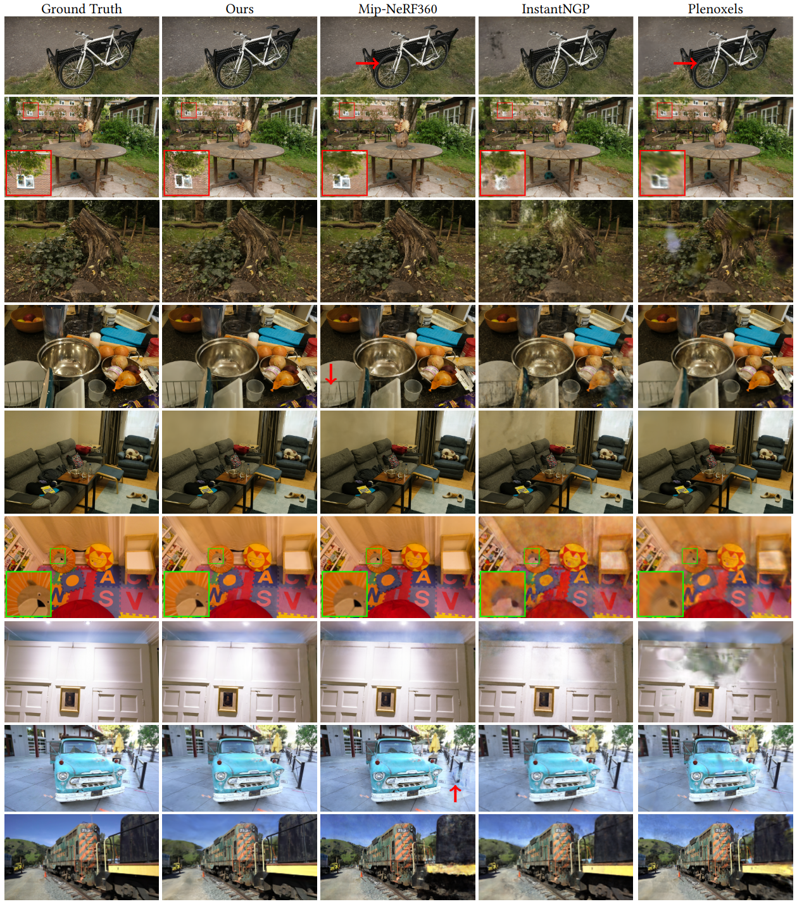
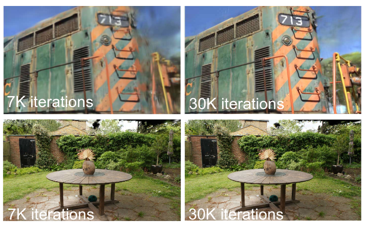
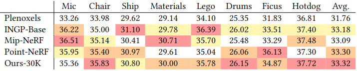
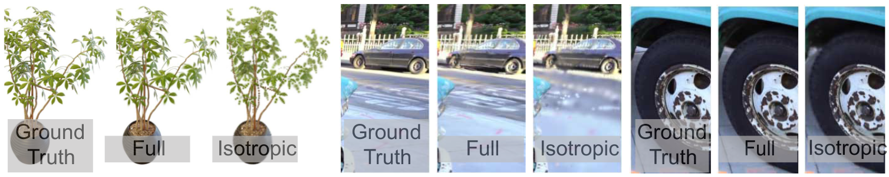

# 3D Gaussian Splatting for Real-Time Radiance Field Rendering

Update: 2023/09/12

## ℹ️ Info
- Paper: [arxiv.org](https://arxiv.org/abs/2308.04079)
  - Submission date: 2023/08/08
  - Authors: Bernhard Kerbl, Georgios Kopanas, Thomas Leimkühler, George Drettakis
  - Conf.: ACM Transactions on Graphics
- Implementation: [graphdeco-inria/gaussian-splatting](https://github.com/graphdeco-inria/gaussian-splatting)
  - framework: Pytorch
  - Official code: Yes
  - License: Other
- Keywords: CV, RGB Image, Novel View Synthesis, Multi-View

## 🖥️ Setup commands to run the implementation
Tested on:
- GPU: RTX4090

### 1. Create a docker container
```bash
# Set this repository absolute path (ex: /home/user/obarads.github.io)
git clone https://github.com/Obarads/obarads.github.io.git
cd obarads.github.io
OGI_DIR_PATH=$PWD

# Get a base image
BASE_IMAGE=nvidia/cuda:11.8.0-cudnn8-devel-ubuntu22.04
docker pull $BASE_IMAGE

# Create and move to a container dir
mkdir containers
cd containers
# Clone the repository
git clone https://github.com/graphdeco-inria/gaussian-splatting --recursive
# Move to the repository
cd gaussian-splatting
# Switch to 2023/09/05 ver.
git switch -d ea68bdf29c3b11d1a7ec2e5a11b1af2c266bd7f2
# Copy a folder for building env.
cp -r "${OGI_DIR_PATH}/environments/3GSfRRFR/" ./dev_env

# Create docker image and container
docker build . -t gaussian-splatting -f ./dev_env/Dockerfile --build-arg UID=$(id -u) --build-arg GID=$(id -g) --build-arg BASE_IMAGE=$BASE_IMAGE
docker run -dit --name gaussian-splatting --gpus all --env="DISPLAY" --env="QT_X11_NO_MITSHM=1" -v $PWD:/workspace -v /tmp/.X11-unix:/tmp/.X11-unix gaussian-splatting
```

### 2. Setup packages
In a docker container:
```bash
cd /workspace

# setup python and packages
conda create -y -n gaussian-splatting python=3.9
conda activate gaussian-splatting
cd dev_env
pip install -r requirements.txt
cd ../submodules/diff-gaussian-rasterization
pip install -e .
cd ../simple-knn
pip install -e .
```

### 3. Setup the dataset
In a docker container:
```bash
cd /workspace

# Download dataset
wget https://repo-sam.inria.fr/fungraph/3d-gaussian-splatting/datasets/input/tandt_db.zip
unzip tandt_db.zip
```

### 4. Run the model
In a docker container:
```bash
cd /workspace
python train.py -s tandt_db/train/
```

### 5. Run Viewer
```bash
cd /workspace
cd SIBR_viewers
cmake -Bbuild . -DCMAKE_BUILD_TYPE=Release # add -G Ninja to build faster
cmake --build build -j24 --target install
install/bin/SIBR_gaussianViewer_app -m path/to/trained/model # ex ../output/f7b2e4c0-7/
```

## 📝 Clipping and note
### Introduction
- > We introduce three key elements that allow us to achieve state-of-the-art visual quality while maintaining competitive training times and importantly allow high-quality real-time (≥30 fps) novel-view synthesis at 1080p resolution.
  - Figure 1 shows competition with the previous method.



> Fig. 1. Our method achieves real-time rendering of radiance fields with quality that equals the previous method with the best quality [Barron et al. 2022], while only requiring optimization times competitive with the fastest previous methods [Fridovich-Keil and Yu et al. 2022; Müller et al. 2022]. Key to this performance is a novel 3D Gaussian scene representation coupled with a real-time differentiable renderer, which offers significant speedup to both scene optimization and novel view synthesis. Note that for comparable training times to InstantNGP [Müller et al. 2022], we achieve similar quality to theirs; while this is the maximum quality they reach, by training for 51min we achieve state-of-the-art quality, even slightly better than Mip-NeRF360 [Barron et al. 2022].

### Contribution, novelty
- > The introduction of anisotropic 3D Gaussians as a high-quality, unstructured representation of radiance fields.
- > An optimization method of 3D Gaussian properties, inter-leaved with adaptive density control that creates high-quality representations for captured scenes.
- > A fast, differentiable rendering approach for the GPU, which is visibility-aware, allows anisotropic splatting and fast back-propagation to achieve high-quality novel view synthesis.

### Results
- Result of real world scene dataset
  - Tab. 1: quantitative evaluation
  - Fig. 5: the results of author method for 30K iterations of training
  - Fig. 6: the difference in visual quality for our two iteration configuration
- Synthetic Bounded Scenes
  - Tab. 2: PSNR scores using a white background for compatibility
  - Fig. 10: result examples
  - Note:
    - The trained synthetic scenes rendered at 180–300 FPS.


> Table 1. Quantitative evaluation of our method compared to previous work, computed over three datasets. Results marked with dagger †have been directly adopted from the original paper, all others were obtained in our own experiments.


> Fig. 5. We show comparisons of ours to previous methods and the corresponding ground truth images from held-out test views. The scenes are, from the top down: Bicycle, Garden, Stump, Counter and Room from the Mip-NeRF360 dataset; Playroom, DrJohnson from the Deep Blending dataset [Hedman et al. 2018] and Truck and Train from Tanks&Temples. Non-obvious differences in quality highlighted by arrows/insets.


> For some scenes (above) we can see that even at 7K iterations ( ∼5min for this scene), our method has captured the train quite well. At 30K iterations (∼35min) the background artifacts have been reduced significantly. For other scenes (below), the difference is barely visible; 7K iterations (∼8min) is already very high quality.


> Table 2.  PSNR scores for Synthetic NeRF, we start with 100K randomly initialized points. Competing metrics extracted from respective papers.


> Fig. 10.   We train scenes with Gaussian anisotropy disabled and enabled. The use of anisotropic volumetric splats enables modelling of fine structures and has a significant impact on visual quality. Note that for illustrative purposes, we restricted Ficus to use no more than 5k Gaussians in both configurations.

### Other experiments
Ablations, Limitations

## 📚 References
- [] 

