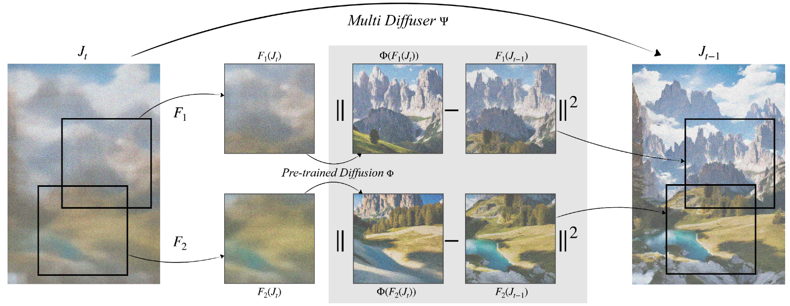
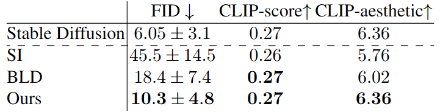
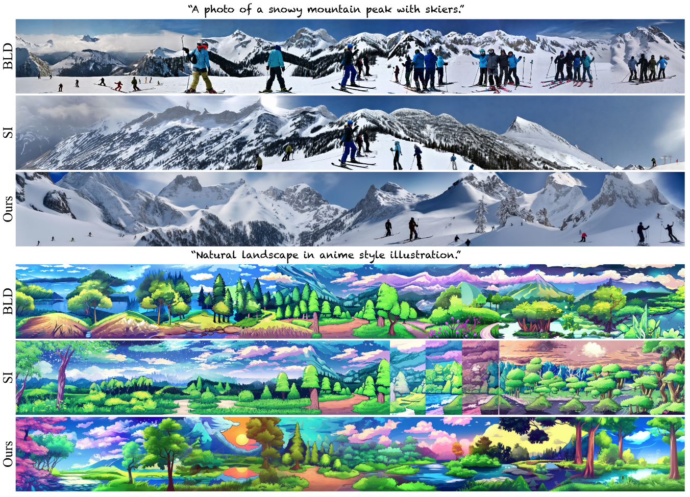
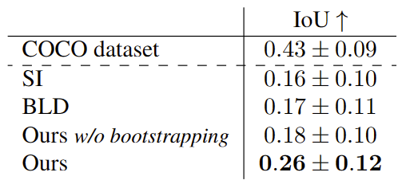
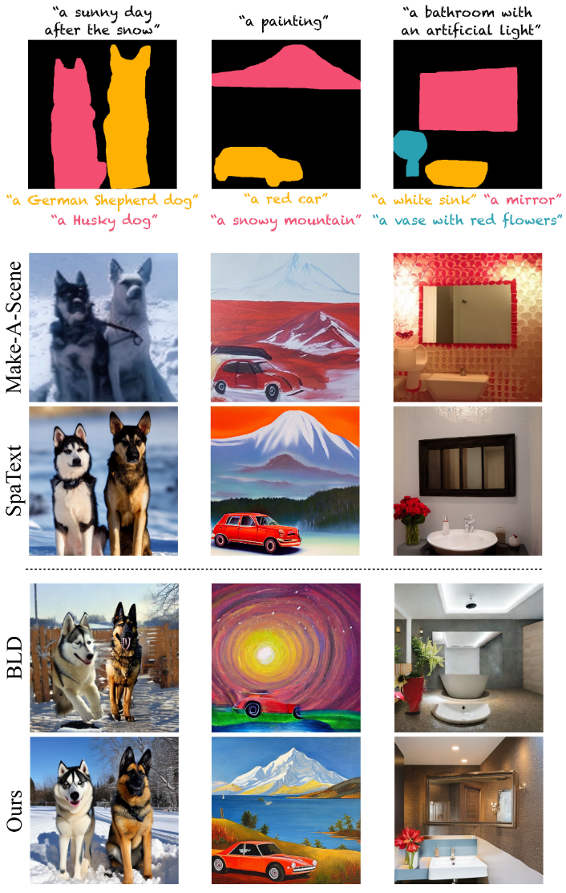

# MultiDiffusion: Fusing Diffusion Paths for Controlled Image Generation

Update: 2023/08/12

## ℹ️ Info
- Paper: [arxiv.org](https://arxiv.org/abs/2302.08113)
  - Submission date: 2023/02/16
  - Authors: Omer Bar-Tal, Lior Yariv, Yaron Lipman, Tali Dekel
  - Conf.: ICML 2023
- Implementation: [omerbt/MultiDiffusion](https://github.com/omerbt/MultiDiffusion)
  - framework: Pytorch
  - Official code: Yes
  - License: ?
- Keywords: CV, RGB Image, Scene Generation, Object Generation

## 🖥️ Setup commands to run the implementation
### 1. Create a docker container
```bash
# Set this repository absolute path (ex: /home/user/obarads.github.io)
git clone https://github.com/Obarads/obarads.github.io.git
cd obarads.github.io
OGI_DIR_PATH=$PWD

# Get a base image
BASE_IMAGE=nvidia/cuda:11.7.1-cudnn8-devel-ubuntu20.04
docker pull $BASE_IMAGE

# Create and move to a container dir
mkdir containers
cd containers
# Clone the repository
git clone https://github.com/omerbt/MultiDiffusion.git
# Move to MultiDiffusion/
cd MultiDiffusion/
# Switch to 2023/04/25 ver.
git switch -d f91b1c25fd14826d46f0f21c6f099b57fc446737
# Copy a folder for building env.
cp -r $OGI_DIR_PATH/environments/MFDPfCIG/ ./dev_env

# Create docker image and container
docker build . -t multi_diffusion -f ./dev_env/Dockerfile --build-arg UID=$(id -u) --build-arg GID=$(id -g) --build-arg BASE_IMAGE=$BASE_IMAGE
docker run -dit --name multi_diffusion --gpus all -v $PWD:/workspace multi_diffusion
```

### 2. Setup packages
In a docker container:
```bash
cd /workspace

# setup python and packages
conda create -n multi_diffusion -y python=3.9
conda activate multi_diffusion
cd dev_env
pip install -r requirements.txt
```

### 3. Setup the models
Please open `/workspace/MultiDiffusion_Panorama.ipynb`, in the container and run the cells in `MultiDiffusion_Panorama.ipynb`.  
Note: cell 2 takes a long time.

## 📝 Clipping and note
### どんなもの?
- > In this work, we present MultiDiffusion, a unified framework that enables versatile and controllable image generation, using a pre-trained text-to-image diffusion model, without any further training or finetuning.
- >  We show that MultiDiffusion can be readily applied to generate high quality and diverse images that adhere to user-provided controls, such as desired aspect ratio (e.g., panorama), and spatial guiding signals, ranging from tight segmentation masks to bounding boxes.
- > MultiDiffusion is to define a new generation process that is composed of several reference diffusion generation pro- cesses binded together with a set of shared parameters or constraints.
  - The process example is shown in Fig. 2.


> Figure 2. MultiDiffusion: a new generation process, $\Psi$, is defined over a pre-trained reference model $\Phi$. Starting from a noise image $J_T$ , at each generation step, we solve an optimization task whose objective is that each crop $F_i (J_t)$ will follow as closely as possible its denoised version $\Phi(F_i(J_t))$. Note that while each denoising step $\Phi(F_i(J_t))$ may pull to a different direction, our process fuses these inconsistent directions into a global denoising step $\Phi(J_t)$, resulting in a high-quality seamless image.

### どうやって有効だと検証した?
- Panorama Generation
  - > To evaluate our method on the task of text-to-panorama generation (Sec. 4.1), we generated a diverse set of 512 × 4608 panoramas, ×9 wider than the original training resolution.
  - Table 1 and figure 4
- Region-based Text-to-Image Generation
  - > Our region-based formulation (Sec. 4.2) allows novice users greater flexibility in their content creation, by lifting the burden of creating accurate tight masks.
  - Table 2 and figure 5



> Table 1. Panorama generation evaluation. We report FID, CLIP text-image score, and CLIP aesthetic scores for of our method compared to the baselines. See more details in Section. 5.1.



> Figure 4. Text-to-Panorama comparison to Blended Latent Diffusion (BLD) (Avrahami et al., 2022a) and Stable Inpainting (SI) (Rombach et al., 2022). Our framework produces seamless and diverse content whereas the baselines either contain repetitive content, visible seams or artifacts.



> Table 2. Region-based generation evaluation of the COCO dataset. We evaluate Intersection over Union (IoU), see Sec. 5.2 for details.



> Figure 5. Region-based text-to-image generation. The input segmentation maps with the corresponding region text descriptions are shown above each example.  Below:  Make-A-Scene (Gafni et al., 2022)and SpaText (Avrahami et al., 2022b) – trained specifically for this task on a large-scale segmentation-text-image dataset; Blended Latent Diffusion (BLD) (Avrahami et al., 2022a), and our results.

### Other experiments
Additional Results, Bootstrapping

## 📚 論文関連リンク
- [Avrahami et al., 2022a] Avrahami, O., Fried, O., and Lischinski, D. Blended latent diffusion. arXiv preprint arXiv:2206.02779, 2022a.
- [Rombach et al., 2022] Rombach,  R.,  Blattmann,  A.,  Lorenz,  D.,  Esser,  P.,  and Ommer, B. High-resolution image synthesis with latent diffusion models. In Proceedings of the IEEE/CVF Con- ference on Computer Vision and Pattern Recognition, pp. 10684–10695, 2022.
- [Gafni et al., 2022] Gafni,  O.,  Polyak,  A.,  Ashual,  O.,  Sheynin,  S.,  Parikh, D., and Taigman, Y.  Make-a-scene:  Scene-based text- to-image generation with human priors.   In European Conference on Computer Vision (ECCV), 2022.
- [Avrahami et al., 2022b] Avrahami, O., Hayes, T., Gafni, O., Gupta, S., Taigman, Y., Parikh, D., Lischinski, D., Fried, O., and Yin, X.  Spa- text: Spatio-textual representation for controllable image generation. arXiv preprint arXiv:2211.14305, 2022b.


 