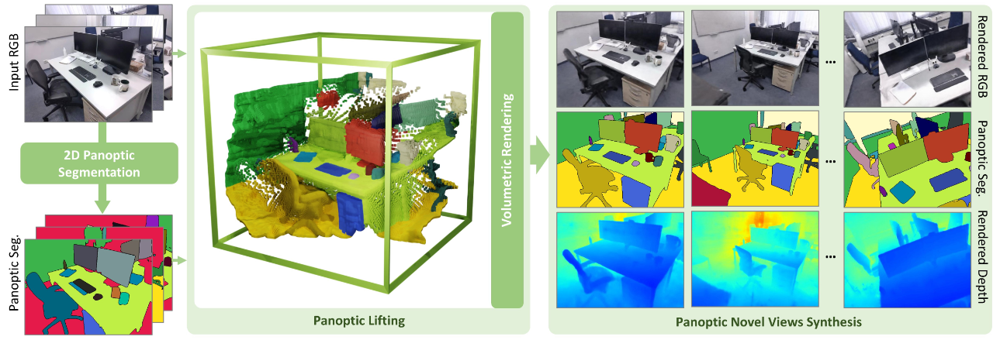
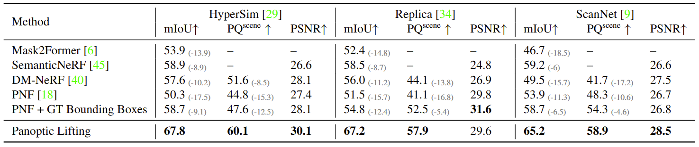
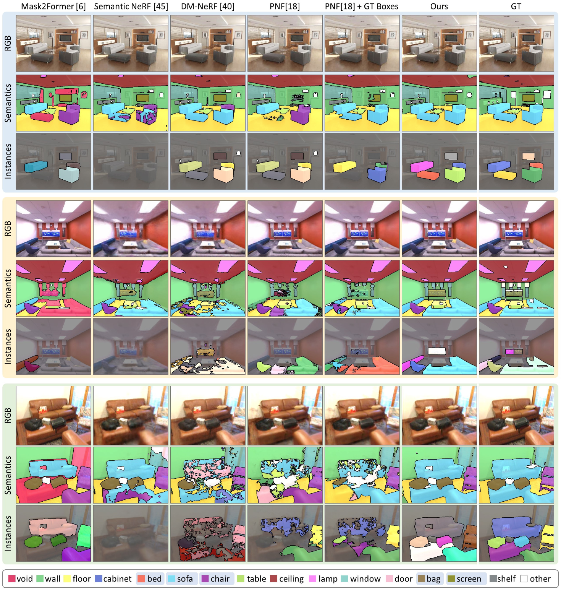
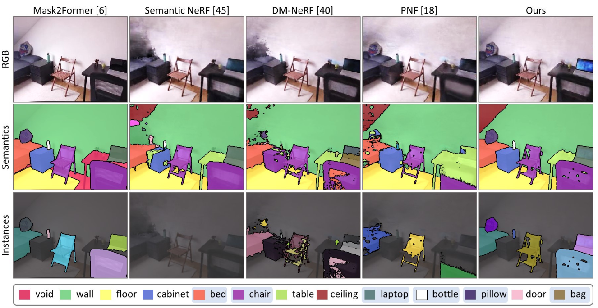

# Panoptic Lifting for 3D Scene Understanding

Update: 2023/08/22

## Info
- Paper: [arxiv.org](https://arxiv.org/abs/2212.09802)
  - Submission date: 2022/12/19
  - Authors: Yawar Siddiqui, Lorenzo Porzi, Samuel Rota Buló, Norman Müller, Matthias Nießner, Angela Dai, Peter Kontschieder
  - Conf.: CVPR 2023
- Implementation: [nihalsid/panoptic-lifting](https://github.com/nihalsid/panoptic-lifting)
  - framework: Pytorch
  - Official code: Yes
  - License: Attribution-NonCommercial-ShareAlike 4.0 International
- Keywords: CV, RGB Image, Intensity Image, Panoptic Segmentation, Depth Estimation, Novel View Synthesis

## Setup commands to run the implementation
Tested on:
- GPU: RTX2080ti

### 1. Create a docker container
```bash
# Set this repository absolute path (ex: /home/user/obarads.github.io)
git clone https://github.com/Obarads/obarads.github.io.git
cd obarads.github.io
OGI_DIR_PATH=$PWD

# Get a base image
BASE_IMAGE=nvidia/cuda:11.3.1-cudnn8-devel-ubuntu20.04
docker pull $BASE_IMAGE

# Clone the repository
git clone https://github.com/nihalsid/panoptic-lifting.git
# Move to the repository
cd panoptic-lifting
# Switch to 2023/06/13 ver.
git switch -d f72fbfa1418638fef15a1c6e2b2ec8a0293871f0
# Copy a folder for building env.
cp -r $OGI_DIR_PATH/environments/PLf3SU/ ./dev_env

# Create docker image and container
docker build . -t panoptic-lifting -f ./dev_env/Dockerfile --build-arg UID=$(id -u) --build-arg GID=$(id -g) --build-arg BASE_IMAGE=$BASE_IMAGE
docker run -dit --name panoptic-lifting --gpus all -v $PWD:/workspace panoptic-lifting
```

### 2. Setup in the docker container
In a docker container:
```bash
cd /workspace

# setup python and packages
conda create -n panoptic-lifting -y python=3.9
conda activate panoptic-lifting
cd dev_env
pip install -r requirements.txt
```

### 3. Setup the model and processed dataset
In a docker container:
```bash
cd /workspace

gdown https://drive.google.com/uc?id=1dvkfZ9beYVsxG_RftZ6aguHP6FLgjAC3
unzip pretrained-examples.zip
gdown https://drive.google.com/uc?id=1I6Y7IqSEmWl_T4CRUj-TmlUgejjexCa7
unzip data.zip
```

### 4. Run the model
In a docker container:
```bash
cd /workspace
cp inference/render_panopli.py ./
python render_panopli.py pretrained-examples/hypersim_ai001008/checkpoints/epoch=30-step=590148.ckpt False
```

## Clipping and note
### どんな論文か？
- > In this work we introduce Panoptic Lifting, a novel formulation which represents a static 3D scene as a panoptic radiance field (see Sec. 3.2).
  - > Panoptic Lifting supports applications like novel panoptic view synthesis and scene editing, while maintaining robustness to a variety of diverse input data. 
  - > Our model is trained from only 2D posed images and corresponding, machine-generated panoptic segmentation masks, and can render color, depth, semantics, and 3D-consistent instance information for novel views of the scene.
- Fig.1 shows Panoptic Lifting overview.


> Figure 1. Given only RGB images of an in-the-wild scene as input, our method optimizes a panoptic radiance field which can be queried for color, depth, semantics, and instances for any point in space. We obtain poses for input images with COLMAP [32], and 2D panoptic segmentation masks using a pretrained off-the-shelf network [6]. During training, our method lifts these 2D segmentation masks, which are often noisy and view-inconsistent, into a consistent 3D panoptic radiance field. Once trained, our model is able to render images and their corresponding panoptic segmentation masks from both existing and novel viewpoints.

### 新規性
- > A novel approach to panoptic radiance field representation that models the radiance, semantic class and instance id for each point in the space for a scene by directly lifting machine-generated 2D panoptic labels.
- > A robust formulation to handle inherent noise and inconsistencies in machine-generated labels, resulting in a clean, coherent and view-consistent panoptic segmentations from novel views, across diverse data.

### 結果
- > As shown in Tab. 1 and Fig. 6, we outperform baselines across all datasets on both semantic and panoptic segmentation tasks, without sacrificing view synthesis quality.
- > Fig. 7 additionally shows qualitative results on an in-the-wild capture.


> Table 1. Quantitative comparison on novel views from the test set. We outperform both 2D and 3D NeRF methods on semantic and panoptic segmentation tasks. Note that, compared to other methods, PNF+GT Bounding Boxes is given the advantage of using ground truth 3D detections. Mask2Former does not predict scene-level object instances, thus it can’t be evaluated for PQscene.


> Figure 6. Novel views and their corresponding semantics and instances on Hypersim [29], Replica [34], and ScanNet [9] (top to bottom, respectively). Highlighted legend labels represent instanced (thing) classes. All 3D methods use the same posed RGB images and 2D machine-generated labels for training. PNF [18] additionally uses 3D bounding box predictions, while PNF + GT Boxes uses ground truth bounding boxes for instance classes. We outperform the state of the art, producing clean and consistent segmentation masks.


> Figure 7. Novel views and their corresponding semantics and instances on in-the-wild room capture. Highlighted labels in the legend represent instanced (thing) classes. All 3D methods use the same posed RGB images and 2D machine-generated labels for training. PNF [18] additionally uses predictions from a 3D bounding box detector.

### Other experiments
Ablations, Scene Editing

## 論文関連リンク
- [6] owen Cheng, Ishan Misra, Alexander G Schwing, Alexander Kirillov, and Rohit Girdhar. Masked-attention mask transformer for universal image segmentation. In Proceedings of the IEEE/CVF Conference on Computer Vision and Pattern Recognition, pages 1290–1299, 2022.
- [9] Angela Dai, Angel X Chang, Manolis Savva, Maciej Halber, Thomas Funkhouser, and Matthias Nießner. Scannet: Richly-annotated 3d reconstructions of indoor scenes. In Proceedings of the IEEE conference on computer vision and pattern recognition, pages 5828–5839, 2017.
- [18] Sosuke Kobayashi, Eiichi Matsumoto, and Vincent Sitzmann. Decomposing nerf for editing via feature field distillation. In Advances in Neural Information Processing Systems, volume 35, 2022.
- [29] Michael Oechsle, Songyou Peng, and Andreas Geiger. Unisurf: Unifying neural implicit surfaces and radiance fields for multi-view reconstruction. In Proceedings of the IEEE/CVF International Conference on Computer Vision, pages 5589–5599, 2021.
- [32] Antoni Rosinol, Arjun Gupta, Marcus Abate, Jingnan Shi, and Luca Carlone. 3d dynamic scene graphs: Actionable spatial perception with places, objects, and humans. arXiv preprint arXiv:2002.06289, 2020.
- [34] Johannes L Schonberger and Jan-Michael Frahm. Structurefrom-motion revisited. In Proceedings of the IEEE conference on computer vision and pattern recognition, pages 4104–4113, 2016.