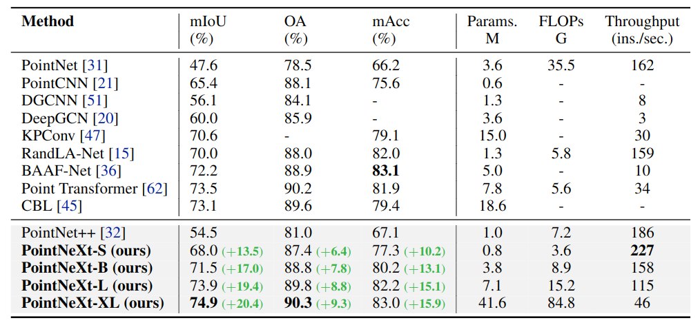

# PointNeXt: Revisiting PointNet++ with Improved Training and Scaling Strategies

Update: 2023/07/01

## Info
- Paper: [arxiv.org](https://arxiv.org/abs/2206.04670)
  - Submission date: 2022/07/09
  - Authors: Guocheng Qian, Yuchen Li, Houwen Peng, Jinjie Mai, Hasan Abed Al Kader Hammoud, Mohamed Elhoseiny, Bernard Ghanem
  - Conf.: NeurlPS 2022
- Implementation: [guochengqian/PointNeXt](https://github.com/guochengqian/PointNeXt)
  - framework: Pytorch
  - Official code: Yes
  - License: MIT license
- Keywords: CV, Point Cloud, Semantic Segmentation, Part Segmentation, Classification

## How to build with docker and run the model in a docker container
### 1. Create a docker container
```bash
# Set this repository absolute path (ex: /home/user/obarads.github.io)
git clone https://github.com/Obarads/obarads.github.io.git
cd obarads.github.io
OGI_DIR_PATH=$PWD

# Get a base image
BASE_IMAGE=nvidia/cuda:11.3.1-cudnn8-devel-ubuntu20.04
docker pull $BASE_IMAGE

# Clone the repository
git clone https://github.com/guochengqian/PointNeXt.git
# Move to PointNeXt
cd PointNeXt
# Switch to 2022/12/22 ver.
git switch -d de9e7f19b8b60645b2d94d210b307cca8d06e926
# Clone openpoints into repository
# Note: this command is provided to avoid the labor with git submodule and ssh.
rm -rf openpoints
git clone https://github.com/guochengqian/openpoints.git
cd openpoints
git switch -d ee100c81b1d9603c0fc76a3ee4e37d10b2af60ba

# Copy a folder for building env.
cd ../
cp -r $OGI_DIR_PATH/environments/PRPwITaSS/ ./dev_env

# Create docker image and container
docker build . -t pointnext -f ./dev_env/Dockerfile --build-arg UID=$(id -u) --build-arg GID=$(id -g) --build-arg BASE_IMAGE=$BASE_IMAGE
docker run -dit --name pointnext --gpus all -v $PWD:/workspace pointnext
```

### 2. Setup in the docker container
In a docker container:
```bash
cd /workspace

# apply diff
cd dev_env
git apply code.diff

# setup packages
cd ../
source install.sh
```

### 3. Setup the dataset
In a docker container:
```bash
mkdir -p data/S3DIS/
cd data/S3DIS
gdown https://drive.google.com/uc?id=1MX3ZCnwqyRztG1vFRiHkKTz68ZJeHS4Y
tar -xvf s3disfull.tar
```

### 4. Run the model
In a docker container:
```bash
cd /workspace
CUDA_VISIBLE_DEVICES=0 python examples/segmentation/main.py --cfg cfgs/s3dis/pointnext-s.yaml --batch_size 16
```

## どんなもの?
- > In this work, we revisit PointNet++, the classical and widely used network, and find that its full potential has yet to be explored, mainly due to two factors that were not present at the time of PointNet++: (1) superior training strategies and (2) effective model scaling strategies.
  1. > Through a comprehensive empirical study on various benchmarks, e.g., ScanObjecNN [48] for object classification and S3DIS [1] for semantic segmentation, we discover that training strategies, i.e., data augmentation and optimization techniques, play an important role in the network’s performance. In fact, a large part of the performance gain of state-of-the-art (SOTA) methods [51, 47, 62] over PointNet++ [32] is due to improved training strategies that are, unfortunately, less publicized compared to architectural changes.
  2.  > Effectively expanding PointNet++ from its original small scale to a larger scale is a topic worth studying because larger models are generally expected to enable richer representations and perform better [2, 18, 61]. However, we find that the naive way of using more building blocks or increasing the channel size in PointNet++ only leads to an overhead in latency and no significant improvement in accuracy (see Sec. 4.4.2). For effective and efficient model scaling, we introduce residual connections [14], an inverted bottleneck design [40], and separable MLPs [34] into PointNet++.
- > The modernized architecture is named PointNeXt, the next version of PointNets. 


> Figure 2: PointNeXt architecture. PointNeXt shares the same Set Abstraction and Feature Propagation blocks as PointNet++ [32], while adding an additional MLP layer at the beginning and scaling the architecture with the proposed Inverted Residual MLP (InvResMLP) blocks. Here, we present PointNeXt for segmentation as an example. Refer to Appendix for the classification architecture.


## どうやって有効だと検証した?
他モデルと比べた際の結果は以下の通り。

### S3DISによるセグメンテーション検証


> Table 1: Semantic segmentation on S3DIS with 6-fold cross-validation. The improvements of our PointNeXt over PointNet++ [32] are highlighted in green color. Methods are in chronological order.

### ScanObjectNNによるオブジェクト分類検証


> Table 2: Object classification on ScanObjectNN.

### ShapeNetPartによるパーツセグメンテーション検証


> Table 3: Part segmentation on ShapeNetPart.

## 論文関連リンク
なし
