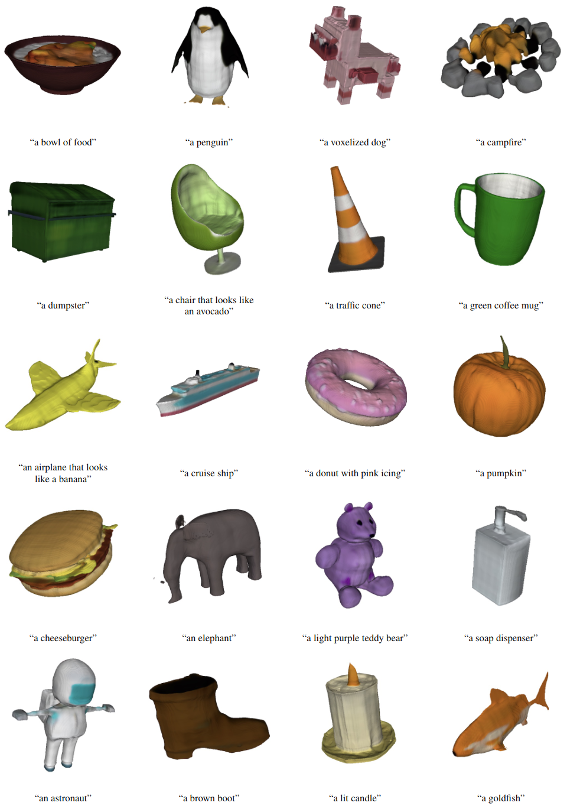
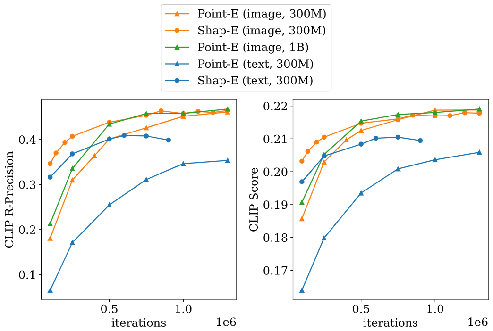
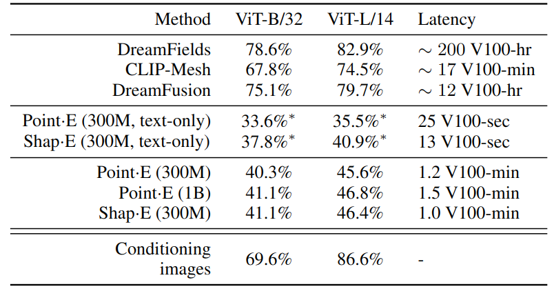

# Shap-E: Generating Conditional 3D Implicit Functions

Update: 2023/07/09

## ℹ️ Info
- Paper: [arxiv.org](https://arxiv.org/abs/2305.02463)
  - Submission date: 2023/05/03
  - Authors: Heewoo Jun, Alex Nichol
  - Conf.: None?
- Implementation: [openai/shap-e](https://github.com/openai/shap-e)
  - framework: Pytorch
  - Official code: Yes
  - License: MIT license
- Keywords: CV, Mesh, Object Generation

## 🖥️ Setup commands to run the implementation
### 1. Create a docker container
```bash
# Set this repository absolute path (ex: /home/user/obarads.github.io)
git clone https://github.com/Obarads/obarads.github.io.git
cd obarads.github.io
OGI_DIR_PATH=$PWD

# Get a base image
BASE_IMAGE=nvidia/cuda:11.7.1-cudnn8-devel-ubuntu20.04
docker pull $BASE_IMAGE

# Create and move to a container dir
mkdir containers
cd containers
# Clone the repository
git clone https://github.com/openai/shap-e.git
# Move to shape-e
cd shap-e
# Switch to 2023/07/07 ver.
git switch -d db3f3b4c2f572b53fbe408d202e2445a1f656353
# Copy a folder for building env.
cp -r $OGI_DIR_PATH/environments/SGC3IF/ ./dev_env

# Create docker image and container
docker build . -t shape -f ./dev_env/Dockerfile --build-arg UID=$(id -u) --build-arg GID=$(id -g) --build-arg BASE_IMAGE=$BASE_IMAGE
docker run -dit --name shape --gpus all -v $PWD:/workspace shape
```

### 2. Setup packages
In a docker container:
```bash
cd /workspace

conda create -n shape python=3.9
conda activate shape

pip install -r dev_env/requirements.txt
pip install -e .
```

### 3. Run the model
Please open `/workspace/shap_e/examples/sample_text_to_3d.ipynb`, in the container and run the cells in `sample_text_to_3d.ipynb`.

## 📝 Clipping and note
### どんなもの?
- > Unlike recent work on 3D generative models which produce a single output representation, Shap·E directly generates the parameters of implicit functions that can be rendered as both textured meshes  and neural radiance fields.
- > We train Shap·E in two stages: 
  - > first, we train an encoder that deterministically maps 3D assets into the parameters of an implicit function;
  - > second, we train a conditional diffusion model on outputs of the encoder.
- > Compared to Point·E [41], a recently proposed explicit 3D generative model, our models converge faster and obtain comparable or superior results while sharing the same model architecture, datasets, and conditioning mechanisms.
- Fig.1 shows text-conditional meshes generated by Shap·E.


> Figure 1: Selected text-conditional meshes generated by Shap·E. Each sample takes roughly 13 seconds to generate on a single NVIDIA V100 GPU, and does not require a separate text-to-image model.
　
### どうやって有効だと検証した?
- 他モデルと比べた際のResultは以下の通り。
- > For most of our experiments, we employ the same dataset of underlying 3D assets as Nichol et al. [41], allowing for fairer comparisons with their method.
  - Note: the authors slightly extend the original post-processing (Section 4.1).
- Comparison to Point·E (figure 4)
- Comparison to Other Methods (table2)


> Figure  4: Evaluations  throughout  training  for  both  Shap·E  and  Point·E.  For  each  checkpoint  for  both  models,  we  take  the  maximum  value  when  sweeping  over  guidance  scales { 2.0, 3.0, 4.0, 5.0, 8.0, 10.0,15.0} .


> Table 2: Comparison of 3D generation techniques on the CLIP R-Precision metric on COCO evaluation prompts. Compute estimates and other methods’ values are taken from Nichol et al. [41]. ∗The best text-conditional results are obtained using our expanded dataset of 3D assets.

### Other experiments
Encoder Evaluation, Limitations and Future Work

## 📚 References
- [41] Alex Nichol, Heewoo Jun, Prafulla Dhariwal, Pamela Mishkin, and Mark Chen.  Point-e: A system for generating 3d point clouds from complex prompts. arXiv:2212.08751, 2022.
