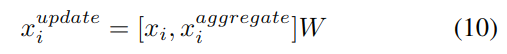
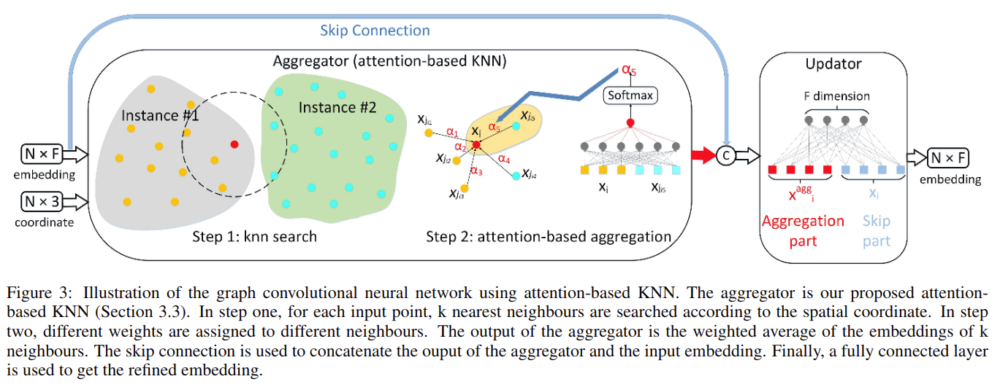
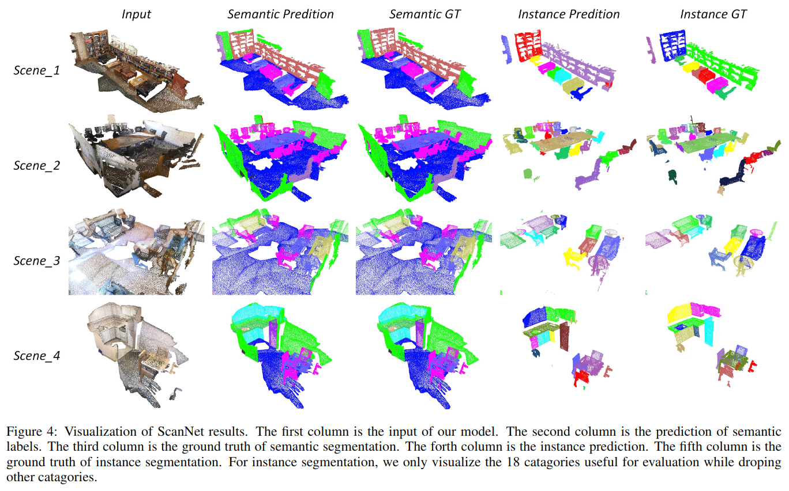

# 3D Graph Embedding Learning with a Structure-aware Loss Function for Point Cloud Semantic Instance Segmentation

元の論文の公開ページ : [arxiv](https://arxiv.org/abs/1902.05247)
Github Issues : [#43](https://github.com/Obarads/obarads.github.io/issues/43)

## どんなもの?
- 3Dセマンティックインスタンスセグメンテーションのための提案なし手法を提案した。
- 提案手法ではkNNを使い点の周りにあるであろう同じインスタンスの点を得ようとするが、近い点全てが同じインスタンスでは無いためアテンション機構を取り込み分別する。

-  また、3Dインスタンスごとに埋め込み情報と構造情報の両方を考慮した3Dインスタンスセグメンテーションのためのstructure-aware lossを提案した。

## 先行研究と比べてどこがすごいの?
- kNNにアテンション機構を導入して不必要な参照をしないようにしたこと。
- また、新しい損失を定義した。

## 技術や手法のキモはどこ? or 提案手法の詳細
提案したネットワークは図2の通り。submanifold convolution networkはGrahamら[1]のものを使う。structure-aware lossとGCNが新規提案となる。

### Structure-aware Loss Function
3Dインスタンスセグメンテーションタスクでは、各インスタンスに含まれる点は埋め込み特徴だけでなく3D空間上の構造特徴も関係する。この損失関数は、埋め込み情報と構造情報を組み合わせてより明確な識別を可能にする。  
埋め込み間の類似度測定においてコサイン距離はスケール不変であるため扱いやすいが、インスタンスの数が多すぎる場合に超球面上で異なるインスタンス埋め込みが制限され十分に区別できなくなる。解決策の1つとして埋め込みの高次元化があるが、後の処理が複雑になる。そのため、ここではユークリッド距離を使う。損失関数は式(5)の通り。

$Loss_ {i}^{intra}$は同じインスタンスの埋め込み間の距離を最小にする損失であり、$Loss_ {ij}^{inter}$は異なるインスタンス間の埋め込みを離れさせる損失である。構造情報は$Loss_ {i}^{intra}$に含まれている。ここには書いてないが、式(1)と式(5)で使われているjは意味が違うっぽい(式(1)は点の番号、式(5)のjはi以外のインスタンス番号....かな?)

### Attention-based K Nearest Neighbour
通常のkNN集約の式にアテンションの重み$\alpha$を組み込んだものを使っている。$\alpha$自体は中心点とその点の近傍点を用いたソフトマックス関数から出力される値である。

### Graph Convolutional Neural Network using Attention-based KNN
通常、グラフ畳み込みニューラルネットワーク(GCN)は集約と更新によって成り立つ。ここでは先程説明したアテンションkNNを集約として使い、バイアスなしの全結合層を更新として使う。よって、式(10)のように表すことができる。このグラフ畳み込みニューラルネットワークの概要図は図3の通り。  
なお、この提案は莫大な計算、グラフの固有値とラプラシアン行列の計算が必要ない(Analysis参照)。

## どうやって有効だと検証した?
### データセットの利用
ScanNetとNYUv2を用いて実験した。結果は表1と表2の通り。視覚的結果は図4の通り。

### Ablation Study
結果は表3の通り。vanillaLossは提案した損失の新規性である構造情報を使わない損失である。structure-aware loss関数はセマンティックセグメンテーションのIoUには影響を及ぼさないが、APの評価では精度が増加しているため、structure-aware lossによって学習されたより識別可能な埋込みから来る恩恵だと考えられる。

## 議論はある?
さらなる複数台のセンサ融合により性能を高められるだろう。

## 次に読むべき論文は?
- なし

## 論文関連リンク
1. [Benjamin Graham, Martin Engelcke, and Laurens van der Maaten. 3d semantic segmentation with submanifold sparse convolutional networks. In Proceedings of the IEEE Conference on Computer Vision and Pattern Recognition, pages 9224–9232, 2018.](http://openaccess.thecvf.com/content_cvpr_2018/papers/Graham_3D_Semantic_Segmentation_CVPR_2018_paper.pdf)

## 会議
不明

## 著者
Zhidong Liang, Ming Yang, Chunxiang Wang.

## 投稿日付(yyyy/MM/dd)
2019/02/14

## コメント
最近、YOLOやFaster R-CNNなどで使われるROI(region of interest)などを使った領域提案を使った手法であるproposal-baseな手法に代わって、入力に対する埋め込みを生成する手法(画像では各ピクセルに対して埋め込みを生成しクラスタアルゴリズムを適応してインスタンスを得る)であるproposal-freeな手法が提案されている。

## key-words
Point_Cloud, Semantic_Segmentation, Instance_Segmentation, CV, Paper, 修正

## status
修正

