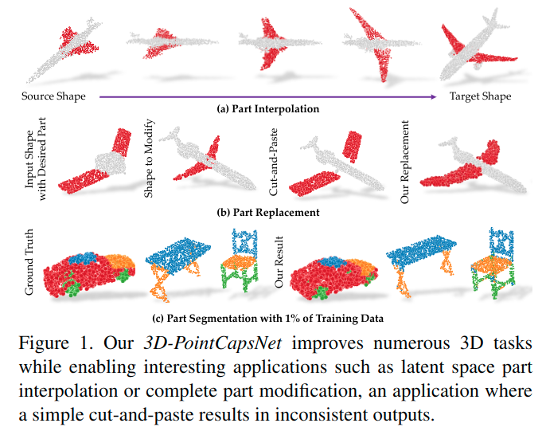

# 3D Point Capsule Networks

元の論文の公開ページ : [openaccess.thecvf.com](http://openaccess.thecvf.com/content_CVPR_2019/papers/Zhao_3D_Point_Capsule_Networks_CVPR_2019_paper.pdf)  
提案モデルの実装 : [yongheng1991/3D-point-capsule-networks](https://github.com/yongheng1991/3D-point-capsule-networks)  
Github Issues :   

Note: 記事の見方や注意点については、[こちら](/)をご覧ください。
Note: 引用中の[*]は論文内の文献番号である。該当する論文は、論文関連リンクの各リストの末尾に基づいて調べられる。

## どんなもの?
##### カプセルネットワークに基づいて設計された非構造3Dデータの教師なし表現学習モデル、3D Point Capsule Networks(3D-PointCapsNet)を提案した。
- 2D分野で発表されているカプセルネットワークと同じく、点群に存在する部品間の幾何学的関係を重視する。
  - [この部品というのは、飛行機の羽などのパーツを指している模様。]
- また、新しい3D point-set decoderを提案し、図1に示すような操作性に優れた再構築物を可能にする。
  - [ここで言う操作性とは、どうやらパーツの修正や挿入などの動作を指すみたい。]
- また、unseen dataへの一般化では、訓練データの1%を使うだけでも85%程の精度を持つことができる。
  - [この話の具体的内容はIntr.は多分実験を見ないとわからない。]
- [他にも利点の紹介があるが省略。]
- 貢献は以下の通り。
  - "Motivated by a unified perspective of the common point cloud autoencoders, we propose capsule networks for the realm of 3D data processing as a powerful and effective tool."
  - "We show that our point-capsule AE can surpass the current art in reconstruction quality, local 3D feature extraction and transfer learning for 3D object recognition."
  - "We adapt our latent capsules to different tasks with semi-supervision and show that the latent capsules can master on peculiar parts or properties of the shape. In the end, this paves the way to higher quality predictions and a diverse set of applications like part specific interpolation."

##### 提案手法は再構築、ローカル3D特徴抽出、3Dオブジェクト認識の転移学習において既存の手法を凌ぐ。
- 他にも、補間アプリケーションについて実演する。
- 評価には以下を使用。
  - ShapeNet-Core
  - ShapeNet-Part
  - ModelNet40
  - 3DMatch Benchmark

## 先行研究と比べてどこがすごいの? or 関連事項
##### 省略

## 技術や手法のキモはどこ? or 提案手法の詳細
##### 手法の概要
- 手法の全体像は図2の通り。

## どうやって有効だと検証した?
##### 省略

## 議論はある?
##### 省略

## 次に読むべき論文は?
##### なし

## 論文関連リンク
##### なし
1. [なし]()[1]

## 会議, 論文誌, etc.
##### CVPR 2019

## 著者
##### Yongheng Zhao, Tolga Birdal, Haowen Deng, Federico Tombari

## 投稿日付(yyyy/MM/dd)
##### 2018/12/27

## コメント
##### あり
- AとIのCont.を確認した。正直、Aに書いてある内容が薄味なので、そこまで書けていない。

## key-words
##### CV, Paper, Point_Cloud, 導入, Implemented, AutoEncoder, Reconstruction, Completion, Part_Segmentation, Unsupervised_Learning, Classification, Semi-Supervised_Learning

## status
##### 導入

## read
##### A, I, C

## Citation
##### 未記入
