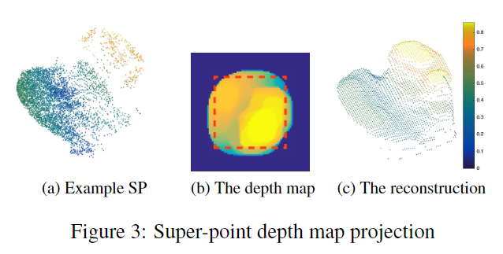

# 3D Point Cloud Registration for Localization using a Deep Neural Network Auto-Encoder

元の論文の公開ページ : [openaccess.thecvf.com](http://openaccess.thecvf.com/content_cvpr_2017/papers/Elbaz_3D_Point_Cloud_CVPR_2017_paper.pdf)  
提案モデルの実装 : [gilbaz/LORAX](https://github.com/gilbaz/LORAX)  
Github Issues : [#48](https://github.com/Obarads/obarads.github.io/issues/48)

Note: 本記事の見方や注意点については、[こちら](/)をご覧ください。

## どんなもの?
##### GPS等の位置に関する事前情報を必要としないレジストレーションアルゴリズム、LORAXを提案した。
- グローバル点群(全体的な点群)とその点群と重複するローカル点群(局所的な点群)の2つに対するレジストレーションを行う。
    - グローバル点群は点の数が最大1億個ある屋外の点群であり、一方でローカル点群はグローバル点群よりも2~3桁分点が少ない。
- キーポイントの代わりにスーパーポイント(superpoint)を使用して、正しい変換(transformation[、ローカル点群がグローバル点群のどこに位置するか])を見つける。
    - 図7のcは、グローバル点群とローカル点群間のそれぞれのスーパーポイントの対応関係を線で表している。

##### [論文のポイントは、スーパーポイントによって大規模なグローバル点群とローカル点群を局所領域ごとに比較するという部分。]
- [更新日: 2019/12/21時点での自分の観点より。]
- [理由は以下の通り。]
    - [最大1億個の点を含むグローバル点群の中のどの部分に小規模な点群であるローカル点群が一致するのか、スーパーポイントによってできた局所領域ごとに分けて比較を行う。]
    - [局所領域の幾何学的な情報を深層オートエンコーダによって低次元なベクトルに変換するために、いくつかの工夫を加えている。]

## 先行研究と比べてどこがすごいの?
##### 野外においてGPS等の事前の環境情報を使わずにレジストレーションを行える。
- 環境情報を得る前提のレジストレーションは、その環境情報の精度に大きく依存するという問題がある。
- GPSは、天気や物理的障害に弱いため精度が左右しやすい。
- 本提案では、その事前情報を使わない。

## 技術や手法のキモはどこ? or 提案手法の詳細

### 手法の概要
##### 1. 点群をスーパーポイント(SP)へ分割する。
- この分割にはRandom Sphere Cover Set (RSCS)アルゴリズムを使用する。
- 詳細は工夫のRandom Sphere Cover Set (RSCS)にて。

##### 2. 各SP内でローカル座標系を定義する。
- SPを2Dの深度マップに反映させる際に必要となる。
- SP内の点の推定共分散行列に対してSingular Value Decomposition (SVD)を使ってローカル座標系を取得する。
- [SP内の点群を表面として示す仮定があるなど、多分、表面の平たい部分がZ軸方向に向くようにする。]

##### 3. SPを2Dの深度マップに反映する。
- 図3のaとbの様に、点群を画像に反映させ、必要な部分のみを切り取るようにする。
    - 最初は一辺64ピクセル、切り取りで32ピクセルで固定長。[SPの重心点から見て投影してる?]
    - ピクセルにはz軸方向の値が入る。
- 点群のノイズや点密度を均一にするためにmax filterとmean filterを使って図3のcの様な形に変換する。

##### 4. SPに対して突起箇所の検出とフィルタリングをする。
- 不適切なSPを取り除くするため、3つのフィルタリングを施す。
- 詳細は工夫のSaliency Detection and Filtrationを参照

##### 5. 深層ニューラルネットワークオートエンコーダを使った次元削減を行う。
- SPの深度マップから次元削減された特徴(SP auto-encoder based Featur, SAF)を抽出するため、深層オートエンコーダを使用する。
- 比較のために、PCAを用いた特徴も使う。
- 実装に関して色々あるが、ここでは省略。

##### 6. 対応する記述子間のマッチングを行う。
- SAFベクトルのユークリッド距離を使い、各ローカル点群中のSPから近いK個(K近傍)のグローバル点群中のSPをペアにする。
    - ただし、i番目の近傍に関連する距離よりi+1番目の近傍に関連する距離がはるかに遠い場合、i+1からKまでの候補は除外する。

##### 7. 局所的な探索を使って粗いレジストレーションを行う。
- 最良の変換を上から5つ出力する。
- 詳細は工夫のCoarse Registration by Localized Searchを参照

##### 8. Iterative Closest Point(ICP)で微調整する。
- 5つの変換に対してそれぞれICPを適応し、一番結果が良かったものを選ぶ。

### 工夫
#### Random Sphere Cover Set (RSCS)
##### 重複有りのSPを生成するシンプルな手法を使う。
- RSCSの手順は以下の通り。
    1. SPに割り当てられていないランダムに単体点$P$を選ぶ。
    2. $P$を中心として、固定半径を持つ球の中にある点を新しいSPとして定義する。SPの重複は有、つまり1つの点が複数のスーパーポイントに属することがある。
    3. すべてのSPの点の数を足し合わせて、それが点群全体の95%を占めるようになるまで1と2を繰り返す。
        - [重複は1カウント。]
- 半径を求めるためのプロパティがある。[ここでは省略。]
- 尚、堅牢性向上のためグローバル点群で1回、ローカル点群で複数回、RSCSが施される。

#### Saliency Detection and Filtration
##### 不適切なSP(特徴があまりないSP)を排除するため3つのフィルタリングを行う。
- フィルタリングは以下の通り。
    - Density Test: $N_ d$点に満たないSPをはじく。また、$K$個の近隣SPよりも比較的少ない点を含むSPもはじく。
    - Geometric Quality Test: 高さ(z軸)に差がないSPをはじく。
    - Saliency Test: グローバル点群から得たSPの深度マップを$d_ {im2}^2$個の深度ベクトルに変形する。深度ベクトルのセットにPCAを施し、最初の三つの固有ベクトルを使うだけで正確に再構築できるSP(ローカル点群とグローバル点群のもの)はデータセットでよく見られる幾何学特徴であるため、排除する。これにより、点群の異なる領域にある類似のSP間での一致の可能性が減少する。
        - [最初ってなに?]

#### Coarse Registration by Localized Search
##### ローカル点群とグローバル点群を見比べて、最良の変換を上から5つ出力する。
- 点群間の対応関係を探すが、ローカル点群とグローバル点群間で一致する箇所を最低$m=3$(堅牢性の考慮により$m=6$)探さなければならない。しかし、そのままだと検索規模が大きすぎるため、各反復でグローバル点群内で$V_ {local}$を超えない範囲の球の中に含まれるm個の候補ペアのみを考慮する。
    - この$m$と$V_ {local}$は、RSCSの半径を決める際にも使われている。
- RANSACを使い、反復的に6つの候補ペアを選択し、変換を計算、そしてグローバル点群中の近傍とローカル点群内の変換点間の物理的な平均距離を計測することで一致度をチェックする。
- coarse registration stepの結果として最良のscoring transformationのみを選択する代わりに、ローカル点群が重ならない5つの最良の変換$(T_ 1, \ldots, T_ 5)$を記録する。
- 次の微調整ステップがそれぞれに適応され、最終的に最良のscoring fine registrationが得られたものが選択される。

## どうやって有効だと検証した?
##### 省略

## 議論はある?
##### なし

## 次に読むべき論文は?
- なし

## 論文関連リンク
1. [Gil Elbaz. 3D Point Cloud Registration for Localization using a Deep Auto-encoder Neural Network. (著者の説明動画, アクセス:2019/04/10)](https://www.youtube.com/watch?v=iAScGjMvyHA)
2. [gilbaz, gilbaz/LORAX: CVPR Paper - "3D Point Cloud Registration for Localization using a Deep Neural Network Auto-Encoder" - Partial Implementation Code. (著者らの実装, アクセス:2019/04/10)](https://github.com/gilbaz/LORAX)

## 会議
CVPR 2017

## 著者
Gil Elbaz, Tamar Avraham, Anath Fischer. 

## 投稿日付(yyyy/MM/dd)
2017/07/21

## コメント
なし

## key-words
Registration, Point_Cloud, AutoEncoder, CV, Paper, 省略, Superpoint

## status
省略

## read
A, I, R, M