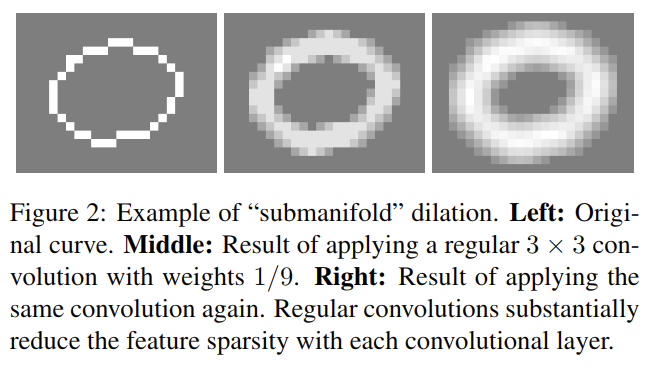
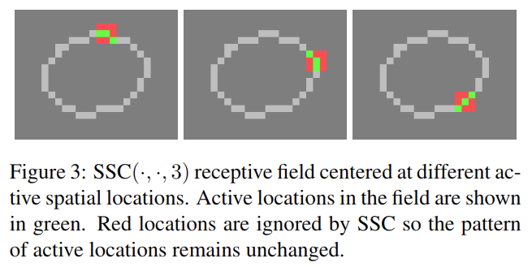
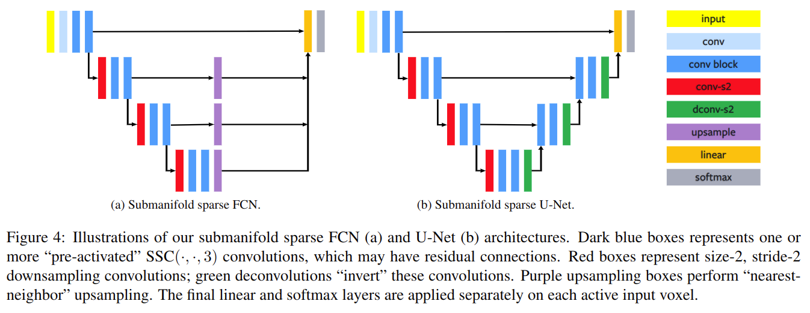

# 3D Semantic Segmentation with Submanifold Sparse Convolutional Networks

元の論文の公開ページ : https://arxiv.org/abs/1711.10275

## どんなもの?
画像などの密なデータ形式にしか対応していない一般的なCNNではなく点群などの疎なデータ形式に対応したsubmanifold sparse convolutional networks(SSCNs)を提案した。

## 先行研究と比べてどこがすごいの?
ボクセルなどの体積データへの3D畳み込みは疎なデータに対してもメモリを多く使用してしまう。スパース畳み込みに関する研究では、各層のアクティブサイト(例:0でない要素)の数を増やす畳み込み演算子が実装されている。この論文では、「full」な畳み込みを各層で適応することで、スパースなデータを「dilate(拡張)」してしまうことを欠点としている(図2とそのgif参照)。これらとは対象的に、著者らは層でスパース性が変化せず、アクティブサイトの位置が固定したままにするsubmanifold sparse convolution(SSC)を提案する。SSCは空の領域(0しか無い領域)の計算を必要としない。

表1でも示すとおり、良い結果が出ている。

尚、先程の「dilate」の問題は3次元以上の2次元表面もしくは2次元以上の1次曲線(3次元から見れば表面というのは2次元の平面であり、2次元から見れば、曲線というのは1次元の線を曲げたものに過ぎない)を含む時に顕著となる(例えば3次元上に平面で表されたオブジェクトしか無い場合に「dilate」が起こると、平面の裏と表が無駄に分厚くなる(=スパース性が失われる)が、球のような形状で球内が満たされている場合では表面の厚みが増すだけでスパース性は前述したものよりも失われない(=そもそも入力自体があまりスパースでない)ということ...多分)。この問題を著者らはsubmanifold dilation problemと呼ぶ。

## 技術や手法のキモはどこ? or 提案手法の詳細
このアプローチの潜在的問題(submanifold dilation problem?)はネットワークにある隠れ層が入力データを分類するために必要とするすべてのデータを受け取ることができない可能性があるためである(特に、2つの隣接する接続されたコンポーネント(?)は完全かつ独立に扱われる)。この問題に解決するため、poolingもしくはstrided畳み込み演算を使った畳み込みネットワークを用いる。

### Sparse Convolutional Operations
$m$個の入力特徴平面、$n$個の出力特徴平面、フィルターサイズ$f$とストライド$s$を持つスパースな畳み込みSC($m,n,f,s$)を定義する。SCは一般的な畳込みと同様の方法でアクティブサイトのセットを計算する(要はSCはサイズ$f^d$(多分$d$乗じゃない)の受容野にあるいくつかのアクティブサイトの存在を探す)。もし、入力がサイズ$\ell$を持つのであれば、出力はサイズ$(\ell-f+s)/s$を持つ。[4]のスパースな畳み込みや通常の畳込みと違い、SCはこれらのサイトからの入力がゼロである場合、非アクティブサイトである基底状態を破棄する(要は0である要素を無視する?)。これは結果として約50%の計算コスト削減を実現する。

### Submanifold sparse convolution
修正されたSC($m,n,f,s=1$)としてsubmanifold sparse convolution SSC($m,n,f$)を定義する。SSCは以下の手順を踏む。また、$f$を奇数とする。  
1. 出力と入力が同じサイズになるように入力の両端(上下も)に$(f-1)/2$個のゼロを埋める。  
2. 入力内の対応するサイトがアクティブな場合(例:受容野の中央サイトがアクティブな場合)、出力サイトをアクティブに制限する。  
3. 出力サイトがアクティブであると決定されると、出力サイトの出力特徴ベクトルはSSCによって計算される。  
アクティブサイトの検出は図3と図3の下のgifの通り。アクティブな場所(サイト?)は緑で表され、赤色の部分は非アクティブな場所である。赤色の部分は非アクティブであるため、SSCによって無視される。

#### Other operators
deconvolution演算子などについて言及しているが省略。

### Submanifold FCNs and U-Nets for Semantic Segmentation
提案するネットワークでは、[4,5]と同様にスパースでボクセル化された入力表現を使う。SSCとストライドSCを組み合わせてFCNとU-Netのスパース向け派生を作成し、このモデルをsubmanifold sparse convolutional network(SSCNs)を定義する(図4参照)。

## どうやって有効だと検証した?
図5はShapeNetのセマンティックセグメンテーション向けに訓練させたもの。(a)はベースラインとの比較、(b)はネットワークアーキテクチャとしてC3,FCN,U-Netを使い比較したもの、(c)は異なるスケールを使用した時のものである。

#### その他
他にもあるが省略

## 議論はある?
なし

## 次に読むべき論文は?
- なし

## 論文関連リンク
1. [cvpaperchallenge2018](https://cvpaperchallenge.github.io/CVPR2018_Survey/#/ID_3D_Semantic_Segmentation_with_Submanifold_Sparse_Convolutional_Networks)
2. [三次元点群を取り扱うニューラルネットワークのサーベイ Ver. 2 / Point Cloud Deep Learning Survey Ver. 2 - Speaker Deck](https://speakerdeck.com/nnchiba/point-cloud-deep-learning-survey-ver-2?slide=55)
3. [facebookresearch/SparseConvNet: Submanifold sparse convolutional networks](https://github.com/facebookresearch/SparseConvNet)
4. [B. Graham. Sparse 3D Convolutional Neural Networks. British Machine Vision Conference, 2015.](https://arxiv.org/abs/1505.02890)
5. [M. Engelcke, D. Rao, D. Z. Wang, C. H. Tong, and I. Pos-ner. Vote3Deep: Fast Object Detection in 3D Point Clouds using Efficient Convolutional Neural Networks. IEEE Inter-national Conference on Robotics and Automation, 2017.](https://arxiv.org/abs/1609.06666)

## 会議
CVPR 2018

## 著者
Benjamin Graham, Martin Engelcke, Laurens van der Maaten

## 投稿日付(yyyy/MM/dd)
2017/11/28

## コメント
重要なアイデア、確認しとくべき。dilateを欠点扱いしたのは、スパース性が失われることだからか?(失うと計算効率が多分下がる?)

## key-words
Point_Cloud, Sparsity, Semantic_Segmentation

## status
省略