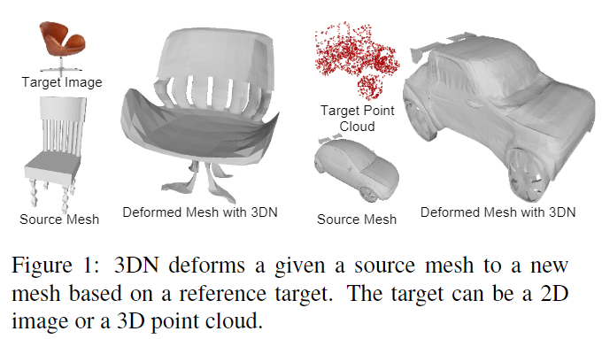

# 3DN: 3D Deformation Network

元の論文の公開ページ : [arxiv](https://arxiv.org/abs/1903.03322)  
Github Issues : 

## どんなもの?
ターゲットの3D点群、3Dメッシュ、2D画像に基づいてソース3Dメッシュを変形させる3D変形ネットワーク、3DNを提案した。  
具体的には、任意のソースメッシュとターゲットモデルが与えられた場合、著者らのネットワークはメッシュの接続性を維持しながらソースメッシュを変形するために頂点変位ベクトル(vertex displacement vectors, 3Dオフセット)を推定する。変形されたモデルの例は図1のとおり。

## 先行研究と比べてどこがすごいの?

## 技術や手法のキモはどこ? or 提案手法の詳細
### 構造
提案モデルの目標は、2D画像と3Dモデルが与えられたときにソースメッシュ$S$がターゲットモデルにできるだけ近くなるように変形することである。ただし、変形時にはソースメッシュの三角トポロジーは固定したまま、頂点の位置を更新する。3DNの構造は図2の通り。

### Offset Decoder
オフセットデコーダーは頂点もしくは点ごとの変位量を予測する$F(\cdot)$を学習する。学習するために使われる入力データは図2の3つの特徴を結合したものである。この頂点もしくは点ごとの変位量と$S$の各点/頂点を足し合わせることで、変形後の形状$S'$の点/頂点が得られる。

## 損失
省略

## どうやって有効だと検証した?

## 議論はある?

## 次に読むべき論文は?
- なし

## 論文関連リンク
1. なし

## 会議
CVPR 2019

## 著者
Weiyue Wang, Duygu Ceylan, Radomir Mech, Ulrich Neumann

## 投稿日付(yyyy/MM/dd)
2019/03/08

## コメント
なし

## key-words
Point_Cloud, Mesh

## status
導入

## read
A

## Citation
