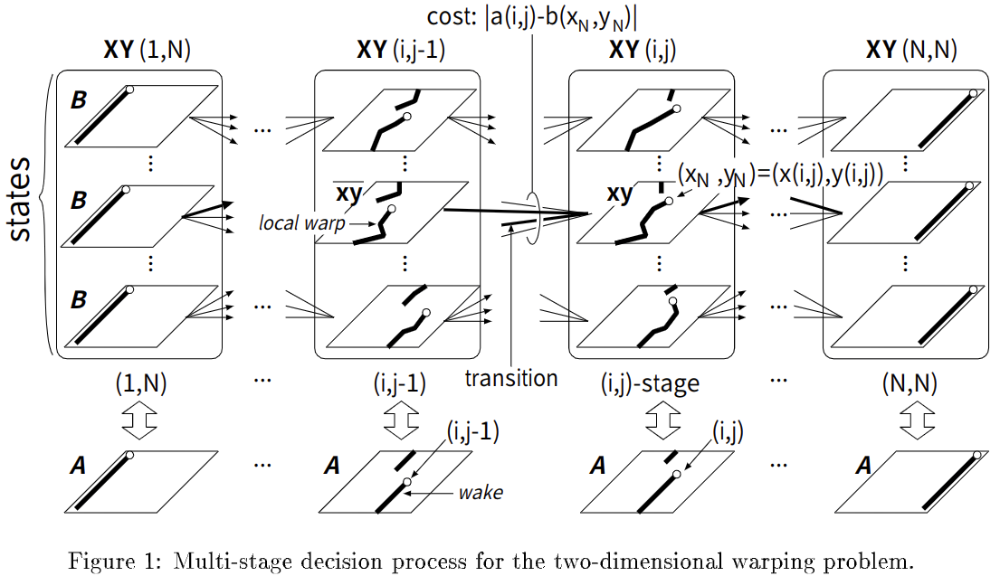

# A Monotonic and Continuous Two-Dimensional Warping Based on Dynamic Programming

元の論文の公開ページ : [pdfs.semanticscholar.org](https://pdfs.semanticscholar.org/36dd/e6fa87576b393fd6769b3ba1c173dc610908.pdf)  
Github Issues : [#118](https://github.com/Obarads/obarads.github.io/issues/118)

## どんなもの?
##### 連続性と単調性の制約を受ける、最適なピクセルマッピングを探索する新規の2次元ワーピングアルゴリズムを提示した。

## 先行研究と比べてどこがすごいの?
DP法に基づく2次元ワーピング手法で最も信頼できるものの一つにLevinとPieraccini[1]が提案したものがある。しかし、この手法は実用面で以下の2つの問題を抱えている。

- **非現実的なワープ** : かなり非現実的なワープがよく生じる。これは単調な条件だけでは画像中の二次元位相構造を保持するのに不十分であることを示している。
- **莫大な計算資源の要求** : 前述した非現実的なワープが探索空間に含まれるので、莫大な計算資源を必要とする。

本研究では、単調性条件と新規の連続性条件を採用した2次元ワーピング手法を提案する。この手法により、画像中の位相構造を大体保持でき、計算コストも[1]より減少する。

## 技術や手法のキモはどこ? or 提案手法の詳細
### Problem formulation
2つの画像$\boldsymbol{A}=\{a(i, j)\}(i, j=1, \ldots, N)$と$\boldsymbol{B}=\{b(x, y)\}(x, y=1, \ldots, M)$を考える。$\boldsymbol{A}$と$\boldsymbol{B}$間の最適な単調性と連続性2次元ワープは式(1)の基準関数を最小化するワーピング関数$(x(i, j), y(i, j))$によって定義される。

$$
\sum_{i=1}^{N} \sum_{j=1}^{N}|a(i, j)-b(x(i, j), y(i, j))| \tag{1}
$$

[※この括弧内は、個人的なメモである。この式(1)は$a$は値$i,j$を与えればそれに対応する値を返す関数、$b$も同様。$b(x(i, j), y(i, j))$は変形された$\boldsymbol{B}$であり、$x(i,j)$は$i,j$に対応する$x$を示す。このワーピングというのは、ある意味画像内のピクセルの領域を変形させる動作であり、2つの画像サイズが同じでも対応するピクセルは$(x,y)\not=(i,j)$である。]

式(1)は式(2)~(5)の影響下にある。

$$
\begin{aligned} 0 \leq y(i, j)-y(i, j-1) & \leq 2 \end{aligned} \tag{2}
$$
$$
\begin{aligned} |x(i, j)-x(i, j-1)| & \leq 1 \end{aligned} \tag{3}
$$
$$
\begin{aligned} 0 \leq x(i, j)-x(i-1, j) & \leq 2 \end{aligned} \tag{4}
$$
$$
\begin{aligned} |y(i, j)-y(i-1, j)| & \leq 1 \end{aligned} \tag{5}
$$

単体のピクセルとそのピクセルに隣接する4つのピクセル間の垂直と水平方向の単調性と連続性の関係はこれらの条件によって保持される。したがって、画像中の位相構造はワープ後も維持される。これらの条件に加えて、式(6)の境界条件も利用する。

$$
x(1, j)=y(i, 1)=1, \quad x(N, j)=y(i, N)=M \tag{6}
$$

このとき、$D(\boldsymbol{A}, \boldsymbol{B})$は基準関数(式(1))の最小化を示す。式(7)に最小化を示す。

$$
D(\boldsymbol{A}, \boldsymbol{B})=\min _{x(i, j) \atop y(i, j)} \sum_{i=1}^{N} \sum_{j=1}^{N}|a(i, j)-b(x(i, j), y(i, j))| \tag{7}
$$

$D(\boldsymbol{A}, \boldsymbol{B})$は$\boldsymbol{A}$と最適に変形された$\boldsymbol{B}$間の重なり合う距離を示す。そして、この$D(\boldsymbol{A}, \boldsymbol{B})$はワーピングによって生成された$\boldsymbol{B}$と$\boldsymbol{A}$間の残差誤差として解釈できる。構造解析の観点から、最適なワーピング関数$(x(i, j), y(i, j))$は生成されたモデル$\boldsymbol{B}$に従って画像$\boldsymbol{A}$の解釈を与える。

### Multi-stage decision process formula-tion of warping
図1は単調性と連続性の2次元ワーピング問題に対する多段階決定過程[2]を示す。

##### 以降未読

## どうやって有効だと検証した?
##### 省略

## 議論はある?
##### 省略

## 次に読むべき論文は?
##### なし

## 論文関連リンク
##### あり
1. [E. Levin and R. Pieraccini. Dynamic planar warping for optical character recognition. Proc ICASSP, pages III 149{152, 1992.](https://www.researchgate.net/publication/3532347_Dynamic_planar_warping_for_optical_character_recognition)
2. [R. Bellman. Adaptive Control Processes. Princeton University Press, New Jersey, 1961.](https://onlinelibrary.wiley.com/doi/abs/10.1002/zamm.19620420718)

## 会議
##### ICPR 1998

## 著者
##### Seiichi Uchida and Hiroaki Sakoe.

## 投稿日付(yyyy/MM/dd)
##### 1998/??/??

## コメント
##### なし

## key-words
##### RGB_Image, CV, Paper, 省略

## status
##### 省略

## read
##### A, I

## Citation
