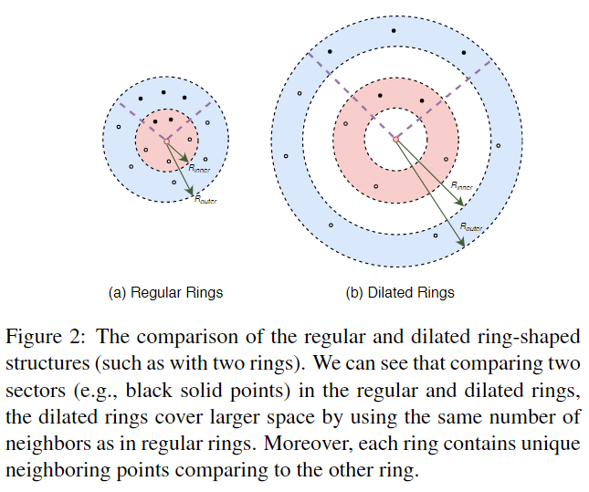

# A-CNN: Annularly Convolutional Neural Networks on Point Clouds

元の論文の公開ページ : [arxiv.org](https://arxiv.org/pdf/1904.08017.pdf)  

Github Issues :   

## どんなもの?
##### (regularとdilatedを持つ)リング状の構造と方向[?]を指定することで各点の局所近傍ジオメトリをより適切に得ることができる新規の畳み込み演算子、Annular convolutionを提案した。
- 3Dオブジェクトの不規則かつ非構造な表現を畳みこむというのは難しいタスクであり、依然として特に点群に関しての畳み込み手法は提案され続けている。[参考文献は省略。]
- この二つのリングの違いは図2の通りである。[regularはよくある近傍取得を指し、dilatedはdilated convolutionのような構造を指す。]  
    

##### また、提案した畳み込み演算子に基づいて新しいマルチレベルの階層的な手法を提案する。
- これにより、形状幾何学的な詳細情報をより適切に取得&抽象化できる。
- 点群の新しいdilated戦略は提案したclosed-loop畳み込みとプーリングに役立つ。

##### 提案したフレームワークはparts seg.、large-scale scene semantic seg. object cls.においてSOTAな性能を示した。

## 先行研究と比べてどこがすごいの? or 関連事項
##### 省略

## 技術や手法のキモはどこ? or 提案手法の詳細
##### 省略

## どうやって有効だと検証した?
##### 省略

## 議論はある?
##### 省略

## 次に読むべき論文は?
##### なし

## 論文関連リンク
##### なし

## 会議, 論文誌, etc.
##### CVPR 2019

## 著者
##### Artem Komarichev, Zichun Zhong, Jing Hua

## 投稿日付(yyyy/MM/dd)
##### 2019/04/16

## コメント
##### なし

## key-words
導入, CV, Paper, Semantic_Segmentation, Classification, Point_Cloud

## status
##### 導入

## read
##### A, I

## Citation
##### @InProceedings{komarichev2019acnn,
    title={A-CNN: Annularly Convolutional Neural Networks on Point Clouds},
    author={Komarichev, Artem and Zhong, Zichun and Hua, Jing},
    booktitle={Proceedings of the IEEE Conference on Computer Vision and Pattern Recognition},
    year={2019}
}