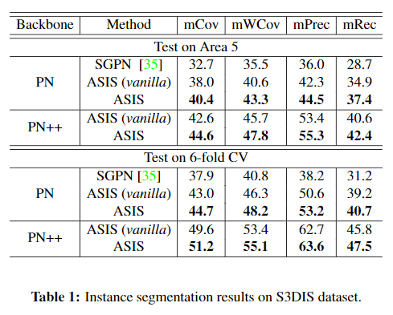
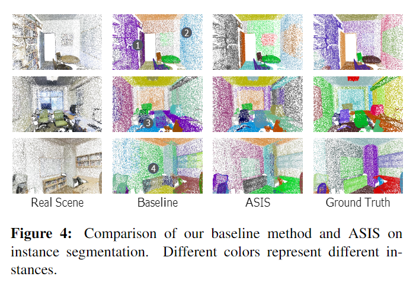
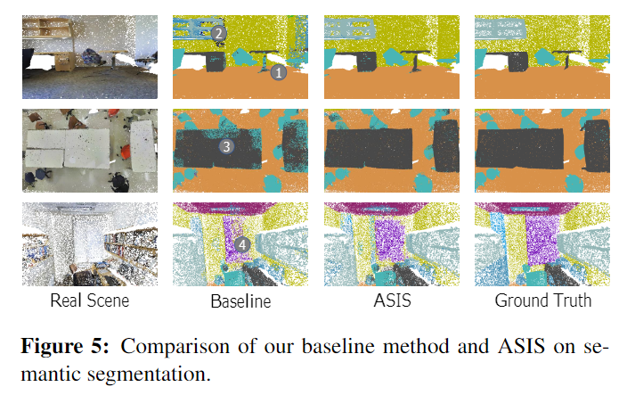

# Associatively Segmenting Instances and Semantics in Point Clouds 

元の論文の公開ページ : [arxiv](https://arxiv.org/abs/1902.09852)
Github Issues : [#26](https://github.com/Obarads/obarads.github.io/issues/26)

## どんなもの?
インスタンスセグメンテーションとセマンティックセグメンテーションを段階的ではなく並列的に学習し、処理するASIS (Associatively Segmenting Instances and Semantics)を提案した。

## 先行研究と比べてどこがすごいの?
セマンティックセグメンテーションで分割したものからインスタンスセグメンテーションを行うと、インスタンスセグメンテーションの精度はセマンティックセグメンテーションに依存してしまう。逆の構造でも前の処理に依存してしまい、どちらも依存問題が残る。著者らは、これらを段階的ではなく並列的にトレーニングさせるEnd-to-Endのフレームワークを提案した。結果として、点群のInstance SegmentationでSOTAな結果を持っているSGPN(論文関連リンクの1)より、優れた性能を持ち合わせ、より迅速なトレーニングと推論を達成した。なお、3DにおけるInstance Segmentationの研究はめったにされていない。

## 技術や手法のキモはどこ? or 提案手法の詳細
提案モデルは図3の通り。計算処理は以下の通り。提案のキモはASISである。

### テスト時
点群をEncoderで処理させ特徴量(PointNetのglobal featureとlocal featureを連結させた特徴量(論文中の$n\times 1088$の特徴量)など)に変換する。  
特徴量は各ブランチに分かれてどちらも特徴量を同じサイズにdecodeする。以下にブランチごとの処理を示す。ASISは後ほど説明する。

#### Semantic Segmentation branch
セマンティックセグメンテーションブランチでは、decode後の特徴量をsemantic feature matrix $F_{SEM}$として扱い、ASISを介してsemantic categories $N_C$長のsemantic predictions $P_{SEM}$に変換される。出力はcross entropyにArgmaxを使い得た点ごとのカテゴリラベルである。

#### Instance Segmentation branch
インスタンスセグメンテーションブランチでは、decode後の特徴量をinstance feature matrix $F_{INS}$として扱い、ASISを介してdimension of the embedding $N_E$長のinstance embedding ${E_{INS}}$に変換される。出力は埋め込みに対してmean-shift clustering(論文関連リンクの3)を使い得られた点ごとのinstance labelである。

### 訓練時
#### Semantic Segmentation branch
セグメンテーションブランチは典型的なcross entropy損失を使う。

#### Instance Segmentation branch
論文関連リンクの2で使われているdiscriminative損失を点群向けに書き換えたものを使う。ただし、この損失はクラスを先に指定する必要がある。その場合、精度がクラスに依存するため、著者らはクラスにとらわれない学習手法をとる。先ほどの埋め込みは異なるインスタンスを区別するようにして、カテゴリに対しては関わらないようにする。損失関数を式(1)の様に定義する(元は先ほどのdiscriminative損失)。

$$
L=L_ {var}+L_ {dist}+ \alpha・L_ {reg} \tag{1}
$$

ここで$L_{var}$は埋め込みを該当するインスタンスの埋め込みの平均値に寄せることを目標として、$L_{dist}$はインスタンスを互いに反発させ、$L_{reg}$は正則化項である。

### ASIS
処理は図3の(b)の通り。

#### Semantic-aware Instance Segmentation
semantic featuresからsemantic awarenessを抽象化し、instance featruesに統合する。図3(b)の$F_{SINS}$は式(5)の通り。式(5)のFCはfully connected層である。

$$
F_{SINS}=F_{INS}+FC(F_{SEM}) \tag{5}
$$

学習により、異なるカテゴリインスタンスに属する点はinstance feature空間ではじかれるが、同じカテゴリのインスタンスはほとんどその影響を受けなくなる。

#### Instance-fused Semantic Segmentation
段階を追って説明する。
1. instance embedding ${E_{INS}}$の空間内で、各点に対して近隣点を見つける$K$-NN(自身の点も含む)と同じインスタンスか確認するための外れ値フィルターを用いて、点ごとに$K$個の点のインデックスを持つ行列を得る。
2. この$N_P\times K$のインデックス行列に従い、$N_P\times N_F$の$F_{SEM}$にある$N_F$長のsemantic featureを合体させ、$N_P\times K \times N_F$のshaped feature tensorを得る。shaped feature tensorはinstance embedding空間内の局所領域に対応する($K$個の点の)グループと$N_F$長のsemantic featureを持つ。  
3. このshaped feature tensorの各グループ内のsemantic featureはchannel-wise max aggregation演算子(論文関連リンクの4等)を介してK-NN時の中心点のより洗練されたsemantic featureとして融合する。

要はInstance feature空間の局所領域を元としたsemantic feature matrixの複数のグループを作り、そのグループ内でsemantic featureをまとめる。

## どうやって有効だと検証した?
データセットはS3DISとShapeNetを使う。インスタンスセグメンテーションとセマンティックセグメンテーションの結果は表1と2の通り。PNはPointNetの略。

ASISも性能向上に役立っている。視覚的比較は図4と図5の通り。

他にもparts segmentatonや動作時間の確認などを行っている。

## 議論はある?
省略

## 次に読むべき論文は?
- [B. De Brabandere, D. Neven, and L. Van Gool. Semantic instance segmentation with a discriminative loss function. arXiv: Comp. Res. Repository, 2017.](https://arxiv.org/abs/1708.02551)

## 論文関連リンク
1. [W. Wang, R. Yu, Q. Huang, and U. Neumann. SGPN: Similarity group proposal network for 3d point cloud instance segmentation. InProc. IEEE Conf. Comp. Vis. Patt. Recogn., 2018.](https://arxiv.org/abs/1711.08588)
2. [B. De Brabandere, D. Neven, and L. Van Gool. Semantic instance segmentation with a discriminative loss function. arXiv: Comp. Res. Repository, 2017.](https://arxiv.org/abs/1708.02551)
3. [ D. Comaniciu and P. Meer. Mean shift: A robust approach toward feature space analysis. IEEE Trans. Pattern Anal. Mach. Intell., 2002.](http://citeseerx.ist.psu.edu/viewdoc/download?doi=10.1.1.160.3832&rep=rep1&type=pdf)
4. [C. R. Qi, H. Su, K. Mo, and L. J. Guibas. Pointnet: Deep learning on point sets for 3d classification and segmentation. InProc. IEEE Conf. Comp. Vis. Patt. Recogn., 2017.](https://arxiv.org/abs/1612.00593)

## 会議
CVPR 2019

## 著者
Xinlong Wang, Shu Liu, Xiaoyong Shen, Chunhua Shen, Jiaya Jia.

## 投稿日付(yyyy/MM/dd)
2019/02/26

## コメント
Deep One-Class classificationのアイデアを用いて論文関連リンクの2と同じようなこと考えていた。

## key-words
Point_Cloud,Instance_Segmentation,Semantic_Segmentation, CV, Paper

## status
更新済