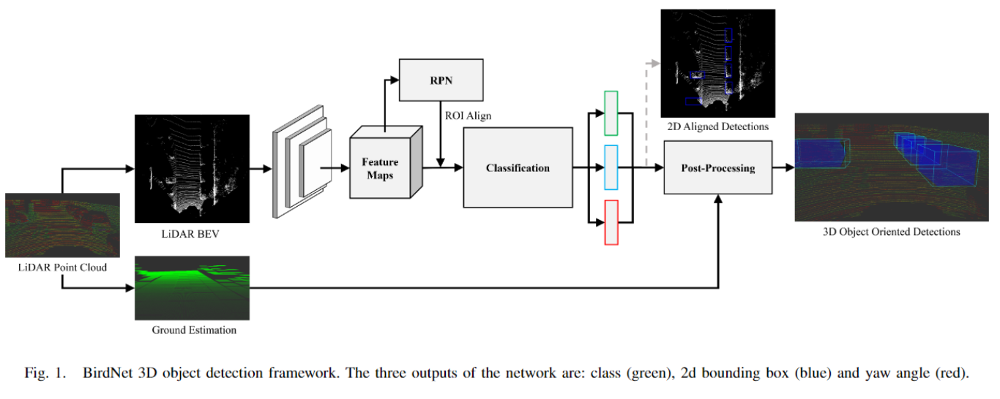

# BirdNet: a 3D Object Detection Framework from LiDAR information

元の論文の公開ページ : [arxiv.org](https://arxiv.org/abs/1805.01195)  
提案モデルの実装 : [2020/1/7:なし]()  
Github Issues :   

Note: 記事の見方や注意点については、[こちら](/)をご覧ください。

## どんなもの?
##### LiDARの鳥観図(BEV)から2DCNNを介してオブジェクトの3Dバウンディングボックスを生成する手法を提案した。
- 提案手法は図1の通り。

## 先行研究と比べてどこがすごいの? or 関連事項
##### 省略

## 技術や手法のキモはどこ? or 提案手法の詳細
##### 省略

## どうやって有効だと検証した?
##### 省略

## 議論はある?
##### 省略

## 次に読むべき論文は?
##### なし

## 論文関連リンク
##### なし
1. [なし]()[1]

## 会議, 論文誌, etc.
##### なし
- Submittied to IEEE International Conference on Intelligent Transportation Systems 2018 (ITSC)

## 著者
##### Jorge Beltran, Carlos Guindel, Francisco Miguel Moreno, Daniel Cruzado, Fernando Garcia, Arturo de la Escalera

## 投稿日付(yyyy/MM/dd)
##### 2018/03/03

## コメント
##### あり
- Aは読んだが、工夫は3章にあるようなのでここでは図だけ載せる。

## key-words
##### CV, Paper, Detection, Point_Cloud, 導入

## status
##### 導入

## read
##### A

## Citation
##### 未記入
