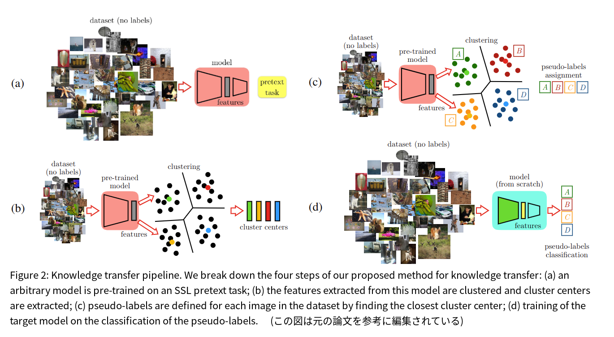

# Boosting Self-Supervised Learning via Knowledge Transfer

元の論文の公開ページ : https://arxiv.org/abs/1805.00385

## どんなもの?

## 先行研究と比べてどこがすごいの?

## 技術や手法のキモはどこ? or 提案手法の詳細
提案する手法は図2の様に4つのステップに分けられる。特徴空間内でクラスタリングを行い、その各クラスタに擬似ラベルを割り当てる(意味的に似ている画像は特徴空間で近づく)。次に、ターゲットタスクのアーキテクチャに擬似ラベルを適応、訓練させ、新しい表現を取得する。  
以下の流れの通りに訓練していく。
- **(a) Self-Supervised Learning Pre-Training**: pretext taskを使ってモデルを訓練する。
- **(b) Clustring**: モデルの中間表現をクラスタリングする。
- **(c) Extracting Pesudo-Labels**: 

## どうやって有効だと検証した?

## 議論はある?

## 次に読むべき論文は?
- なし

## 論文関連リンク
1. なし

## 会議
CVPR 2018

## 著者
Mehdi Noroozi, Ananth Vinjimoor, Paolo Favaro, Hamed Pirsiavash.

## 投稿日付(yyyy/MM/dd)
2018/03/01

## コメント
なし

## key-words
2D_Image, Classification, Self-supervised

## status
未完