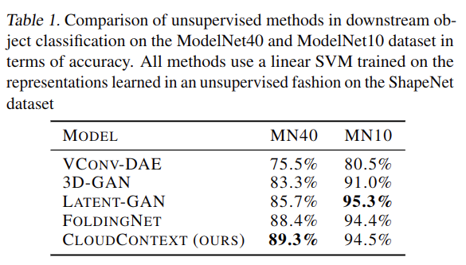
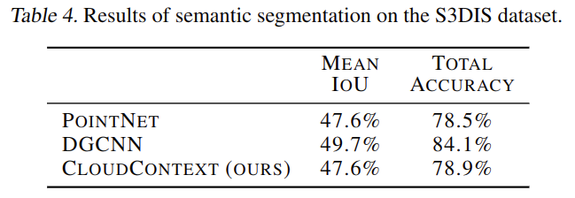

# Context Prediction for Unsupervised Deep Learning on Point Clouds

元の論文の公開ページ : [arxiv](https://arxiv.org/abs/1901.08396)
Github Issues : [#13](https://github.com/Obarads/obarads.github.io/issues/13)

## どんなもの?
ラベルなし、生の点群を用いて2つの点群区分の空間的関係性を予測するself-supervised手法であるCloudContextを提案した。

## 先行研究と比べてどこがすごいの?
Unsupervised Visual Representation Learning by Context Prediction(論文関連リンク3)の点群バージョンであり、多分これが点群分野で初めてのself-supervisedな手法となる。点群の教師なし学習で使われる類似性測定基準はEarth Mover's Distance(EMD)とChamfer distanceに依存している。特によく使われるChamfer distanceは点群が多ければ多いほど非効率的になり、さらに特定の異常なケースでは不正確な扱い方をされる(論文関連リンク2)。提案手法は分類問題であるためそのような類似性測定基準を使わずとも学習できる。

## 技術や手法のキモはどこ? or 提案手法の詳細
モデルは図2の通り。入力はオブジェクトのセグメントであり、出力はセグメントの関係性をラベルで表したものである。triviality(pretext taskを解くための楽な解答導出、trivial solutionもしくはshortcutとも)な方法である、高さの比較を避けるために各入力セグメントの点の座標値を単位球(unit ball、多分0~1の値に修正している、実装で確認したい)に置き換える。このとき、全体の高さは消失するが入力セグメントごとの座標は維持する。また、高さ以外の軸の関係は等しいものとする。言い換えると、「AはBの前にある」または「AはBの後ろにある」ではなく、「AはBの隣にある」という扱いになる。  
更に回転や全く関係ないコンテキスト(オブジェクトAとオブジェクトBのセグメントを一つずつ入力する)の関係性も含むと論文中で書いてある。

実装では正規分布から引き抜いたランダム変数によって点群に対してジッタリングやシフト(転換?)、空間に対して拡大縮小を行う。追加で高さ軸周りに90度\*A(Aには0~3の整数)回転も行う。

## どうやって有効だと検証した?
提案手法に関してはセグメントではなくオブジェクト自体の埋め込みを得るために、全てのセグメントの埋め込みを連結してそれをオブジェクトの埋め込みとして扱う。その後、分類問題の場合は線形SVMに埋め込みを入力し、セグメンテーションはMLPを接続する。ShapeNetで学習をしたModelNet40とModelNet10による教師なし学習のみの分類問題(表1)、ModelNetで学習した教師なし学習を含めたModelNet40の分類問題(表2)、ShapeNetによるパーツセグメンテーション(表3)、S3DISによるセマンティックセグメンテーション(表4)をした。

また、埋め込みの性能(図3)やSVMと提案手法の損失関数の関係性(図4)、ラベル付きデータの数と正答率の関係(図5)も実験している。

## 議論はある?
あるオブジェクトのセグメントと別のオブジェクトのセグメントによって「AとBは関係がない」と言う関係性を含めると0.6%\~0.8%の精度が向上する。オブジェクトの埋め込みとしてこれらを連結させたものを使う場合はあるオブジェクトからセグメントを2つ用意しそれの関係性を比べる手法をとるよりも精度が3\~4%精度が向上する。またシンプルなDGCNNの方がPointNetを使う場合よりも1.5%\~2.5%向上する(ここちゃんと翻訳できていない)。また、Doerschら(論文関連リンク3)では色収差などの心配をしているが、点群の環境ではその影響が出なかった。

## 次に読むべき論文は?
- [Achlioptas Panos, Diamanti Olga, Mitliagkas Ioannis, and Guibas Leonidas. Representation learning and adversarial generation of 3d point clouds. 2017.](https://arxiv.org/abs/1707.02392)

## 論文関連リンク
1. [Jonathan Sauder and Bjarne Sievers. Context Prediction for Unsupervised Deep Learning on Point Clouds. 2019.](https://arxiv.org/abs/1901.08396v1)
2. [Achlioptas Panos, Diamanti Olga, Mitliagkas Ioannis, and Guibas Leonidas. Representation learning and adversarial generation of 3d point clouds. 2017.](https://arxiv.org/abs/1707.02392)
3. [Carl Doersch, Abhinav Gupta, and Alexei A. Efros. Unsupervised Visual Representation Learning by Context Prediction. 2015.](https://arxiv.org/abs/1505.05192)

## 会議
なし(2019/01/26現在)

## 著者
Jonathan Sauder and Bjarne Sievers.

## 投稿日付(yyyy/MM/dd)
2019/01/24

## コメント
結局ラベルの種類は何個?見逃したかな...。回転や関係ないコンテキストも含めて実装が見たい。

## key-words
Classification, Point_Cloud, Semantic_Segmentation, Self-Supervised_Learning, CV, Paper

## status
更新済