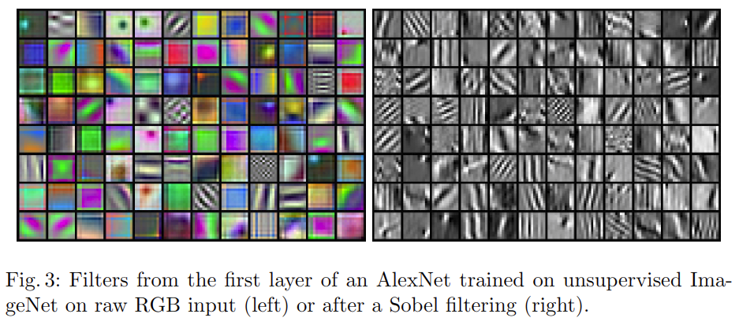

# Deep Clustring for Unsupervised Learning of Visual Features

元の論文の公開ページ : [arxiv](https://arxiv.org/abs/1807.05520)  
Github Issues : [#51](https://github.com/Obarads/obarads.github.io/issues/51)

## どんなもの?
画像をconvnetに入力して得た画像の特徴量をクラスタリングで分割し、それらの分割した特徴量を元に画像に擬似ラベルを振り分ける。convnetはその疑似ラベルを元に学習をして重みを更新する。この作業を繰り返して有用な特徴量を抽出できるself-supervised learning(SSL)手法を提案した。提案手法はDeepClustringと名付けられた。

## 先行研究と比べてどこがすごいの?
過去にも、クラスタリング損失をconvnetの特徴との共同学習で使うことがあったが、これらは現在のconvnetアーキテクチャに関して徹底的な研究を可能にするような規模でテストされていない。クラスタリング損失に関連する研究で興味深いのは、Yangら\[5\]のconvnetの特徴とクラスタを交互に学習していく再帰的なフレームワークである。巨大なデータセットを使って特徴学習をした研究もあるがそれらはexamplar SVMと\[6\]同じように画像を区別するが(?)、こちらの提案手法は単純なクラスタリングを用いる。

既存のSSLは入力に依存する手法が殆どであった。しかし、著者らの提案手法はconvnetの特徴量を元に擬似ラベルを生成するため、入力がどんな形であろうが入力の特徴量さえ取れれば学習が可能である。

## 技術や手法のキモはどこ? or 提案手法の詳細
$\theta$のパラメーターを持つconvnet mapping $f_ \theta$は、学習させなければ良い特徴を生成することができない。しかし、$\theta$の値がランダムでも$f_ \theta$は何らかの画像上に存在している特徴を捉えており、$\theta$がランダム値であるAlexNetでもImageNetで12%の精度を持っている\[2\](本当にランダムであるなら0.1%の精度しか持たないはずである[4])。  
この研究のアイデアは、このconvnetの識別能力を使うことにある。著者らはconvnetの出力をクラスタリングし、その分割した出力それぞれに擬似ラベルを割り当てて使う(図1)。

クラスタリングアルゴリズムは$k$-meansであり、これを用いて特徴$f_ \theta(x_ n)$を分割し各画像の疑似ラベルを取得する。明確には、式(2)の問題を解くことで$d\times k$の重心行列$C$と各画像$n$のクラスタ割当$y_ n$を同時に学習していく。

$$
\min _{C \in \mathbb{R}^{d \times k} } \frac{1}{N} \sum_{n=1}^{N} \min _{y_{n} \in\{0,1\}^{k} }\left\|f_{\theta}\left(x_{n}\right)-C y_{n}\right\|_{2}^{2} \quad \text { such that } \quad y_{n}^{\top} 1_{k}=1 \tag{2}
$$

この問題を解くことで最適割当の$(y_ n^\*)_ n \leq N$と重心行列$C^\*$が得られ、この割当のみ擬似ラベルとして使われる($C^\*$は使わない)。  
提案手法であるDeepClusterは式(2)を使って疑似ラベルを生成し、疑似ラベルを使ってconvnetの$\theta$を更新していく動作を繰り返す。ただしこの交互手順は自明な解を発生させやすいため、以下のような対策を立てる。

### Avoiding trivial solutions
以下は[1]を参考にしている。完全な文を見るのであれば[1]をおすすめする。

#### Empty clusters
識別モデルはクラス間の決定境界を学習する。この時、最適な決定境界は全ての入力を1つのクラスタに割り振ることである。この問題は空のクラスタを防ぐためのメカニズムを備えていないために起こり、convnetと同様に線形モデルでも発生する。これに対応するため、クラスタが空になる場合にランダムに空でないクラスタを選択し、それらの重心に僅かにランダムな摂動を与え、それを空のクラスタの新しい重心とする。その後、空でないクラスタに属する点を2つのクラスタに再び割り当てる。

#### Trivial parametrization
少数のクラスタに大部分の画像が割り振られている場合、パラメータ$theta$はそれらの間を排他的に識別するだろう。1つのクラスタを除く全てのクラスタがシングルトン(??)となるような非常に極端なシナリオである時、入力に関係なくconvnetは同じ予測を出力するtrivial parametrizationを引き起こす。この問題は画像のクラスが非常に偏っている教師有り学習でも起こる。この問題を回避するため、クラスまたは疑似ラベル上の一様分布に基づいて画像をサンプリングすることである。

## どうやって有効だと検証した?
### Preliminary study
図2(a)に訓練中のクラスタの割当とImageNetのラベル間のNormalized Mutual Information(NMI)の評価を示す。割当とラベル間の依存性は時間と共に増加し、抽出される特徴量はオブジェクトクラスに関連する情報を取り込み続ける。

図2(b)は訓練中のエポック$t$と$t-1$のクラスタ間のNMIを示したものである。これは画像が前とは別のクラスタにどれくらい振り分けられるかを示すものであり、図2(b)では徐々にNMIが増加している、つまり再割り当てが少なくなっていることを示している。

図2(c)にクラスタの数$k$がどれくらいモデルの質に影響を与えるか示す。mAPは下流タスクとしてPASCAL VOC 2007分類バリデーションセットを採用したときの値である。測定は300エポックまで学習させたモデルを用いて行っている。その結果、図2(c)より$k=10000$のとき最良の性能が得られることがわかった。ImageNetでモデルを訓練すると想定する場合、ImageNetのクラス数と同じ$k=1000$で最良の結果が得られるように思えるが、図2(c)よりある程度のオーバーセグメンテーション(過剰分割)を行うことが性能向上につながることがわかった。

### Visualizations
#### First layer filters
図3はSobelフィルタリングを用いて前処理された画像と生の画像を用いてDeepClusterを用いて訓練されたAlexNetの最初の層を示したものである。生の画像をそのまま使ったconvnetの学習の難しさは以前から指摘されており、図3の左側のおアネルに示すように、殆どのフィルタはクラス分類にほとんど影響しない色情報のみを捕捉する。Sobelフィルタリングを行ったものはエッジ情報を得ている。

#### Probing deeper layers

## 議論はある?
省略

## 次に読むべき論文は?
- Unsupervised Learning of Visual Representations by Solving Jigsaw Puzzles
- Representation Learning with Contrastive Predictive Coding
- ConvNets and ImageNet Beyond Accuracy: Understanding Mistakes and Uncovering Biases

## 論文関連リンク
1. [TAKAMI TORAO. 論文翻訳: Deep Clustering for Unsupervised Learning of Visual Features. (アクセス日時 2019/04/24)](https://hazm.at/mox/machine-learning/computer-vision/clustering/deepcluster/index.html)
2. [Yuki Ishikawa. DeepCluster 論文の紹介. (アクセス日時 2019/04/24)](https://speakerdeck.com/hoto17296/deepcluster-lun-wen-falseshao-jie?slide=15)
3. [鈴⽊智之. Self-supervised Learningによる特徴表現学習. (アクセス日時 2019/04/24)](http://hirokatsukataoka.net/temp/cvpaper.challenge/SSL_0929_final.pdf)
4. [Noroozi, M., Favaro, P.: Unsupervised learning of visual representations by solving jigsaw puzzles. In: ECCV. (2016)](https://arxiv.org/abs/1603.09246)
5. [Yang, J., Parikh, D., Batra, D.: Joint unsupervised learning of deep representations and image clusters. In: CVPR. (2016)](https://arxiv.org/abs/1604.03628)
6. [Malisiewicz, T., Gupta, A., Efros, A.A.: Ensemble of exemplar-svms for object detection and beyond. In: ICCV. (2011)](https://www.cs.cmu.edu/~efros/exemplarsvm-iccv11.pdf)

## 会議
ECCV 2018

## 著者/所属機関
Mathilde Caron, Piotr Bojanowski, Armand Joulin, and Matthijs Douze

## 投稿日付(yyyy/MM/dd)
2018/07/15

## コメント
なし

## key-words
RGB_Image, Self-Supervised_Learning, CV, Paper, 修正

## status
修正