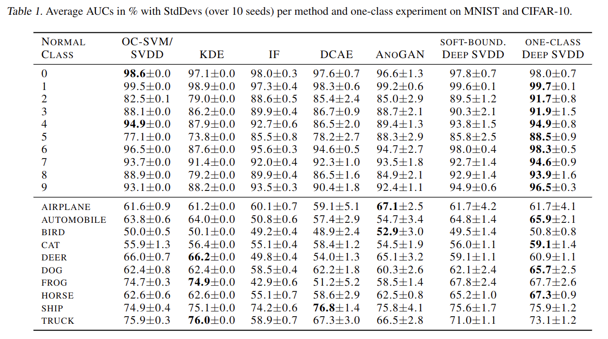

# Deep One-Class Classification

元の論文の公開ページ : http://proceedings.mlr.press/v80/ruff18a/ruff18a.pdf

## どんなもの?
カーネルベースの一クラス分類と最小ボリューム推定からインスピレーションを受け、新しい深いAnomaly Deteciotn(以下AD)を提案する。その手法はDeep Support Vector Data Description(以下Deep SVDD)と名付ける。これはデータのネットワーク表現を包みこむ超球のボリュームを最小化するニューラルネットワークを学習する。下の図(論文中の図1)で言えば、
- 学習中にニューラルネットワーク$\phi(\cdot ; \mathcal{W})$を介して、入力空間($\mathcal{X}$)に含まれる入力には正常なデータ(黒点)のみが与えられ、出力先の出力空間($\mathcal{F}$)ではcを中心とする半径Rの超球が内部に点を含むように形成される。この時、ニューラルネットワークも学習する。
- 追加で、学習するデータが$\mathcal{F}$において$c$の付近にマッピングされるように、別の定義式を提案する。
- テスト時に異常なデータ(白点)が入力されても出力された時、その点は外側に位置するようになる(ニューラルネットワークによって、正常なデータに共通する要因を的確に抽出し出力しているため、異常なデータではその要因を正しく抽出できなくなり、結果として超球外に位置するようになる)。

## 先行研究と比べてどこがすごいの?
深層学習は革新的でありADでも深いADとして有望な結果を出しているが、ADベースの目的関数を最適化することによって学習されておらず、基本的に再構築誤差(入力と出力の誤差)に依存している。  
AutoEnocoder(以下AE)等の再構築誤差を使う学習を行うものは、学習時の入力に正常なデータだけを使い、その正常なデータに含まれる多様性の一般的要因を抽出できるようにする。また、再構築誤差を異常スコアとして使い異常検知も可能である。テスト時にこの要因を含む入力は入力に近似したものを出力できるが、そうではない入力は要因を抽出できなくなるので入力とは別のものが出力される。こうして再構築誤差を使ったものは異常検知ができる。

ただし、AEはADのために作られたものではない。そのため、AEをADに適応する際に入力情報をどこまで次元圧縮するか(以下compactness)の調節が必要となる。compactnessはハイパーパラメータであり、適切なバランスを取るのは難しい。

Deep SVDDはADの使用を前提としており、データを囲む超球のボリュームを最小限に抑えることで、適切なcompactnessを得ている。

なおAnoGANもAEと同様でどうやってcompactnessのためにジェネレータを正規化するかが問題になる。

## 技術や手法のキモはどこ? or 提案手法の詳細
適切なcompactnessを得るための定義を以下に示す。
### 各定義
入力空間$\mathcal{X} \subseteq \mathbb{R}^{d}$、出力空間$\mathcal{F} \subseteq \mathbb{R}^{p}$として、ニューラルネットワークを$\phi(\cdot ; \mathcal{W}) : \mathcal{X} \rightarrow \mathcal{F}$、隠れ層$L\in \mathbb{N}$で重み$\mathcal{W}=\\{\boldsymbol{W}^{1}, \ldots, \boldsymbol{W}^{L}\\}$、ここで$\boldsymbol{W}^{\ell}$は層の重み$\ell \in\\{1, \ldots, L\\}$とする。また、$\phi(\boldsymbol{x} ; \mathcal{W}) \in \mathcal{F}$は$x\in \mathcal{X}$の特徴表現である。

### 仮定
Deep SVDDは$\mathcal{W}$の調節と$\mathcal{F}$を含む超球の最小化を同時に学習する。このとき、超級は半径$R>0$、中央$c\in\mathcal{F}$とする。

### soft-boundary Deep SVDD
学習データに$\mathcal{D}_ {n}=\\{\boldsymbol{x}_ {1}, \ldots, \boldsymbol{x}_ {n}\\}$が与えられたとすると、soft-boundary(超球の境界線) Deep SVDDの目標は式(3)となる。  
下の定義式によってデータ点が超球の$c$に密接にマッピングされるような$\mathcal{W}$をネットワークは学習できる。  

$$
\min _{R, \mathcal{W}} \ \ R^{2}+\frac{1}{\nu n} \sum_{i=1}^{n} \max \{0,||\phi(\boldsymbol{x}_{i} ; \mathcal{W})-\boldsymbol{c}\|^{2}-R^{2}\} \\
+\frac{\lambda}{2} \sum_{\ell=1}^{L}||\boldsymbol{W}^{\ell}||_{F}^{2} \tag{3}
$$

- 第一項はカーネルSVDDと同じように$R^2$を最小にすることで超球を最小化することになる。
- 第二項は罰則項であり、ネットワークを通過したあと球の外にある点(つまり、中心からの距離が半径$R$よりはるかに遠い点がある場合)のためである。ハイパーパラメーター$\nu\in(0,1]$は球のボリュームと限度侵犯のトレードオフを取り持つ。つまり、どれくらい球の外側の点を許容するか決められる。
- 最終項は重みを調節するための正則化を$||\cdot||_ F$のフロベニウスノルムとハイパーパラメーター$\lambda>0$で定義している。  

### One-Class Deep SVDD
学習データのほとんどが正常なデータである場合(一クラス分類など)、簡略化された損失を定義する。これは、$\phi(x_ i ; \mathcal{W})$とcの距離を罰則化するためのものである。定義式は式(4)のとおり。

$$
\min _{\mathcal{W}} \frac{1}{n} \ \sum_{i=1}^{n}||\phi(\boldsymbol{x}_{i} ; \mathcal{W})-\boldsymbol{c}||^{2}+\frac{\lambda}{2} \sum_{\ell=1}^{L} ||\boldsymbol{W}^{\ell}||_{F}^{2} \tag{4}
$$

- 第一項はノルムによって示されている$\phi(x_ i ; \mathcal{W})$から$c$までの距離を集計し、平均に直したもの。
- 第二項は正則化を行うためのものであり、ハイパーパラメーター$\lambda>0$を含む。

soft-boundary Deep SVDDは直接半径にペナルティを課して縮小するのに対し、One-Class Deep SVDDはFでのデータ表現を中心(cの近く)まで抑えることができる。

### anomaly score
異常値であるかどうかを表す指標。定義式は式(5)の通り。この値からR*を引いたものが負であれば正常なデータ(超球内)であり、正であれば異常なデータ(超球外)である。  

$$
s(\boldsymbol{x})=||\phi(\boldsymbol{x} ; \mathcal{W}^{*})-\boldsymbol{c}||^{2} \tag{5}
$$

## どうやって有効だと検証した?
MNISTとCIFAR-10を使った異常検知タスクと、Boundary AttackをGTSRB stop datasetに適応したAdversarial attacksの評価を行った。下図のKDEはKernel density estimation、IFはIsolation Forestである。

## 議論はある?
省略

## 次に読むべき論文は?
- Unsupervised Anomaly Detection with Generative Adversarial Networks to Guide Marker Discovery 

## 論文関連リンク
- [lukasruff. lukasruff/Deep-SVDD-PyTorch: A PyTorch implementation of the Deep SVDD anomaly detection method. (アクセス:2019/05/03)](https://github.com/lukasruff/Deep-SVDD-PyTorch)

## 参考リンク
- なし

## 会議
ICML 2018

## 著者/所属機関
Lukas Ruff, Robert A. Vandermeulen, Nico G ̈ornitz, Lucas Deecke, Shoaib A. Siddiqui, Alexander Binder, Emmanuel M ̈uller, Marius Kloft.

## 投稿日付(yyyy/MM/dd)
2018/??/??

## コメント
提案手法がシンプル。論文1章にあるように一クラス分類(異常検知)が他の分類タスクと比べてそこまで活発ではないせいか(いつしかの国際会議のワークショップでも、生成モデルは満員だったのに一クラス分類は空席が目立っていたことがあった)。特性についてももうちょっと理解を深めたい。

## key-words
2D_Image, One-Class_&_Anomaly_Detection

## status
更新済