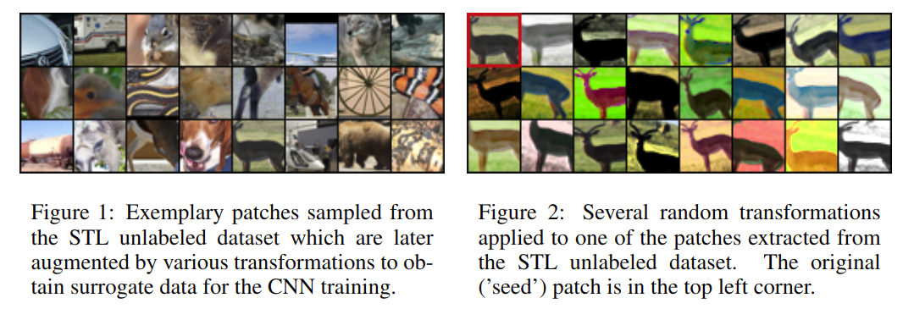

# Discriminative Unsupervised Feature Learning with Convolutional Neural Networks

元の論文の公開ページ : [nips](https://papers.nips.cc/paper/5548-discriminative-unsupervised-feature-learning-with-convolutional-neural-networks.pdf)
Github Issues : [#74](https://github.com/Obarads/obarads.github.io/issues/74)

## どんなもの?
省略

## 先行研究と比べてどこがすごいの?
省略

## 技術や手法のキモはどこ? or 提案手法の詳細
### Creating Surrogate Training Data
ラベル付けされていない画像のセットを入力とする。画像は$32\times 32$サイズにサンプリングしたパッチとなり、変換される。変換は以下の通り。

- translation: パッチサイズの0.2(20%?)以内の距離で垂直もしく水平に平行移動する。
- scaling: パッチのスケールを0.7から1.4の間の係数で乗算する。
- rotation: 画像を最大20度回転させる。
- contrast 1: 0.5から2の間の係数で全てのピクセルのセットの主成分に各パッチのピクセルの投影を乗算する(?)。(係数は各主成分に対して独立しており、パッチ内の全てのピク説に対して同じである(?))
- contrast 2: 全てのピクセルの値と彩度(HSVのVとS)を0.25から4の間で累乗する(パッチ中の全てのピクセルに対し同じように)、0.7から1.4の間の係数をこれらの値に掛ける、-0.1から0.1の間の値をそれらに足す。
- color: -0.1から0.1の間の値をパッチ中の全ピクセルの色相(HSVのH)に追加する(同じ値がパッチ中の全ピクセルに対して使われる)。

パッチは図1の様にサンプリングされ、図2の様に変換される。図2のシード画像(変換前の画像)一種類のみである。

### Learning Algorithm
変換されたパッチにシード画像ごとのクラスラベル(代理クラスのラベル)を割り振る。次に、これらの代理クラスを適切に識別する様に以下の損失関数を最小化する。

### Formal Analysis

## どうやって有効だと検証した?
省略

## 議論はある?
省略

## 次に読むべき論文は?
- なし

## 論文関連リンク
1. なし

## 会議
NIPS 2014

## 著者
Alexey Dosovitskiy, Philipp Fischer, Jost Tobias Springenberg, Martin Riedmiller, Thomas Brox.

## 投稿日付(yyyy/MM/dd)
2014/07/26

## コメント
なし

## key-words
RGB_Image, Data_Augmentation

## status
未完