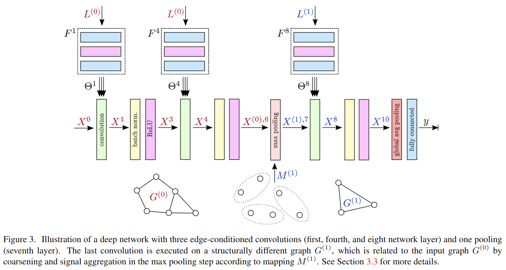

# Dynamic Edge-Conditioned Filters in Convolutional Neural Networks on Graphs

元の論文の公開ページ : [arxiv](https://arxiv.org/abs/1704.02901)
Github Issues : [#75](https://github.com/Obarads/obarads.github.io/issues/75)

## どんなもの?
グラフ上の各頂点(点)とその頂点の近傍頂点間のエッジを使って畳み込むEdge-Conditioned Convolution(ECC)を提案した。

## 先行研究と比べてどこがすごいの?

## 技術や手法のキモはどこ? or 提案手法の詳細
この手法では、頂点$i$におけるフィルタリングされた信号$X^l(i)\in\mathbb{R}^{d_ l}$(頂点、点に含まれる情報)を近傍の(複数の)信号$X^{l-1}(j)\in\mathbb{R}^{d_ {l-1} }$の加重和として計算する。概要図は図1の通り。$X^l(i)$は式(1)で表され、このフィルタリング(畳み込み演算)をEdge-Conditioned Convolution(ECC)とする。

ここの加重和で使われる重みは頂点$i$と頂点の近傍頂点$j$間のエッジ(自己ループも含む)ごとに振り分けられる。この重みの適切な値を見つけるためにDynamic filter networks[1]のアイデアを利用したfilter-generating network $F^l$($l$は層のインデックス)を使う。このネットワークは与えられたエッジラベル$L(j,i)$からedge-specific weight matrix $\Theta_ {j i}^{l} \in \mathbb{R}^{d_ {l} \times d_ {l-1}}$(生成されたフィルタ)を出力する。

最終的にすべて足し合わせる理由は、構造情報の平滑化と近傍点($\Theta_ {11}^{l} X^{l-1}(1)$から$\Theta_ {51}^{l} X^{l-1}(5)$)の順序が存在しないというものである。

$$
\begin{aligned} X^{l}(i) &=\frac{1}{|N(i)|} \sum_{j \in N(i)} F^{l}\left(L(j, i) ; w^{l}\right) X^{l-1}(j)+b^{l} \\ &=\frac{1}{|N(i)|} \sum_{j \in N(i)} \Theta_{j i}^{l} X^{l-1}(j)+b^{l} \end{aligned} \tag{1}
$$

ECCを使ったネットワークは図3の通り。

## どうやって有効だと検証した?

## 議論はある?

## 次に読むべき論文は?
- なし

## 論文関連リンク
1. [B. D. Brabandere, X. Jia, T. Tuytelaars, and L. V. Gool. Dynamic filter networks. InNIPS, 2016.](https://papers.nips.cc/paper/6578-dynamic-filter-networks.pdf)
2. [Naoya Chiba. 三次元点群を取り扱うニューラルネットワークのサーベイ Ver. 2 / Point Cloud Deep Learning Survey Ver. 2 - Speaker Deck. 2019. (アクセス:2019/05/28)](https://speakerdeck.com/nnchiba/point-cloud-deep-learning-survey-ver-2?slide=50)

## 会議
CVPR 2017

## 著者
Martin Simonovsky, Nikos Komodakis.

## 投稿日付(yyyy/MM/dd)
2017/04/10

## コメント
なし

## key-words
Graph, Point_Cloud, RGB_Image, Classification, CV

## read
A, I, M

## status
省略

## Citation
@inproceedings{Simonovsky2017ecc,
    author = {Martin Simonovsky and Nikos Komodakis},
    title = {Dynamic Edge-Conditioned Filters in Convolutional Neural Networks on Graphs},
    url = {https://arxiv.org/abs/1704.02901},
    booktitle = {CVPR},
    year = {2017}}