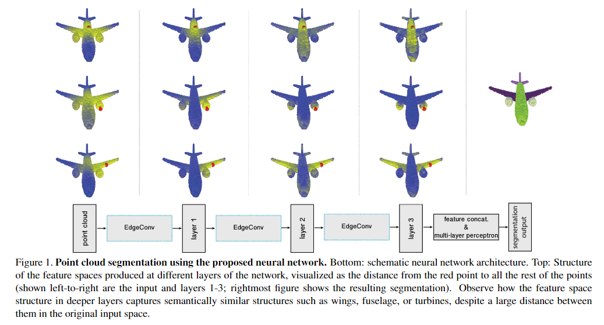
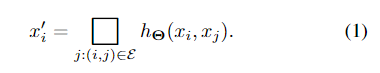
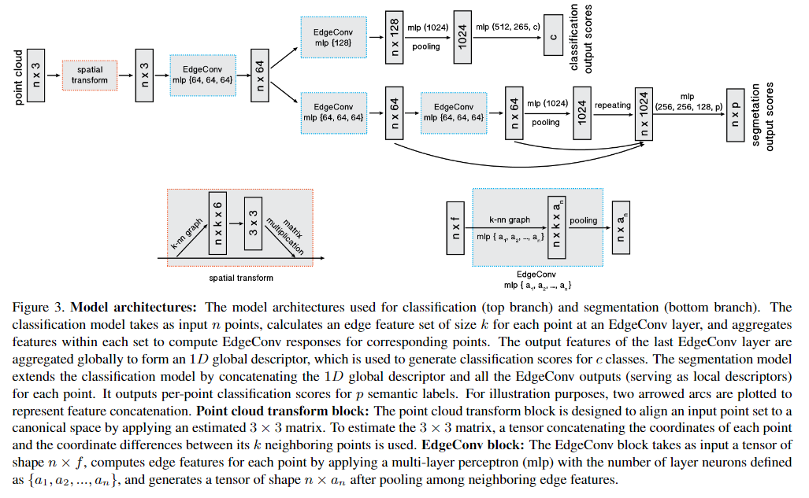
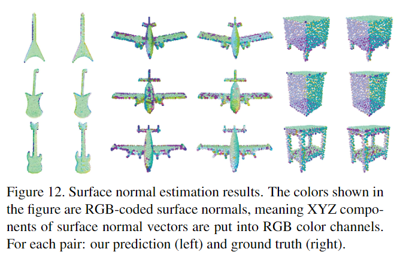

# Dynamic Graph CNN for Learning on Point Clouds

元の論文の公開ページ : https://arxiv.org/abs/1801.07829

## どんなもの?
点とその近傍の点との関係を記述するエッジ特徴を生成するEdgeConvを提案した。EdgeConvは既存の深層学習モデルに統合させ、性能を向上させることも可能である。

## 先行研究と比べてどこがすごいの?
局所領域の情報を取り入れることで特徴の質が上がる。また、通常のグラフCNNと違ってEdgeConvを介すごとにグラフを再計算することでより効果的に意味的な特徴をとらえている。

## 技術や手法のキモはどこ? or 提案手法の詳細
グラフを動的に更新することで意味的に点をグループ化することができる。グラフの更新はEdgeConvを介すごとに行われる。中心点(中心ノード)kNNを用いた近傍点(周辺ノード)の情報を点群の空間のみならず、特徴空間にも用いる。図1にも示すように、点群の時点では距離的な点を近いと認識しているが、layer3では形状的に似ているものを近いと認識している。

EdgeConvは式1の様に定義される。この時、□は$\sum$の様なsymmetric aggregation operationであり、$h_ \theta$はMLP等の非線形関数である。

本研究では$h_ \theta(x_ i,x_ j)$に4つの手法を紹介おり、提案手法では$h_ \theta(x_ i, x_ j) = hΘ(x_ i, x_ j-x_ i)$を扱っている。この時、$x_ i$は中心ノードであり、$x_ j$は周辺ノードであり、$x_ i$は中心ノードの値、$x_ i - x_ j$は$x_ i$を中心とした$x_ j$の相対距離である。相対距離を含んだものを入力することで、付近の特徴(局所領域の特徴)を総括した入力が可能となる。

EdgeConvを視覚的に説明したのが図2である。図2の左はsymmetric aggregation operationを使用する前のもの、図2の右の$e_ {ij}$はエッジ特徴と呼ばれ、これらの情報をsymmetric aggregation operationでひとまとめにしたものが$x'_ i$である。

図3がタイトルにもあるDGCNNである。PointNetを参考にEdgeConvを使用したモデルである。

## どうやって有効だと検証した?
主な検証としてはModelet40とShapeNet part dataset、S3DIS、ModelNet40を使った法線推定を行った。他にもいくつかある。

## 議論はある?
シンプルな案でありながら、他の分野でも扱える汎用性がある。結論でも、3D幾何学以外のアプリケーションへの適応を示唆している。

## 次に読むべき論文は?
なし

## 論文関連リンク
1. https://www.slideshare.net/naoyachiba18/ss-120302579

## 会議
なし?

## 著者/所属機関
Yue Wang, Yongbin Sun, Ziwei Liu, Sanjay E. Sarma, Michael M. Bronstein, Justin M. Solomon.

## 投稿日付(yyyy/MM/dd)
2018/1/24

## コメント
シンプルな発想のわりに強力な効果を発揮している...。

## key-words
Classification, Point_Cloud, Semantic_Segmentation

## status
更新済