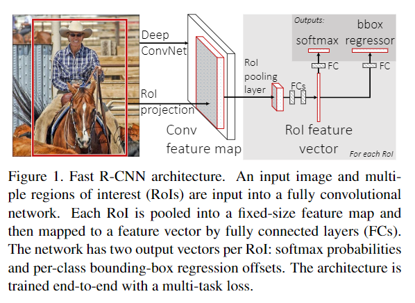
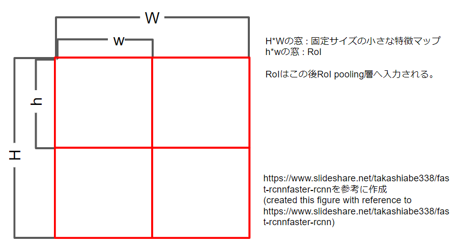
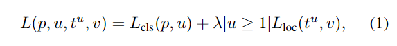
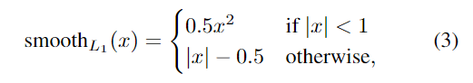
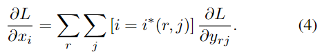

# Fast R-CNN

元の論文の公開ページ : https://arxiv.org/abs/1504.08083  
Github Issues : [#53](https://github.com/Obarads/obarads.github.io/issues/53)

## どんなもの?
深層畳み込みネットワークを使ったオブジェクト検出用のフレームワークであるFast R-CNNを提案した。

## 先行研究と比べてどこがすごいの?
簡単に言えば、より正確に、より早く動作するようになった。

R-CNN(論文関連リンクの1、先に見るべき)では以下の点が問題となっている。

1. 多数の段階に分かれた訓練
2. 訓練の時間と容量を必要とする訓練
3. オブジェクト検知が遅い。

R-CNNが遅い理由としてそれぞれのオブジェクト提案のためにConvNetのforward処理を計算共有なしで行っている。SSPnetsはその点を解決している。しかし、多段階訓練や空間ピラミッドプーリングを処置する畳み込み層の更新不可など問題点を抱えている。対して、Fast R-CNNは以下の優位性がある。

1. より正確な検知能力(mAP)を持つ
2. マルチタスク損失により訓練が1段階のみになった
3. 全てのネットワーク層を更新可能
4. 要求される容量の低減

## 技術や手法のキモはどこ? or 提案手法の詳細
Fast R-CNNのモデルは図1の通り。Fast R-CNNは入力として全体画像と提案候補のセットを取る。入力された全体画像はconv層とmax pooling層で畳み込み特徴マップへ変換される。次に畳み込み特徴マップ上の提案候補の領域(region of interest、略してRoI)をRoI pooling layerで固定サイズの特徴マップへpoolingする。固定サイズの特徴マップは全結合層(FC層)を経てRoI feature vectorへマッピングされる。このRoI feature vectorは二つのFC層に渡される: 一つはKクラス+背景クラスの確率を算出するsoftmax(分類問題)、もう一つは各Kオブジェクトクラスに対する実際の値(回帰問題)を出力する。各4つの値のセットはKクラスのうちの一つに対して洗練されたbounding boxの位置を符号化する。

### The RoI pooling layer
RoI pooling layerはmax poolingを使って任意のRoI内の特徴を小さな特徴マップに変換する。RoIは４つのタプルである$ (r,c,h,w) $で定義される。左上からの位置$ (r,c) $と、高さと幅$ (h,w) $からなる。RoI max poolingは$ h \times w $のRoIを$ H \times W $の碁盤目上に区切ったおおよそ$ h/H\ \times w/W $サイズのsub-windowへ分割し、分割されたsub-windowをそれぞれmax poolingする(max pooling後はまた一つの特徴マップとして合体する?)。RoIとsub-windowの関係は以下の通り。

max pooling後、FC層を経てRoI feature vectorに変換された後、分類問題と回帰問題を解くために使用される。

### Multi-task lose
Fast R-CNNのネットワークは2つの出力層を持ち、一つはRoIごとに$ K+1 $カテゴリ分類確率$ p=(p_0,...,p_K) $を出力する。二つ目はbounding box回帰のオフセット$ t^k=(t^k_x,t^k_y,t^k_w,t^k_h) $を$ K $クラスごとに出力する($ k $はクラスのインデックス)。ここで、$ t^k $はオブジェクト提案に対するスケール不変の並進とlog空間の高さ/幅を特定する。それぞれのRoIのトレーニングはground-truthのクラスuとground-truthのbounding box回帰目標vでラベル付けされる。bounding box回帰と分類を同時に訓練するためにラベル付けされたRoIでmulti-task lossを式(1)に示す。

ここで、$ L_{cls}(p,u)=-\log p_u $でありクラスの誤差を示す。また、アイバーソンの記法で表されている関数$ [u \geq 1] $はu>=1のとき1を返し、その他は0を返す。なお、背景クラスはu=0に割り当てられる。背景のRoIにbounding boxという概念は無いため、この場合Llocは無視される。$ v=(v_x,v_y,v_w,v_h) $、$ t^u=(t^u_x,t^u_y,t^u_w,t^u_h) $でbounding box回帰の誤差は式(2)の様になる。

このrubust L1損失はR-CNNやSPPnetで使われているL2損失より外れ値に強い。回帰対象がunboundedである場合、L2損失を用いた訓練は勾配爆発を防ぐために細かい学習率の調整が必要となる。

### Back-propagation through RoI pooling layers
RoI pooling層のbackwardsは式(4)のようになる。

ここで、$x_i \in \mathbb{R}$をRoI poolingへのi番目の入力、$y_{rj}$はr番目のRoIを層に入力し、j番目に出力されたものである。RoI pooling層は$y_{rj} =x_{i^* (r,j)}$を計算する。ここで$i^* (r,j) = \arg\max_{i' \in \mathcal{R} (r,j)} x_{i'}$である。$\mathcal{R} (r,j)$は出力$y_{rj}$の範囲のsub-window中の入力のインデックスの集合である。(?)

### Truncated SVD for faster detection
画像全体の分類では全結合層は畳み込み層よりも処理する時間が短いものの、検知でRoIを処理する数が多いため、結果的にforward処理に掛ける時間のほぼ半分が全結合層に費やされる。それらの全結合層を全て切り詰めるためturncated SVD(論文関連リンクの7,8)を用いる。$ u \times v $の重み行列Wがおおよそで因数分解される時、turncated SVDを使って式(5)を定義する。

このとき、Uは最初のt個のWの左特異ベクトルを含む$ u \times t $の行列であり、$ \Sigma_t $はトップのt個のWの特異行列を含む$ t \times t $の単位行列、Vは最初のt個の右特異ベクトルを含む$ v \times t $の行列である。turncated SVDはuvから$ t(u+v) $にパラメータ数を減らすことができ、tが$ \min (u,v) $よりもかなり小さい場合は重要になる。

論文関連リンクの3を見たほうが良いと思う。

## どうやって有効だと検証した?
主な結果は以下の通り。

1. VOC07、2010、2012においてSOTAなmAPを達成。
2. R-CNNやSPPneよりも早い訓練と動作。
3. VGG16でfine-tuningした畳み込み層がmAPを改善。

## 議論はある?
省略

## 次に読むべき論文は?
- [S. Ren, K. He, R. Girshick, and J. Sun. Faster r-cnn: Towards real-time object detection with region proposal networks. In Advances in Neural Information Processing Sys-tems 28, pages 91–99. 2015.](https://arxiv.org/abs/1506.01497)

## 論文関連リンク
1. [R. Girshick, J. Donahue, T. Darrell, and J. Malik. Rich feature hierarchies for accurate object detection and semantic segmentation. InCVPR, 2014.](https://arxiv.org/abs/1311.2524)
2. [K. He, X. Zhang, S. Ren, and J. Sun. Spatial pyramid pooling in deep convolutional networks for visual recognition. In ECCV, 2014.](https://arxiv.org/abs/1406.4729)
3. [論文紹介 Fast R-CNN&Faster R-CNN](https://www.slideshare.net/takashiabe338/fast-rcnnfaster-rcnn)
4. [最新のRegion CNN(R-CNN)を用いた物体検出入門 \~物体検出とは? R-CNN, Fast R-CNN, Faster R-CNN, Mask R-CNN\~ - Qiita](https://qiita.com/arutema47/items/8ff629a1516f7fd485f9)
5. [最新の物体検出手法Mask R-CNNのRoI AlignとFast(er) R-CNNのRoI Poolingの違いを正しく理解する - Qiita](https://qiita.com/yu4u/items/5cbe9db166a5d72f9eb8)
6. [4 Mask RCNN Arc.(Part3) - How RoI Pooling, RoI Warping & RoI Align Work](https://www.youtube.com/watch?v=XGi-Mz3do2s)
7. [E. Denton, W. Zaremba, J. Bruna, Y. LeCun, and R. Fergus. Exploiting linear structure within convolutional networks for efficient evaluation. InNIPS, 2014.](https://arxiv.org/abs/1404.0736)
8. [J. Xue, J. Li, and Y. Gong. Restructuring of deep neural network acoustic models with singular value decomposition. InInterspeech, 2013.](https://www.microsoft.com/en-us/research/wp-content/uploads/2013/01/svd_v2.pdf)

## 会議
ICCV 2015

## 著者
Ross Girshick

## 投稿日付(yyyy/MM/dd)
2015/04/30

## コメント
Faster R-CNNのために見たので、省略多め。

## key-words
Detection, 2D_Image

## status
省略