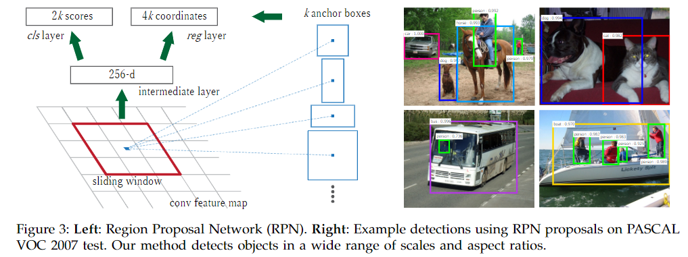
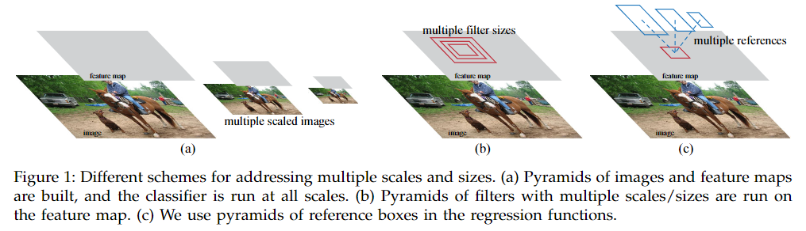
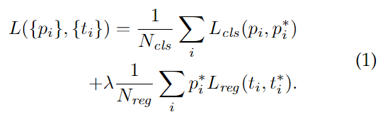
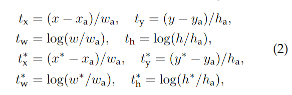

# Faster R-CNN: Towards Real-Time Object Detection with Region Proposal Networks

## どんなもの?
オブジェクト検知ネットワークと領域提案アルゴリズムをEnd-to-Endの単体のネットワークに統合したFaster R-CNNを提案した。

## 先行研究と比べてどこがすごいの?
既存の研究では領域提案の時間がボトルネックになっている。本論文で提案するネットワークはその提案の計算をほぼコストフリーにする。

## 技術や手法のキモはどこ?
まだ

## 提案手法の説明
Faster-R-CNNはRegion Proposal Network(RPN)とFast R-CNNの2つのモジュールからなる単体のネットワークである。

### **Region Proposal Network(PRN)**
PRNは画像を取り込み、objectnessなスコア付きの長方形のオブジェクト提案を行う(objectnessはオブジェクトっぽさ)。これらのプロセスはfully convolutional network(FCN)で作られる。これは最終的な目標にFast R-CNNと共通の畳み込み層のセットを共有することがあるためである。

図3の左に示す内容を説明する。領域提案を行うため、最後の共有畳み込み層によってsmall networkを畳み込み特徴マップの出力上でスライドさせる。このsmall networkは入力として、n\*nの入力畳み込み特徴マップの空間的なwindow(図3ではsliding window)を取る。このsliding windowは低次元の特徴へ写像される。この特徴はbox-regression層(reg)とbox-classification層(cls)に渡される。

- **Ancchors**  
    各sliding windowの位置において、同時に複数の領域提案を予測する。この時、各位置の最大提案数をkで表す。よってreg層は4k、cls層は2kの出力(regは一つの提案につき、4つの座標に関する回帰値、clsは2つのオブジェクトであるかどうかの分類値を出力する、詳細は損失関数へ)を行う。k個の提案は、アンカーと呼ばれるk個の参照ボックスを基準にしてパラメータ化される。
    
    アンカーはsliding windowの中心にあり、スケールと縦横比が関連付けられている。デフォルトでは3つのスケールと3つの縦横比を使って各sliding windowの位置で9個のアンカーが生成される。

- **Translation-Invariant Anchors**  
    自分たちの提案手法は並進不変(論文関連リンク2がわかりやすい)である。これは論文関連リンク3と同様、提案手法のネットワークがネットワークのストライドの合計次第の並進不変を持つからである。

- **Multi-Scale Anchors as Regression References**  
    提案するマルチスケールなアンカーを図1の(c)に示す。以下に、図1にある(a)\~(b)の手法について説明する。
    
    - (a)は複数のサイズ変更された画像からそれぞれのサイズに合った特徴マップを生成する。有用性を持っているが時間がかかる。

    - (b)は特徴マップの上で複数の縮尺のsliding windowを使用する(multiple filter sizes)。異なるアスペクト比とスケールのモデルは異なるサイズのフィルタを使って別々にトレーニングされる(このフィルタをフィルターのピラミッドともいう)。この場合、(a)同様の処理がなされる。

    - (c)は提案したアンカーベースの手法であり、アンカーのピラミッド上に作られる。複数のスケールとアスペクト比のアンカーボックスを参照(multiple references)して境界ボックスを分類または回帰する。これは単一の画像と特徴マップにのみ依存しており、単一のサイズのフィルタ(sliding window)を使用する。

    つまり、(c)は(b)のように複数のサイズのフィルターを使わないため、それに必要な処理を省ける。

    

- **Loss Function**  
    RPNをレーニングするにあたってそれぞれのアンカーに2値クラスラベル(オブジェクトかそうでないか)を割り振る。ラベルの振り方とそれに関する説明はは以下のようになる

    - positiveラベル  
        以下の二つのどちらかに合うものをpositiveのラベルとする。

        1. 最も高いIntersection-over-Union(IoU)を持つアンカーが、ground-truthボックスと重複する。
        2. アンカーとground-truthボックスがIoUで0.7以上重複している。

        尚、一つのground-truthボックスが複数のアンカーにpositiveのラベルを割り振ることがある。普段は2つめの条件で十分にpositiveな標本を決めることができるが、ごくまれに2つ目の条件でpositiveラベルの標本を見つけることができない場合があるため、一つ目の条件を適応している。

    - negativeラベル  
        negativeラベルの条件は次の一つのみ。

        1. アンカーとground-truthボックスがIoUで0.3以下重複している。

    positiveでもnegativeでもないアンカーはトレーニングには使われない。

    以上の定義があるとき、最小化する目的関数をFast R-CNN(論文関連リンクの5)に従って式(1)のように定義する。

    

    ここで、
    1. iはミニバッチ中のアンカーのインデックスである。
    1. piはiのアンカーがオブジェクトである予測確率である。pi*はアンカーがpositiveなら1、negativeなら0である。
    1. tiは予測した境界ボックスの座標を4つの値でパラメーター化させたベクトルである。4つのパラメータについては式(2)に示す。ti*はpositiveアンカーに関連するground-truthボックスの4の記述のベクトルである。
    1. 分類損失Lclsは2クラス(オブジェクトかそうでないか)のlog損失です。回帰損失Lregは、Lreg(ti,ti*)=R(ti-ti*)である。
        1. Rは論文関連リンクの5で定義されているrubust損失関数(smooth L1)である。
    1. pi*Lregは損失関数はpositiveアンカーのみで活性化し、そのほかでは無効になる。
    1. cls層とreg層はそれぞれpiとtiからなる。
    1. 二つの項はNclsとNregで正規化され、λによって重みづけされる。実装では、Nclsの値をmini-batchサイズ(Ncls=256等)に、Nregの値をアンカーの位置の数(Nreg\~2400)に設定している。λはデフォルトで10に設定している。

    境界ボックスの回帰のために論文関連リンクの6に従い、4つの座標のパラメータを適応する。これを式(2)に示す。

    

    この時、
    1. xとyはボックスの中央座標、wとhはそれぞれ幅と高さである。
    2. 変数x, xa, x*はそれぞれ予測したボックス, アンカーボックス, ground-truthボックスである(y, w, hも同様)。

    この式は、アンカーボックスからすぐ近くのground-truthへの境界ボックスの回帰だと考えられる。

    

## どうやって有効だと検証した?

## 議論はある?

## 次に読むべき論文は?
-
-

### 論文関連リンク
1. [みんな大好き物体検出のデファクトスタンダードFaster R-CNNの特許を読んだ - Qiita](https://qiita.com/yu4u/items/6bc9571c19181c1600a7)
2. [machine learning - What is translation invariance in computer vision and convolutional neural network? - Cross Validated](https://stats.stackexchange.com/questions/208936/what-is-translation-invariance-in-computer-vision-and-convolutional-neural-netwo)
3. [J. Long, E. Shelhamer, and T. Darrell, “Fully convolutional networks for semantic segmentation,” in IEEE Conference on Computer Vision and Pattern Recognition (CVPR), 2015.](https://arxiv.org/abs/1411.4038)
4. [論文紹介: Fast R-CNN&Faster R-CNN](https://www.slideshare.net/takashiabe338/fast-rcnnfaster-rcnn)
5. [R. Girshick, “Fast R-CNN,” inIEEE International Conference on Computer Vision (ICCV), 2015.](https://arxiv.org/abs/1504.08083)
6. [R. Girshick, J. Donahue, T. Darrell, and J. Malik, “Rich feature hierarchies for accurate object detection and semantic seg-mentation,” in IEEE Conference on Computer Vision and Pattern Recognition (CVPR), 2014.](https://arxiv.org/abs/1311.2524)

### 会議
NIPS 2015

### 著者
Shaoqing Ren, Kaiming He, Ross Girshick and Jian Sun

### 投稿日付(yyyy/MM/dd)
2015/07/04

## コメント
Faster R-CNNは特許がある(論文関連リンクの1)。