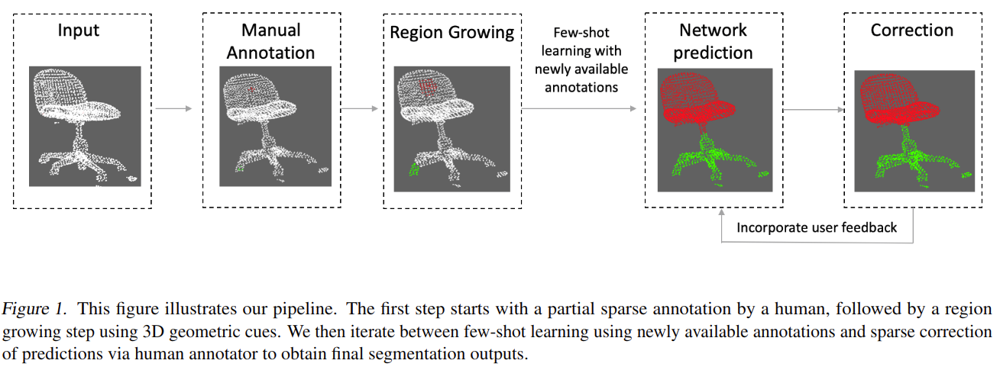

# Few-Shot Point Cloud Region Annotation with Human in the Loop

元の論文の公開ページ : [arxiv](https://arxiv.org/abs/1906.04409)  
提案モデルの実装 : [2020/1/22:なし]()  
Github Issues : [#130](https://github.com/Obarads/obarads.github.io/issues/130)  

Note: 記事の見方や注意点については、[こちら](/)をご覧ください。

## どんなもの?
##### 点ごとのアノテーションを持つ大規模点群データセットを作成するための点群アノテーションフレームワークを提案する。
- 本フレームワークではhuman-in-loop学習を採用している。
- 著者らの提案するフレームワークの概要図は図1の通り。
- 本手法は人による部分的でまばらな注釈(Manual Annotation)を用いて始まり、次に3Dの幾何学的なキュー(手がかり)を用いてregio growing stepを行う。その後は、以下の手順は繰り返す。
  1. 新たに利用できるアノテーションを使用してModelのfine-turningを行う。
  2. アノテーションされた点群の予測を行う。
  3. 人による予測の修正を行う。
- [fine-turningで使用できるアノテーションはかなり少ないため、Few-shot Learningの扱いとなる。]

## 先行研究と比べてどこがすごいの? or 関連事項
##### 省略

## 技術や手法のキモはどこ? or 提案手法の詳細
##### 省略

## どうやって有効だと検証した?
##### 省略

## 議論はある?
##### 省略

## 次に読むべき論文は?
##### なし

## 論文関連リンク
##### なし
1. [なし]()[1]

## 会議, 論文誌, etc.
##### 2019 ICML Workshop on Human in the Loop Learning (HILL 2019)

## 著者
##### Siddhant Jain, Sowmya Munukutla, and David Held

## 投稿日付(yyyy/MM/dd)
##### 2019/06/11

## コメント
##### なし

## key-words
##### Point_Cloud, Few-Shot_Learning, Labeling, CV, Paper, 導入

## status
##### 導入

## read
##### A, I

## Citation
##### 未記入
