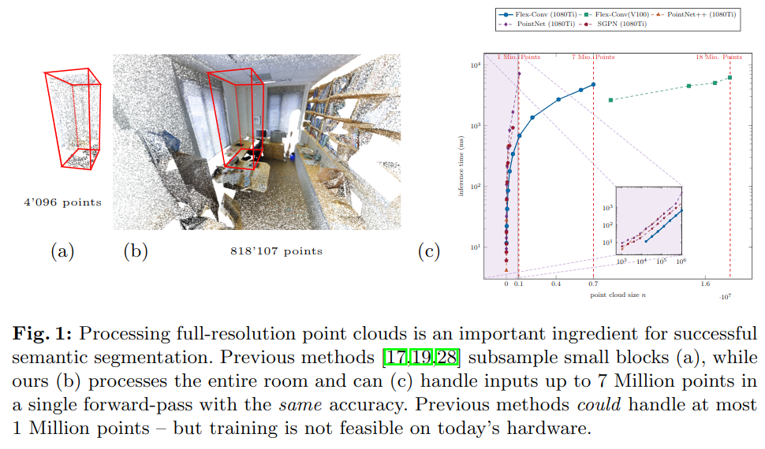

# Flex-Convolution (Million-Scale Point-Cloud Learning Beyond Grid-Worlds)

元の論文の公開ページ : [arxiv](https://arxiv.org/abs/1803.07289)  
Github Issues : [#76](https://github.com/Obarads/obarads.github.io/issues/76)

## どんなもの?
##### 点群処理向けの、複雑な層構造を使用せずにシンプルかつ少量の学習可能パラメータを持つネットワークアーキテクチャを提案した。また、GPU用に高度にチューニングした実装も提供している。
- 貢献は以下の通り。
    1. 任意の距離空間のための新規の畳み込み層を導入する。これは従来の格子ベースの畳み込み層の一般化を示すものである。
    2. 非常に調節されたGPUベースの実装を行い、高速な処理を実現した。
    3. 経験的評価により、後処理なしで大規模な点群に対するセグメンテーションの大幅な改善を確認した。小規模のベンチマークでは、より少ないメモリとパラメータだけで競争力のある結果を示した。

## 先行研究と比べてどこがすごいの? or 関連事項
##### 密で複雑な点群(3Dシーンなど)に対する処理能力を持つ。
- 図1に示すように、PointNetの派生モデルでは、$1m^2$につき4096個の点を受け付け、単体オブジェクト分類を可能とする。
- しかしながら、密で複雑な3Dシーンでは基本的に100万個の点を含んでいる。
- 図1のcに示すように、既存の手法でこれ程の点を処理するのは不可能である。
    - [原因は、点ごとの特徴をmaxpoolingなどで抽出するまでの道のりが長い、次元の呪いを受けるなどでメモリの許容量を遥かに超えることが挙げられる。]
- 動的フィルターを用いた手法[1]も大きな点群に対してはすぐにメモリがきつくなる。

##### 最近の点群モデルは複雑であるため、シンプルかつ少量の学習可能パラメータなモデルを提案した。また、従来のグリッドベースの畳込みを一般化したものを導入する。
- 一般的なCNNアーキテクチャの経験より、学習可能なパラメータが少ない単純な畳込み演算はより深いネットワークアーキテクチャ上で有利となると考えている。

## 技術や手法のキモはどこ? or 提案手法の詳細

## どうやって有効だと検証した?

## 議論はある?

## 次に読むべき論文は?
- なし

## 論文関連リンク
1. なし

## 会議
ACCV 2018

## 著者
Fabian Groh, Patrick Wieschollek, Hendrik P.A. Lensch.

## 投稿日付(yyyy/MM/dd)
2018/03/20

## コメント
なし

## key-words
Point_Cloud, CV, Paper, Classification, Semantic_Segmentation, 導入

## status
導入

## read
A, I

## Citation
