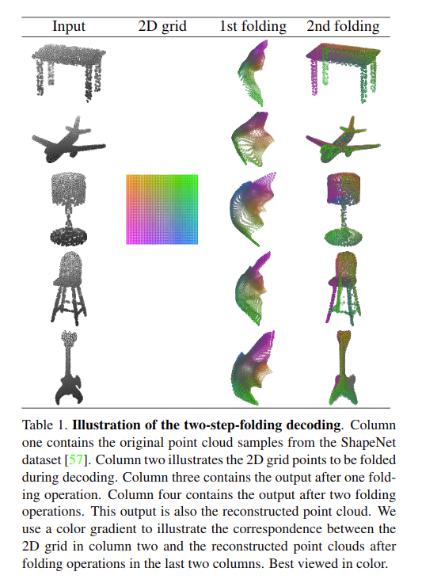
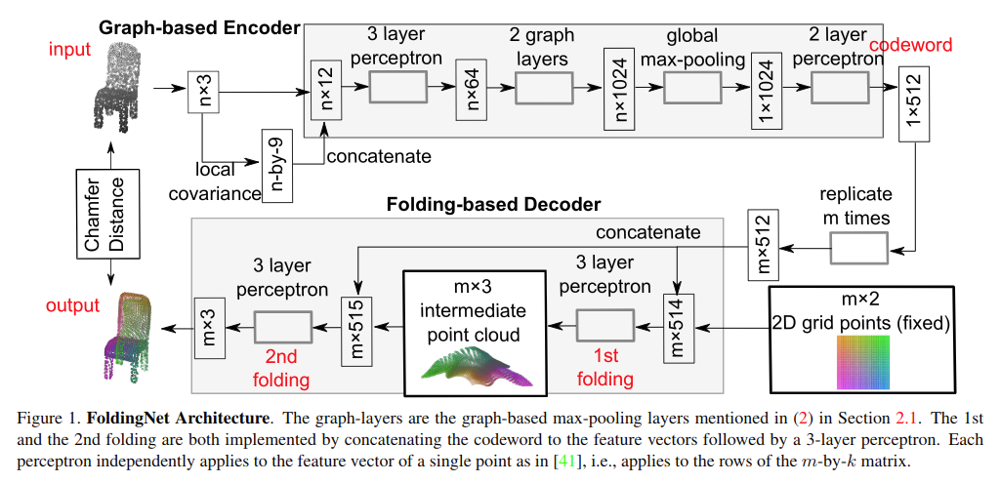
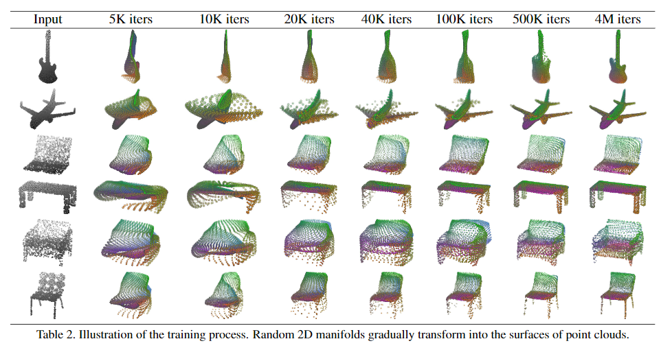
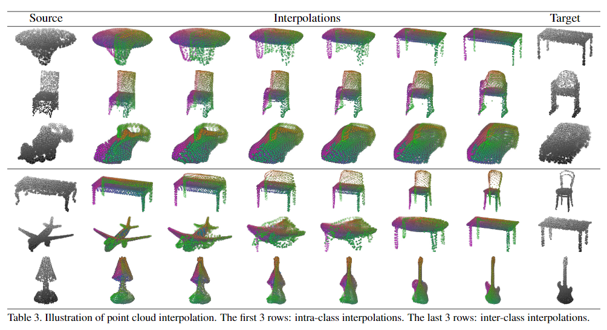
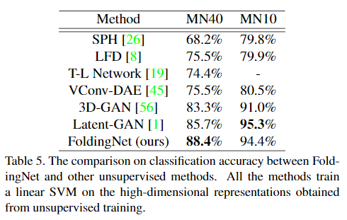

# FoldingNet: Point Cloud Auto-encoder via Deep Grid Deformation

元の論文の公開ページ : [arxiv](https://arxiv.org/abs/1712.07262)
Github Issues : [#22](https://github.com/Obarads/obarads.github.io/issues/22)

## どんなもの?
点群をEncoderで符号化した後に、紙の様な2Dの点群と先程の符号化したものを用いて入力と同じものに復元するFoldingNetと呼ばれるAutoEncoderを提案した(じゃんけんで言えは紙で石を包む感じ)。

## 先行研究と比べてどこがすごいの?
点群はオブジェクトの表面形状をかたどった表現であるため、表1の様に軸に沿った2Dの点群で3Dの形状を覆うようにして表現可能であるというアイデアを元にした提案である。このアイデアを用いることで復元中の動作が解釈しやすくなった。また、論文関連リンクの1(当時の著者が知る限り、点群用AutoEncoderに関する論文がこれしかなかった)の3つの全結合層のデコーダーよりもパラメーターのサイズが小さくなった。Encoderも最近隣グラフとmax-poolingによって局所形状を会得できるようにしている(グラフはあくまでAutoEncoderとしての話)。

## 技術や手法のキモはどこ? or 提案手法の詳細
### 構成
提案するFoldingNetは図1の通り。損失には(拡張された)Chamfer distanceを使用する。入力点群が$S$、再構成点群が$\widehat{S}$である時、(拡張された)Chamfer distanceは式(1)になる。

$$
d_{CH}(S,\widehat S)=\max\{\frac{1}{|S|}\sum_{ {\bf x} 
\in S}\min_{ {\bf \widehat x}\in \widehat S} {\bf|| x-\widehat x||_ 2} 
,\frac{1}{|\widehat S|}\sum_{ {\bf \widehat x} 
\in \widehat S}\min_{ {\bf x}\in S} {\bf|| \widehat x-x||_2}\} \tag{1}
$$

### Graph-based Encoder Architecture
graph-based encoderは点群の近傍グラフを使った論文関連リンクの2に従って設計したものである。実験でのK-NNGのKは16とする。処理の流れは図1と以下に示す。
1. n個の入力点に対して単体の点ごとに、その点とその点のK-NNGで選ばれた点を使って$3\times 3$の共分散行列(局所共分散行列、座標値を使う)を得て、これを$1 \times 9$のベクトルに変換する(局所的な関係を得た特徴を使うため?)。
2. nの座標点群と先ほどの$n\times 1 \times 9$のベクトルを連結する。
3. $n\times 12$のベクトルを3層のパーセプトロンに入力する。
4. 先ほどの出力である$n\times 64のベクトル$を2つのgraph layer(多分論文関連リンクの2のgraph max pooling)に入力する。 
  具体的には、K-NNGは隣接行列${\bf A}$として、graph layerへの入力行列は${\bf X}$とする。以上の場合の時、出力行列は式(2)のようになる。

  $$
  {\bf Y=A_{max}(X)K } \tag{2}
  $$

  ここで、${\bf K}$が特徴写像行列であるとき、行列${\bf A_{max}(X)}$の$(i,j)$番目のentryは式(3)のようになる。

  $$
  {\bf (A_{max}(X)) }_ {ij} = {\bf ReLU}(\max_{k\in\mathcal{N}_ (i)} x_{kj}) \tag{3}
  $$

  となる。局所max-pooling operationである$\max_{k\in\mathcal{N}(i)}$はグラフ構造を元とする局所シグネチャを計算するのに必須である。このsignatureは局所近傍の(集約された)幾何学情報として表現できる。

5. PointNet(論文関連リンクの3)と同じようにglobal featureにして2層のパーセプトロンに入力

### Folding-based Decoder Architecture
提案されたDecoderは2Dグリッドの点群を曲げることで入力に似た点群を形成する。処理は以下のとおりである。
1. 入力にはcodewordを$m$個に複製した行列と$m\times 2$の行列で構成された2Dグリッドの点群が使われ、これらは連結した後に3層のパーセプトロンへ入力される。出力は$m\times 3$の行列である。
2. 先ほどの出力を先ほどの入力と連結し、3層のパーセプトロンに入力する。この出力が最終的な出力点群であり、損失を得るために直接入力と比較される対象となる。

論文中にこの折り畳みと呼ばれる動作の定義について書かれている(ここでは省略)。

### Theoretical Analysis
提案手法に対する証明について述べたもの。問題の投げかけは以下の通り。
1. 提案したEncoderは置換不変である。
2. 折り畳み操作を使って、2次元グリッドから任意の点群を生成できる2層パーセプトロンが存在する。

これらは提案したDecoderが普遍的であることを示すための、存在を元とした証明である。そのため、FoldingNet AutoEncoderの内部で実際に何が起こっているのかを示すもではない。   
尚、実際に使用するDecoderは理論上の3mのhidden unitsよりも小さいとのこと。

## どうやって有効だと検証した?
### Visualization of the Training Process
どのようにして意味のある点群表現へ変化していくのか表2に示す。ShapeNetのpart datasetを使う。

### Point Cloud Interpolation
codewordが意味のある表現を会得しているか確認するためにクラス間(飛行機から机)とクラス内(F1とセダン車)で補間が行われているか確認した。表3にその様子を示す。

### Illustration of Point Cloud Clustering
学習させた表現がうまく分けられているかT-SNEでcodewordを確認した。ここではShapeNetのデータセットを使って訓練させ、ModelNet10のデータセットのcodewordを得て確認している。これを図2に示す。また、よくある分類のミスを表4に示す。

### その他
線形SVMによる損失関数と精度の関係(図3)や他のネットワークとの比較(表5)等がある。

## 議論はある?
省略

## 次に読むべき論文は?
- 今のところなし

## 論文関連リンク
1. [P. Achlioptas, O. Diamanti, I. Mitliagkas, and L. Guibas. Learning Representations and Generative Models for 3D Point Clouds. arXiv preprint arXiv:1707.02392, 2017.](https://arxiv.org/abs/1707.02392)
2. [Y. Shen, C. Feng, Y. Yang, and D. Tian. Mining point cloud local structures by kernel correlation and graph pooling.Proceedings of the IEEE Conference on Computer Vision and Pattern Recognition, 2018.](https://www.merl.com/publications/docs/TR2018-041.pdf)
3. [C. R. Qi, H. Su, K. Mo, and L. J. Guibas. Pointnet: Deep learning on point sets for 3D classification and segmentation. Proceedings of the IEEE Conference on Computer Vision and Pattern Recognition, 2017.](https://arxiv.org/abs/1612.00593)

## 会議
CVPR 2018

## 著者
Yaoqing Yang, Chen Feng, Yiru Shen and Dong Tian.

## 投稿日付(yyyy/MM/dd)
2017/12/19

## コメント
なし

## key-words
Point_Cloud,AutoEncoder, CV

## status
更新済